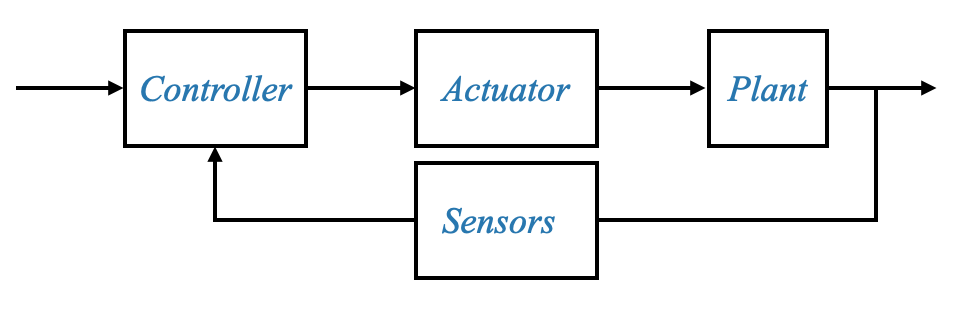
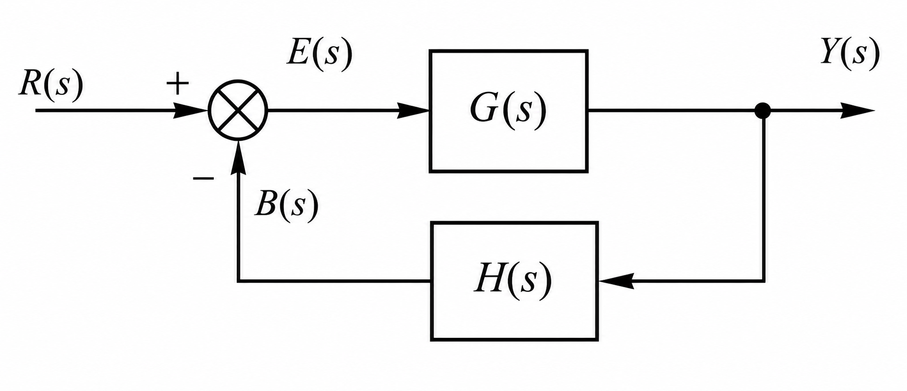
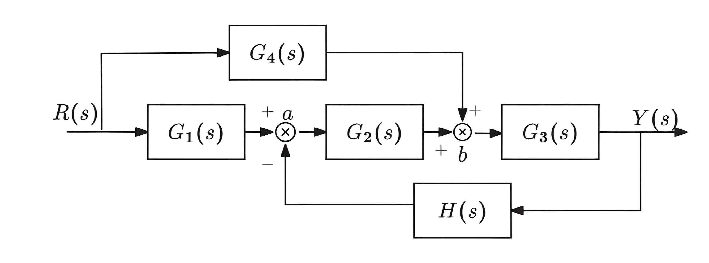
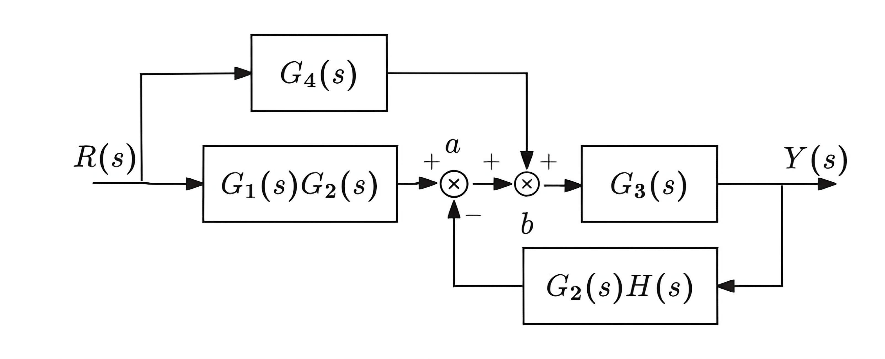
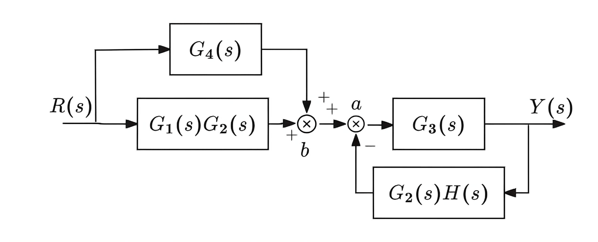
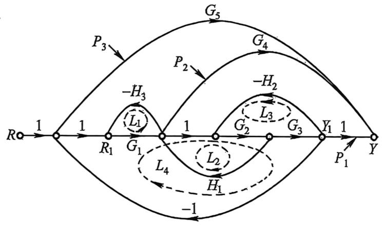

# Foundations

[toc]

### Feedback Control System

A control system is an interconnection of components designed to produce a desired system response.

| Component | Concept | Function |
|---|---|---|
| Controller | hardware or an algorithm that processes the reference and measured output | computes the control signal needed to reduce the error |
| Actuator | the mechanism through which the control system acts on the physical process | converts the control signal into physical action that changes the plant input |
| Plant | the physical system or process to be controlled | receives the actuator input and produces the controlled output |
| Sensors | devices that measure relevant plant variables or outputs | convert measurements into feedback signals for the controller |

| Symbol | Meaning |
|---|---|
| $r(t)$ | reference input, or setpoint when the reference is constant |
| $y(t)$ | controlled variable, or system output |
| $d(t)$ | disturbance input |
| $n(t)$ | measurement noise |
| $y_m(t)$ | measured output, or feedback signal |
| $e(t)$ | error signal |

$$
e(t)=r(t)-y_m(t)
$$

The path from the system input to the system output is called the **forward path**.

The signal returned from the output side to the input side is called the **feedback signal**. The principal feedback signal is sometimes called the **primary feedback signal**, while additional feedback signals are called **local feedback signals**. The path through which the output signal is fed back is called the **feedback path**.

##### Open-Loop and Closed-Loop Control

In an open-loop control system, the control action is independent of the system output.

In a closed-loop control system, the output is measured and compared with the reference input. The resulting error signal is used to reduce the difference between the desired response and the actual response.

For unity feedback,

$$
e(t)=r(t)-y(t)
$$

##### Performance Specifications

| Requirement | Meaning |
|---|---|
| Stability | the ability of the system response to return to an equilibrium state after a disturbance |
| Transient response | the part of the response that occurs before steady state is reached |
| Steady-state accuracy | the closeness of the steady-state output to the desired output, usually quantified by the steady-state error |

### Mathematical Models

A mathematical model describes the input–output relationship of a dynamic system. Different physical systems may have the same mathematical model.

##### Transfer Function

The transfer function of a **linear time-invariant (LTI) system** is the ratio of the Laplace transform of the output to the Laplace transform of the input **under zero initial conditions**.

$$
G(s)=\frac{Y(s)}{R(s)}
$$

The transfer function is a property of the system and is independent of the particular input signal. It is also the Laplace transform of the **impulse response**, $G(s)=\mathcal{L}\{g(t)\}$. For a **single-input, single-output (SISO)** system, $Y(s)=G(s)R(s)$; for a **multiple-input, multiple-output (MIMO)** system, $\boldsymbol{Y}(s)=\mathbf{G}(s)\boldsymbol{R}(s)$.

##### Polynomial Form

A linear time-invariant system may be described by the differential equation

$$
\begin{aligned}
a_0\frac{\mathrm{d}^n y(t)}{\mathrm{d}t^n}
&+a_1\frac{\mathrm{d}^{n-1}y(t)}{\mathrm{d}t^{n-1}}
+\cdots
+a_{n-1}\frac{\mathrm{d}y(t)}{\mathrm{d}t}
+a_ny(t) \\
&=b_0\frac{\mathrm{d}^m r(t)}{\mathrm{d}t^m}
+b_1\frac{\mathrm{d}^{m-1}r(t)}{\mathrm{d}t^{m-1}}
+\cdots
+b_{m-1}\frac{\mathrm{d}r(t)}{\mathrm{d}t}
+b_mr(t)
\end{aligned}
$$

Under zero initial conditions, the corresponding proper rational transfer function has the form

$$
G(s)=\frac{b_0s^m+b_1s^{m-1}+\cdots+b_m}
{a_0s^n+a_1s^{n-1}+\cdots+a_n}
\qquad n\ge m
$$

The order of a rational transfer function is the degree of its denominator after common pole–zero factors have been canceled. For a minimal realization, this is also the order of the system.

If

$$
G(s)=\frac{N(s)}{D(s)}
$$

has no pole–zero cancellations, then the denominator polynomial $D(s)$ is the **characteristic polynomial**. The equation

$$
D(s)=0
$$

is called the **characteristic equation**.

##### Pole–Zero Form

The zeros are the roots of $N(s)$, and the poles are the roots of $D(s)$.

$$
G(s)=k\frac{\displaystyle\prod_{j=1}^{m}(s-z_j)}
{\displaystyle\prod_{i=1}^{n}(s-p_i)}
$$

Here $z_j$ are the zeros, and $p_i$ are the poles. The closed-loop poles determine the stability and strongly influence the transient response of the closed-loop system.

##### Time-Constant Form

In time-constant form, each finite pole or zero factor is normalized so that its constant term is unity.

$$
G(s)=\frac{K\displaystyle\prod_j(\tau_js+1)
\displaystyle\prod_k(\tau_k^2s^2+2\zeta_k\tau_ks+1)}
{s^\nu\displaystyle\prod_i(\tau_is+1)
\displaystyle\prod_l(\tau_l^2s^2+2\zeta_l\tau_ls+1)}
$$

Here $K$ is the **gain constant**, $\tau$ denotes a time constant, $\zeta$ denotes a damping ratio, and $\nu$ is the number of poles at the origin.

##### Standard Dynamic Elements

| Element | Differential relation | Transfer function |
|---|---|---|
| Proportional element | $y(t)=Kr(t)$ | $G(s)=K$ |
| Integrating element | $y(t)=\displaystyle\int_0^t r(\tau)\,\mathrm{d}\tau$ | $G(s)=\dfrac{1}{s}$ |
| First-order lag element | $T\dfrac{\mathrm{d}y(t)}{\mathrm{d}t}+y(t)=r(t)$ | $G(s)=\dfrac{1}{Ts+1}$ |
| Standard second-order element | $T^2\dfrac{\mathrm{d}^2y(t)}{\mathrm{d}t^2}+2\zeta T\dfrac{\mathrm{d}y(t)}{\mathrm{d}t}+y(t)=r(t)$ | $G(s)=\dfrac{1}{T^2s^2+2\zeta Ts+1}$ |
| Differentiating element | $y(t)=\dfrac{\mathrm{d}r(t)}{\mathrm{d}t}$ | $G(s)=s$ |
| Pure time delay | $y(t)=r(t-\tau)$ | $G(s)=e^{-\tau s}$ |

### Block Diagrams

A block diagram shows the functional relationships among system variables.

| Connection | Equivalent transfer function |
|---|---|
| Series connection | $G_{\mathrm{eq}}(s)=G_1(s)G_2(s)$ |
| Parallel connection | $G_{\mathrm{eq}}(s)=G_1(s)+G_2(s)$ |
| Negative-feedback connection | $G_{\mathrm{eq}}(s)=\dfrac{G(s)}{1+G(s)H(s)}$ |
| Positive-feedback connection | $G_{\mathrm{eq}}(s)=\dfrac{G(s)}{1-G(s)H(s)}$ |

The product of the forward-path transfer function and the feedback-path transfer function is called the **loop transfer function**. In classical control, it is also commonly called the **open-loop transfer function** or **loop gain**.

$$
L(s)=\frac{B(s)}{E(s)}=G(s)H(s)
$$

Here $E(s)$ is the error signal, $B(s)$ is the feedback signal, $G(s)$ is the forward-path transfer function, and $H(s)$ is the feedback-path transfer function. For unity feedback, $H(s)=1$.

For **negative feedback**,

$$
\begin{aligned}
E(s)&=R(s)-B(s)\\
B(s)&=H(s)Y(s)\\
Y(s)&=G(s)E(s)
\end{aligned}
$$

Therefore,

$$
\frac{Y(s)}{R(s)}=\frac{G(s)}{1+G(s)H(s)}
$$

For **positive feedback**,

$$
\begin{aligned}
E(s)&=R(s)+B(s)\\
B(s)&=H(s)Y(s)\\
Y(s)&=G(s)E(s)
\end{aligned}
$$

Therefore,

$$
\frac{Y(s)}{R(s)}=\frac{G(s)}{1-G(s)H(s)}
$$

For a negative-feedback system, the characteristic equation is

$$
1+G(s)H(s)=0
$$

Block-diagram reduction combines series, parallel, and feedback connections. Inner loops are usually reduced before outer loops.

##### Block-Diagram Reduction Principles

- If feedback loops overlap by sharing part of the same forward path, first rearrange the diagram, when possible, into an equivalent structure with nonoverlapping or nested loops.

- Adjacent summing points may be interchanged, and adjacent takeoff points may also be interchanged. However, an adjacent summing point and takeoff point generally cannot be interchanged directly without compensating changes elsewhere in the diagram.

- For a multiple-loop structure, reduce the diagram from the innermost loop to the outermost loop until a single equivalent block and the overall transfer function are obtained.

##### eg. Block-Diagram Reduction

Find the overall transfer function of the following system.

From the diagram

$$
B(s)=G_4(s)R(s)+G_2(s)A(s)
$$

Substituting the signal at summing point $a$

$$
B(s)=G_4(s)R(s)+G_2(s)\left[G_1(s)R(s)-H(s)Y(s)\right]
$$

Expanding the expression

$$
B(s)=G_4(s)R(s)+\left[G_1(s)G_2(s)R(s)-G_2(s)H(s)Y(s)\right]
$$

Let

$$
A'(s)=G_1(s)G_2(s)R(s)-G_2(s)H(s)Y(s)
$$

The corresponding equivalent block diagram is

Interchange the two adjacent summing points

The left side is a parallel connection

$$
G_1(s)G_2(s)+G_4(s)
$$

The right side is a negative-feedback connection

$$
\frac{G_3(s)}{1+G_2(s)G_3(s)H(s)}
$$

Therefore

$$
G(s)
=
\frac{G_1(s)G_2(s)G_3(s)+G_3(s)G_4(s)}
{1+G_2(s)G_3(s)H(s)}
$$

### Signal-Flow Graphs

A signal-flow graph represents a set of linear algebraic equations using nodes and directed branches.

| Term | Meaning |
|---|---|
| Source node | a node with only outgoing branches |
| Sink node | a node with only incoming branches |
| Mixed node | a node with both incoming and outgoing branches |
| Forward path | a path from an input node to an output node that does not pass through any node more than once |
| Loop | a closed path that begins and ends at the same node and does not pass through any other node more than once |
| Non-touching loops | loops that have no nodes in common |

##### Mason's Gain Formula

For $N$ forward paths,

$$
\frac{Y(s)}{R(s)}=\frac{1}{\Delta}\sum_{k=1}^{N}P_k\Delta_k
$$

Here $P_k$ is the gain of the $k$th forward path, and $\Delta_k$ is obtained from $\Delta$ by omitting all loops that touch the $k$th forward path.

$$
\Delta
=1-\sum_iL_i
+\sum_{i,j}L_iL_j
-\sum_{i,j,l}L_iL_jL_l
+\cdots
$$

The first sum contains the gains of all individual loops. The second sum contains the products of all pairs of non-touching loops, and the third sum contains the products of all triples of mutually non-touching loops.

##### eg. Mason's Gain Formula

Find the transfer function from the input node $R$ to the output node $Y$.

There are three forward paths:

$$
P_1=G_1G_2G_3
\qquad
P_2=G_1G_4
\qquad
P_3=G_5
$$

The four loop gains are

$$
L_1=-G_1H_3
\qquad
L_2=G_2H_1
\qquad
L_3=-G_2G_3H_2
\qquad
L_4=-G_1G_2G_3
$$

Only $L_1$ and $L_3$ are non-touching. Thus,

$$
\begin{aligned}
\Delta
&=1-(L_1+L_2+L_3+L_4)+L_1L_3\\
&=1+G_1H_3-G_2H_1+G_2G_3H_2+G_1G_2G_3
+G_1G_2G_3H_2H_3
\end{aligned}
$$

The path cofactors are

$$
\Delta_1=1
\qquad
\Delta_2=1-L_3=1+G_2G_3H_2
$$

$$
\Delta_3
=1-(L_1+L_2+L_3)+L_1L_3
=1+G_1H_3-G_2H_1+G_2G_3H_2+G_1G_2G_3H_2H_3
$$

By Mason's gain formula,

$$
\frac{Y(s)}{R(s)}
=
\frac{
G_1G_2G_3
+G_1G_4(1+G_2G_3H_2)
+G_5\left(1+G_1H_3-G_2H_1+G_2G_3H_2+G_1G_2G_3H_2H_3\right)
}{
1+G_1H_3-G_2H_1+G_2G_3H_2+G_1G_2G_3+G_1G_2G_3H_2H_3
}
$$
