# Frequency-Domain Analysis

[toc]

### Frequency Response

##### Sinusoidal Steady-State Response

Frequency response is the steady-state response of a stable linear time-invariant system to a sinusoidal input. If

$$
r(t)=R\sin \omega t
$$

then

$$
R(s)=\frac{R\omega}{s^2+\omega^2}
$$

For a stable system with transfer function $G(s)$, the steady-state output is a sinusoid at the same frequency

$$
y_{ss}(t)=R\left|G(j\omega)\right|\sin\left[\omega t+\angle G(j\omega)\right]
$$

The magnitude changes the amplitude, and the phase changes the time position of the sinusoid.

##### Frequency Characteristics

The frequency transfer function is obtained by setting $s=j\omega$ in the transfer function

$$
G(j\omega)=G(s)\big|_{s=j\omega}
$$

Using complex sinusoidal phasors, it can be written as

$$
G(j\omega)=\frac{\widetilde{Y}(\omega)}{\widetilde{R}(\omega)}=A(\omega)e^{j\varphi(\omega)}
$$

where $\widetilde{R}(\omega)$ and $\widetilde{Y}(\omega)$ are the complex amplitudes of the input and steady-state output, respectively, and

$$
A(\omega)=\left|G(j\omega)\right|
$$

$$
\varphi(\omega)=\angle G(j\omega)
$$

Equivalent forms are

$$
G(j\omega)=\operatorname{Re}\left[G(j\omega)\right]+j\operatorname{Im}\left[G(j\omega)\right]
$$

$$
G(j\omega)=\left|G(j\omega)\right|e^{j\angle G(j\omega)}
$$

$$
G(j\omega)=\left|G(j\omega)\right|\cos\angle G(j\omega)+j\left|G(j\omega)\right|\sin\angle G(j\omega)
$$

##### Frequency-Response Plots

| plot | main idea |
|---|---|
| polar plot | plot $G(j\omega)$ in the complex plane as $\omega$ varies from $0$ to $\infty$ |
| Bode plot | plot logarithmic magnitude and phase against logarithmic frequency |
| Nichols plot | plot logarithmic magnitude against phase with $\omega$ as a parameter |

The Bode magnitude is

$$
L(\omega)=20\log_{10}A(\omega)\ \mathrm{dB}
$$

The horizontal axis is logarithmic in $\omega$, usually in rad/s. A decade means a tenfold change in frequency. A slope in Bode magnitude is measured in dB/dec.

##### Pole-Zero Interpretation

For a factored transfer function

$$
G(s)=K\frac{\prod_{i=1}^{m}(s-z_i)}{\prod_{i=1}^{n}(s-p_i)}
$$

the frequency response is

$$
G(j\omega)=K\frac{\prod_{i=1}^{m}(j\omega-z_i)}{\prod_{i=1}^{n}(j\omega-p_i)}
$$

As $\omega$ varies from $0$ to $\infty$, the evaluation point $s=j\omega$ moves upward along the positive imaginary axis. Each zero or pole defines a vector from its location to the point $j\omega$. Therefore,

$$
|G(j\omega)|=|K|\frac{\prod_{i=1}^{m}|j\omega-z_i|}{\prod_{i=1}^{n}|j\omega-p_i|}
$$

$$
\angle G(j\omega)=\angle K+\sum_{i=1}^{m}\angle(j\omega-z_i)-\sum_{i=1}^{n}\angle(j\omega-p_i)
$$

A zero contributes its vector length to the numerator and adds its vector angle. A pole contributes its vector length to the denominator and subtracts its vector angle.

For example,

$$
H(s)=\frac{s-1}{s+2}
$$

has a zero at $z=1$ and a pole at $p=-2$. Hence

$$
H(j\omega)=\frac{j\omega-1}{j\omega+2}
$$

$$
|H(j\omega)|=\frac{\sqrt{1+\omega^2}}{\sqrt{4+\omega^2}}
$$

$$
\angle H(j\omega)=\operatorname{atan2}(\omega,-1)-\operatorname{atan2}(\omega,2)
$$

As $\omega\to0^+$, the vector from the right-half-plane zero approaches the negative real axis from above, so its angle approaches $180^\circ$. The pole vector approaches the positive real axis, so its angle approaches $0^\circ$. Thus
$$
|H(j\omega)|\to\frac{1}{2},\qquad \angle H(j\omega)\to180^\circ
$$

As $\omega\to\infty$, both vector angles approach $90^\circ$, so $|H(j\omega)|\to1$ and $\angle H(j\omega)\to0^\circ$.

### Elementary Factors

##### Proportional Factor

For $G(s)=K$, if $K>0$,
$$
G(j\omega)=K=Ke^{j0}
$$

$$
A(\omega)=K
$$

$$
\varphi(\omega)=0
$$

$$
L(\omega)=20\log_{10}K
$$

In general, $A(\omega)=|K|$.

##### Integral and Derivative Factors

For an integral factor,

$$
G(s)=\frac{1}{s}
$$

$$
G(j\omega)=\frac{1}{j\omega}=\frac{1}{\omega}e^{-j90^\circ}
$$

$$
A(\omega)=\frac{1}{\omega}
$$

$$
\varphi(\omega)=-90^\circ
$$

$$
L(\omega)=-20\log_{10}\omega
$$

For a derivative factor,

$$
G(s)=s
$$

$$
G(j\omega)=j\omega=\omega e^{j90^\circ}
$$

$$
A(\omega)=\omega
$$

$$
\varphi(\omega)=90^\circ
$$

$$
L(\omega)=20\log_{10}\omega
$$

The integral factor has slope $-20\ \mathrm{dB/dec}$ and constant phase $-90^\circ$. The derivative factor has slope $20\ \mathrm{dB/dec}$ and constant phase $90^\circ$.

For a sinusoidal input, the pure derivative factor contributes a constant phase of $+90^\circ$. Its output therefore leads the input by one quarter cycle, so it is a phase-advance factor. Its magnitude increases without bound as frequency increases, which also makes an ideal differentiator sensitive to high-frequency components.

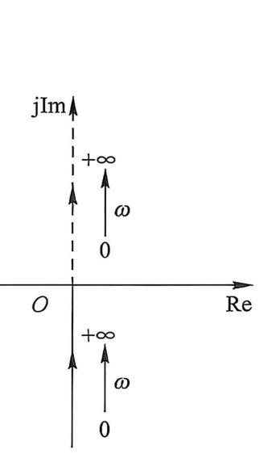

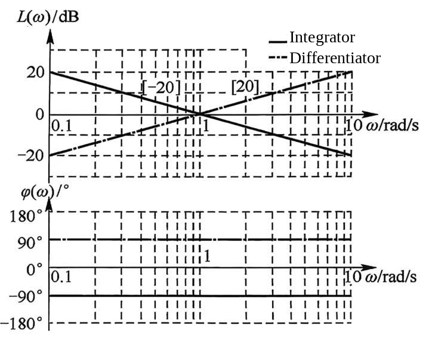

##### Approximate Derivative Factor

An ideal differentiator is not physically realizable as a proper causal transfer function. A practical derivative action can be approximated by a first-order high-pass factor

$$
G_D(s)=\frac{s}{1+\varepsilon\tau_d s},\qquad \varepsilon>0
$$

Its frequency response is

$$
G_D(j\omega)=\frac{j\omega}{1+j\omega\varepsilon\tau_d}
$$

$$
A(\omega)=\frac{\omega}{\sqrt{1+(\omega\varepsilon\tau_d)^2}}
$$

$$
\varphi(\omega)=90^\circ-\operatorname{atan2}(\omega\varepsilon\tau_d,1)
$$

The break frequency introduced by the pole is

$$
\omega_f=\frac{1}{\varepsilon\tau_d}
$$

For $\omega\ll\omega_f$, $G_D(j\omega)\approx j\omega$, so the factor behaves like an ideal differentiator. For $\omega\gg\omega_f$, its magnitude approaches $1/(\varepsilon\tau_d)$ and its phase approaches $0^\circ$, limiting the unbounded high-frequency gain of the ideal derivative factor.

##### First-Order Lag Factor

For

$$
G(s)=\frac{1}{Ts+1}
$$

$$
G(j\omega)=\frac{1}{1+j\omega T}
$$

$$
A(\omega)=\frac{1}{\sqrt{1+(\omega T)^2}}
$$

$$
\varphi(\omega)=-\operatorname{atan2}(\omega T,1)
$$

$$
L(\omega)=-20\log_{10}\sqrt{1+(\omega T)^2}
$$

The real and imaginary parts are

$$
\operatorname{Re}[G(j\omega)]=\frac{1}{1+(\omega T)^2}
$$

$$
\operatorname{Im}[G(j\omega)]=-\frac{\omega T}{1+(\omega T)^2}
$$

The polar plot lies on the circle

$$
\left(\operatorname{Re}[G(j\omega)]-\frac{1}{2}\right)^2+\left(\operatorname{Im}[G(j\omega)]\right)^2=\left(\frac{1}{2}\right)^2
$$

The corner frequency is

$$
\omega_b=\frac{1}{T}
$$

The low-frequency asymptote is $0\ \mathrm{dB}$, and the high-frequency asymptote has slope $-20\ \mathrm{dB/dec}$. At the corner frequency, the exact curve is about $3\ \mathrm{dB}$ below the asymptotes.

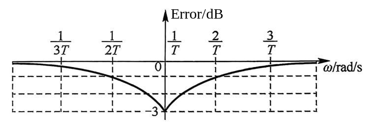

##### First-Order Lead Factor

For

$$
G(s)=Ts+1
$$

$$
G(j\omega)=1+j\omega T
$$

$$
A(\omega)=\sqrt{1+(\omega T)^2}
$$

$$
\varphi(\omega)=\operatorname{atan2}(\omega T,1)
$$

$$
L(\omega)=20\log_{10}\sqrt{1+(\omega T)^2}
$$

The first-order lead factor is the inverse of the first-order lag factor. Its high-frequency asymptote has slope $20\ \mathrm{dB/dec}$.

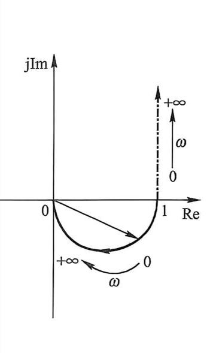

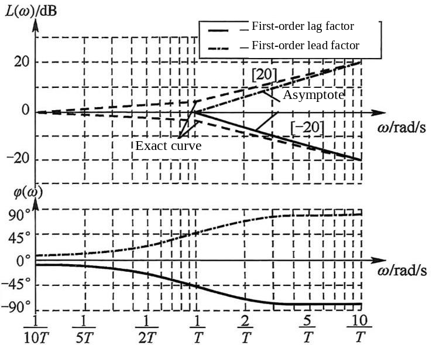

##### Second-Order Factor

A standard second-order factor is

$$
G(s)=\frac{1}{T^2s^2+2\zeta Ts+1}
$$

With $\omega_n=1/T$,

$$
G(j\omega)=\frac{1}{1-(\omega T)^2+j2\zeta\omega T}
$$

$$
A(\omega)=\frac{1}{\sqrt{[1-(\omega T)^2]^2+(2\zeta\omega T)^2}}
$$

$$
L(\omega)=-20\log_{10}\sqrt{[1-(\omega T)^2]^2+(2\zeta\omega T)^2}
$$

The phase is

$$
\varphi(\omega)=-\operatorname{atan2}\left(2\zeta\omega T,1-(\omega T)^2\right)
$$

The low-frequency asymptote is $0\ \mathrm{dB}$, and the high-frequency asymptote has slope $-40\ \mathrm{dB/dec}$. The corner frequency is

$$
\omega_b=\omega_n=\frac{1}{T}
$$

For $0<\zeta<1$, the poles are a complex-conjugate pair and the system is underdamped. A nonzero-frequency resonant peak exists only for

$$
0<\zeta<\frac{1}{\sqrt{2}}
$$

The resonant frequency and resonant peak are

$$
\omega_r=\omega_n\sqrt{1-2\zeta^2}
$$

$$
M_r=\frac{1}{2\zeta\sqrt{1-\zeta^2}}
$$

At the natural frequency,

$$
A(\omega_n)=\frac{1}{2\zeta},\qquad \varphi(\omega_n)=-90^\circ
$$

For small damping, $\omega_r\approx\omega_n$ and $M_r\approx1/(2\zeta)$. Geometrically, as $j\omega$ passes near a complex pole, the corresponding denominator vector becomes short and the magnitude increases. Smaller $\zeta$ places the poles closer to the imaginary axis and produces a higher, sharper resonant peak. For $\zeta\geq1/\sqrt{2}$, the magnitude is largest at $\omega=0$ and decreases monotonically, so there is no nonzero-frequency resonant peak.

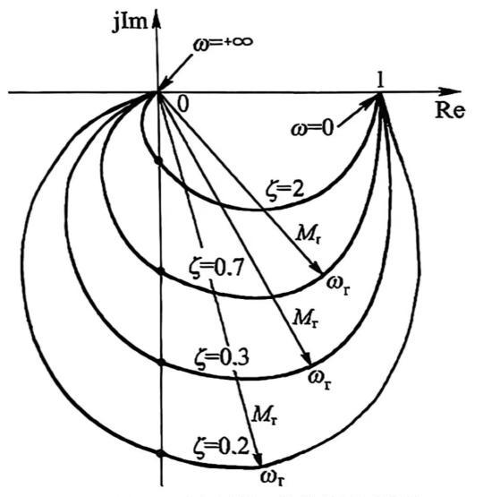

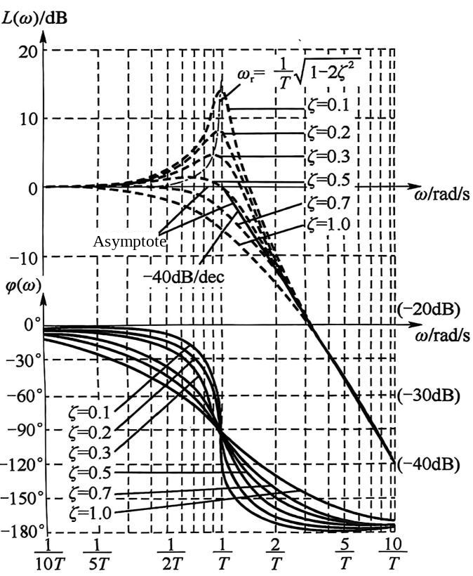

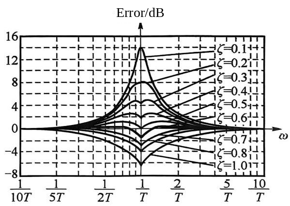

##### Time Delay

For a pure time delay,

$$
G(s)=e^{-\tau s}
$$

$$
G(j\omega)=e^{-j\tau\omega}
$$

$$
A(\omega)=1
$$

$$
\varphi(\omega)=-\tau\omega\quad\text{rad}
$$

$$
L(\omega)=0\ \mathrm{dB}
$$

A time delay changes only the phase. For small $\tau\omega$,
$$
e^{-j\tau\omega}\approx 1-j\tau\omega\approx\frac{1}{1+j\tau\omega}
$$

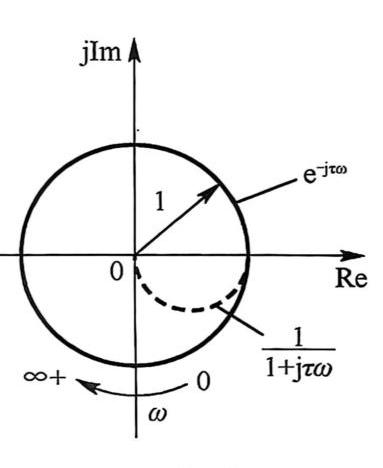

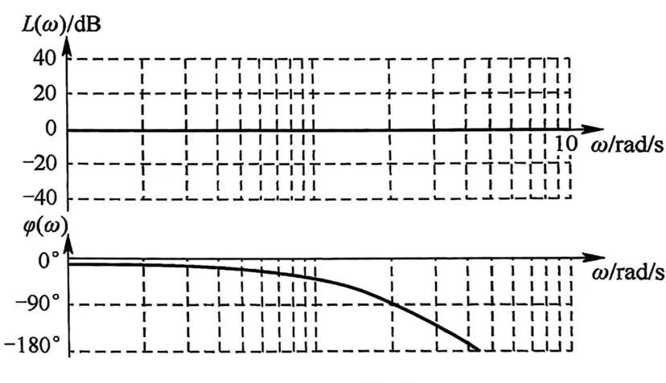

### Bode Plot Construction

##### Magnitude Plot

For an open-loop transfer function

$$
L(s)=G(s)H(s)=\frac{K\prod_{j=1}^{m}(\tau_js+1)}{s^\nu\prod_{i=1}^{n-\nu}(T_is+1)}
$$

The low-frequency asymptote is

$$
L_{\mathrm{low}}(\omega)=20\log_{10}K-20\nu\log_{10}\omega
$$

The initial slope is $-20\nu\ \mathrm{dB/dec}$. At $\omega=1$, $L_{\mathrm{low}}(1)=20\log_{10}K$. For $\nu>0$, the low-frequency asymptote crosses $0\ \mathrm{dB}$ at $\omega=K^{1/\nu}$.

Each factor changes the slope after its corner frequency.

| factor | slope change |
|---|:---|
| $Ts+1$ | $+20\ \mathrm{dB/dec}$ |
| $\dfrac{1}{Ts+1}$ | $-20\ \mathrm{dB/dec}$ |
| second-order zero factor | $+40\ \mathrm{dB/dec}$ |
| second-order pole factor | $-40\ \mathrm{dB/dec}$ |

At high frequency, if the open-loop transfer function has $n$ poles and $m$ zeros, the final slope is

$$
-20(n-m)\ \mathrm{dB/dec}
$$

The gain crossover frequency is defined by

$$
L(\omega_{gc})=0\ \mathrm{dB}
$$

##### Phase Plot

The phase curve is obtained by adding the phase contribution of each factor. For the standard left-half-plane factors listed below, $T>0$ and $\zeta>0$.

| factor | phase change |
|---|---|
| first-order zero $Ts+1$ | $0^\circ$ to $90^\circ$ |
| first-order pole $1/(Ts+1)$ | $0^\circ$ to $-90^\circ$ |
| second-order zero factor | $0^\circ$ to $180^\circ$ |
| second-order pole factor | $0^\circ$ to $-180^\circ$ |

For a first-order factor, the phase is $\pm45^\circ$ at the corner frequency. For a second-order factor, the phase is $\pm90^\circ$ at the corner frequency.

### Open-Loop Frequency Characteristics

##### Nyquist Plot

For

$$
L(s)=G(s)H(s)
$$

The positive-frequency branch of the Nyquist plot is the polar plot of $L(j\omega)$ as $\omega$ varies from $0$ to $\infty$. For stability analysis, the complete Nyquist plot is the mapping of the complete Nyquist contour, including the negative-frequency branch and any required small indentations around imaginary-axis poles.

If

$$
L(s)=\frac{K\prod_{j=1}^{m}(\tau_js+1)}{s^\nu\prod_{i=1}^{n-\nu}(T_is+1)}
$$

then at low frequency

$$
L(j\omega)\approx\frac{K}{(j\omega)^\nu}=\frac{K}{\omega^\nu}\angle(-90^\circ\nu)
$$

Thus the starting behavior is

| type $\nu$ | low-frequency behavior |
|:---|---|
| $0$ | starts at $K$ on the positive real axis |
| $1$ | starts at infinity along the negative imaginary axis |
| $2$ | starts at infinity along the negative real axis |
| $3$ | starts at infinity along the positive imaginary axis |

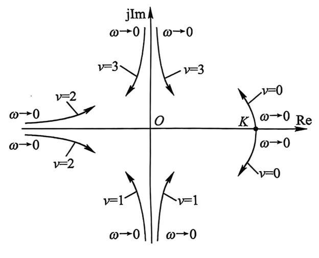

If $n>m$, then at high frequency

$$
L(j\omega)\to 0\angle[-90^\circ(n-m)]
$$

| $n-m$ | approach to the origin |
|:---|---|
| $1$ | tangent to the negative imaginary axis |
| $2$ | tangent to the negative real axis |
| $3$ | tangent to the positive imaginary axis |
| $4$ | tangent to the positive real axis |

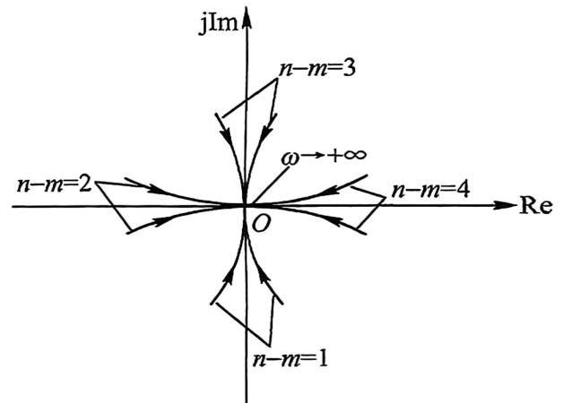

For the middle-frequency part, axis crossings can be found from

$$
\operatorname{Re}[L(j\omega)]=0
$$

$$
\operatorname{Im}[L(j\omega)]=0
$$

A local peak in magnitude satisfies

$$
\frac{dA(\omega)}{d\omega}=0
$$

##### Open-Loop Bode Plot

The open-loop Bode plot gives useful information about the closed-loop system. Low-frequency gain is related to steady-state accuracy. Crossover behavior and phase lag are related to relative stability and transient response.

For a type-$\nu$ system, the low-frequency Bode magnitude slope is $-20\nu\ \mathrm{dB/dec}$. Type $0$ begins with a horizontal line, type I begins with slope $-20\ \mathrm{dB/dec}$, and type II begins with slope $-40\ \mathrm{dB/dec}$.

### Minimum-Phase Systems

A continuous-time transfer function is minimum phase if it is stable, all its finite zeros lie in the open left-half plane, and it contains no pure time delay. A system with such a transfer function is called a minimum-phase system.

A stable transfer function with at least one zero in the closed right-half plane or a pure time-delay factor is nonminimum phase. These factors may have the same magnitude curve as corresponding minimum-phase factors, but they introduce additional phase lag.

A right-half-plane pole makes the system unstable. It also prevents the system from being minimum phase, but it should be distinguished from nonminimum-phase zeros.

### Nyquist Stability Criterion

##### Mapping Relation

For a negative-feedback system,

$$
G_{yr}(s)=\frac{Y(s)}{R(s)}=\frac{G(s)}{1+G(s)H(s)}
$$

Let

$$
L(s)=G(s)H(s)=\frac{M(s)}{N(s)}
$$

The closed-loop characteristic function is

$$
f(s)=1+L(s)=\frac{N(s)+M(s)}{N(s)}
$$

The zeros of $f(s)$ are the closed-loop poles. The poles of $f(s)$ are the open-loop poles.

##### Criterion

Let $P$ be the number of open-loop poles of $L(s)$ in the right-half $s$-plane. Let $N$ be the number of counterclockwise encirclements of $(-1,j0)$ by the complete Nyquist plot of $L(s)$.

Then the number of closed-loop poles in the right-half plane is

$$
Z=P-N
$$

The closed-loop system is stable if and only if

$$
Z=0
$$

Equivalently, the Nyquist plot must encircle $(-1,j0)$ counterclockwise exactly $P$ times.

Here $N$ is defined as the number of counterclockwise encirclements of $(-1,j0)$. With the opposite convention, where clockwise encirclements are positive, the relation is written as

$$
Z=P+N
$$

If the open-loop system is stable, then $P=0$. The closed-loop system is stable if the Nyquist plot neither encircles nor passes through $(-1,j0)$. If the plot passes through $(-1,j0)$, the closed-loop characteristic equation has at least one root on the imaginary axis and the system is on the stability boundary. It is marginally stable only if the imaginary-axis roots are simple and all remaining closed-loop poles lie in the open left-half $s$-plane.

##### Imaginary-Axis Poles

If $L(s)$ has poles on the imaginary axis, the Nyquist contour is indented to the right of those poles. Integral poles at the origin are handled by the modified contour, and the same encirclement relation is then applied.

##### Example

Consider a type-II ($\nu=2$) minimum-phase system with no open-loop poles in the right-half plane, so $P=0$. As $\omega$ varies from $0^+$ to $+\infty$, the possible positive-frequency branches of the open-loop Nyquist plot are shown below.

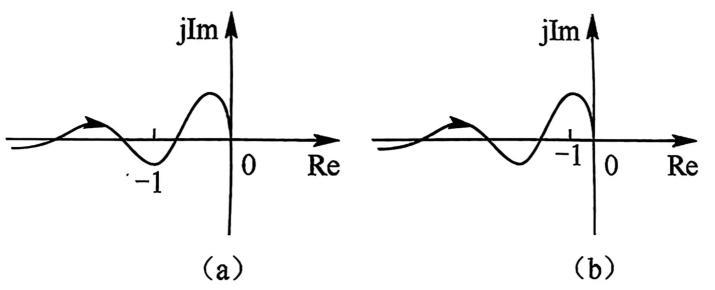

The corresponding complete Nyquist plots are obtained as $\omega$ varies from $-\infty$ to $+\infty$, including the negative-frequency branch and the infinite-radius arc introduced by the two poles at the origin.

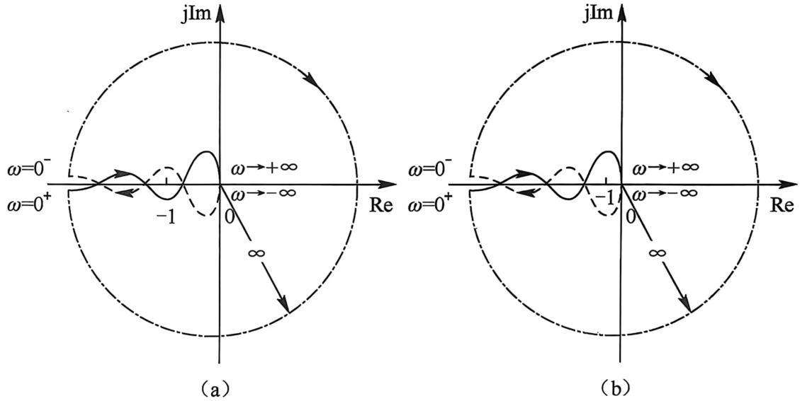

In case (a), the Nyquist plot does not encircle $(-1,j0)$. Therefore, $N=0$ and

$$
Z=P-N=0
$$

so the closed-loop system is stable.

In case (b), the Nyquist plot encircles $(-1,j0)$ twice in the clockwise direction. With counterclockwise encirclements defined as positive, $N=-2$, and therefore

$$
Z=P-N=0-(-2)=2
$$

The closed-loop system has two poles in the right-half plane and is unstable.
