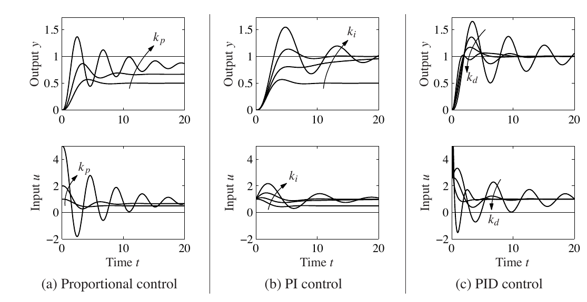

# PID Control

[toc]

### Controller Form

##### Continuous Form

For a negative-feedback system, the control error is

$$
e(t)=r(t)-y(t)
$$

The ideal parallel-form PID control law is

$$
u(t)=K_pe(t)+K_i\int_0^t e(\tau)\,\mathrm{d}\tau+K_d\frac{\mathrm{d}e(t)}{\mathrm{d}t}
$$

Under zero initial conditions, the controller transfer function is

$$
C(s)=\frac{U(s)}{E(s)}=K_p+\frac{K_i}{s}+K_ds
$$

For $K_p\ne0$, an equivalent ideal time-constant form is

$$
C(s)=K_p\left(1+\frac{1}{T_is}+T_ds\right)
$$

where

$$
K_i=\frac{K_p}{T_i},\qquad K_d=K_pT_d
$$

##### Control Actions

| action | term | parameter | principal effect |
|---|---|---|---|
| proportional | $K_pe(t)$ | $K_p$ | reacts to the present error and increases the control effort as the error increases |
| integral | $K_i\displaystyle\int_0^t e(\tau)\,\mathrm{d}\tau$ | $K_i$ | accumulates past error and improves steady-state accuracy |
| derivative | $K_d\dfrac{\mathrm{d}e(t)}{\mathrm{d}t}$ | $K_d$ | reacts to the rate of change of error and adds damping to the transient response |

Increasing $K_p$ generally makes the response faster but may increase overshoot. Increasing $K_i$ reduces steady-state error but may increase overshoot and settling time. Increasing $K_d$ often reduces overshoot, but its effect depends on the plant and closed-loop pole locations.

##### Controller Types

| controller | transfer function | common purpose |
|---|---|---|
| P | $C(s)=K_p$ | simple control when some steady-state error is acceptable or the plant already contains integral action |
| PI | $C(s)=K_p+\dfrac{K_i}{s}$ | zero steady-state error for a step input when the closed loop is stable and the integrator is not canceled |
| PID | $C(s)=K_p+\dfrac{K_i}{s}+K_ds$ | combines steady-state accuracy with additional transient-response shaping |

A derivative term is not always required. PI control is widely used when steady-state accuracy is the main requirement, while PID control is used when both steady-state and transient performance must be adjusted.

The figure compares the output response and control input for proportional, PI, and PID control as the corresponding gain is varied. Proportional control retains a steady-state offset, integral action removes the offset, and derivative action increases damping but can produce a larger initial control effort.

### System Effects

##### Time Response

The principal step-response specifications are rise time $t_r$, maximum overshoot $M_p$, settling time $t_s$, and steady-state error $e_{ss}$.

| gain increase | rise time | overshoot | settling time | steady-state error |
|---|---|---|---|---|
| $K_p$ | usually decreases | usually increases | may increase or decrease | decreases but is not generally eliminated |
| $K_i$ | usually decreases | usually increases | usually increases | eliminated for a step input under the stated stability conditions |
| $K_d$ | usually changes little | usually decreases | usually decreases | no direct effect |

These trends are qualitative rather than universal. PID gains move the closed-loop poles, so the final response depends on the plant and the complete feedback system.

##### Steady-State Error

For a unity negative-feedback system with plant $G(s)$ and controller $C(s)$,

$$
E(s)=\frac{R(s)}{1+C(s)G(s)}
$$

Assuming zero initial conditions and that the final value theorem applies, for a unit-step input,

$$
e_{ss}=\lim_{s\to0}sE(s)=\lim_{s\to0}\frac{1}{1+C(s)G(s)}
$$

With proportional control and finite plant DC gain $G(0)$,

$$
e_{ss}=\frac{1}{1+K_pG(0)}
$$

Thus, increasing $K_p$ reduces the step steady-state error but does not generally make it zero. A PI or PID controller with $K_i\ne0$ contains an integrator, so its DC gain becomes infinite. If the closed loop is stable and the integrator is not canceled, the step steady-state error is

$$
e_{ss}=0
$$

An uncanceled integrator increases the system type by one. This improves low-frequency tracking, but zero error for a ramp input requires sufficient total integral action in the loop.

##### Pole–Zero Form

The ideal PID transfer function can be written as

$$
C(s)=\frac{K_ds^2+K_ps+K_i}{s}
$$

For $K_i\ne0$, it contains a pole at the origin. For $K_d\ne0$, it has up to two zeros given by

$$
z_{1,2}=\frac{-K_p\pm\sqrt{K_p^2-4K_dK_i}}{2K_d}
$$

For a PI controller with $K_p\ne0$,

$$
C(s)=K_p\frac{s+K_i/K_p}{s}
$$

so it has one pole at the origin and one zero at

$$
z=-\frac{K_i}{K_p}
$$

The pole at the origin raises the low-frequency gain and improves steady-state accuracy. The controller zeros reshape the root locus and influence the closed-loop damping and response speed.

### Discrete Control

##### Position Form

With sampling period $T_s$, let

$$
e[k]=r[k]-y[k]
$$

A basic discrete PID implementation is

$$
u[k]=K_pe[k]+K_iT_s\sum_{j=0}^{k}e[j]+K_d\frac{e[k]-e[k-1]}{T_s}
$$

Equivalently, the integral state may be updated recursively

$$
I[k]=I[k-1]+K_iT_se[k]
$$

$$
u[k]=K_pe[k]+I[k]+K_d\frac{e[k]-e[k-1]}{T_s}
$$

##### Increment Form

The change in controller output is

$$
\Delta u[k]=u[k]-u[k-1]
$$

For the same rectangular integration and backward-difference derivative,

$$
\begin{aligned}
\Delta u[k]
={}&K_p\bigl(e[k]-e[k-1]\bigr)+K_iT_se[k]+\frac{K_d}{T_s}\bigl(e[k]-2e[k-1]+e[k-2]\bigr)
\end{aligned}
$$

Then

$$
u[k]=u[k-1]+\Delta u[k]
$$

##### Sampling Period

The sampling period must be included in both the integral and derivative terms. A smaller $T_s$ gives more frequent control updates, while a sampling period that is too large introduces additional delay and may degrade stability and transient performance.

The controller gains and $T_s$ form one design. Changing the sampling period without checking the discrete controller changes the effective integral and derivative actions.

##### Practical Improvements

Actuator saturation can keep the error nonzero even though the control output cannot increase further. Continued integration then causes integrator windup, which can increase overshoot and delay recovery from saturation.

**Integral clamping** limits the integral contribution to a prescribed range

$$
I_{\mathrm{raw}}[k]=I[k-1]+K_iT_se[k]
$$

$$
I[k]=\operatorname{clip}\left(I_{\mathrm{raw}}[k],I_{\min},I_{\max}\right)
$$

The bounds should be consistent with the available control effort. Limiting only the final output does not prevent the internal integral state from continuing to grow.

**Integral separation**, also called error-based conditional integration, enables integral action only when the error is sufficiently small
$$
I[k]=
\begin{cases}
I[k-1]+K_iT_se[k], & |e[k]|\le e_{\mathrm{sep}}\\
I[k-1], & |e[k]|>e_{\mathrm{sep}}
\end{cases}
$$

This reduces integral buildup during startup or large transients while retaining integral action near the setpoint to remove steady-state error. A threshold that is too small may prevent effective integral correction.

**Derivative on measurement** applies derivative action to the measured output rather than to the error
$$
D[k]=-K_d\frac{y[k]-y[k-1]}{T_s}
$$

Because differentiating $e[k]=r[k]-y[k]$ includes the setpoint change, a step in $r[k]$ can produce a derivative kick. Derivative on measurement avoids this setpoint-induced kick but remains sensitive to measurement noise, so practical derivative action is commonly filtered.

### Basic Tuning

##### Manual Tuning

A practical basic procedure is

1. Set $K_i=0$ and $K_d=0$.
2. Increase $K_p$ until the response is sufficiently fast without unacceptable oscillation.
3. Increase $K_i$ gradually until the required steady-state accuracy is obtained.
4. Add $K_d$ only when additional damping or overshoot reduction is needed.
5. Recheck rise time, overshoot, settling time, steady-state error, and stability after each change.

Only one gain should be changed at a time during the first tuning pass. The final gains are a compromise among response speed, overshoot, accuracy, and robustness.

##### Ultimate-Gain Rule

For the classical Ziegler–Nichols closed-loop method, set $K_i=K_d=0$ and increase the proportional gain until sustained oscillation occurs. Let $K_u$ be the ultimate gain and $T_u$ the oscillation period.

| controller | $K_p$ | $T_i$ | $T_d$ |
|---|---:|---:|---:|
| P | $0.5K_u$ | — | — |
| PI | $0.45K_u$ | $T_u/1.2$ | — |
| PID | $0.6K_u$ | $T_u/2$ | $T_u/8$ |

For the parallel form,

$$
K_i=\frac{K_p}{T_i},\qquad K_d=K_pT_d
$$

These values are initial estimates rather than final settings. The method often gives an aggressive response, so the gains should be refined according to the required performance and stability margin.
