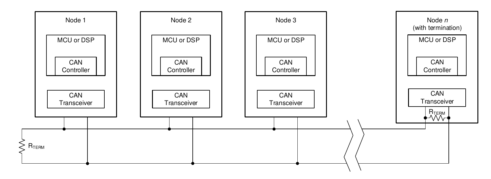
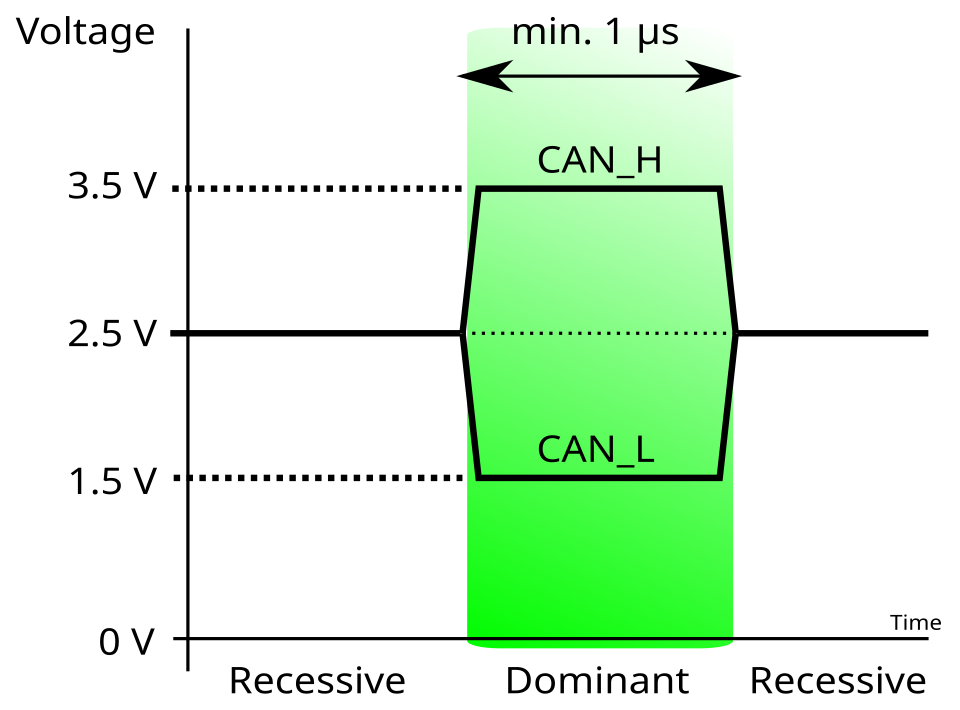
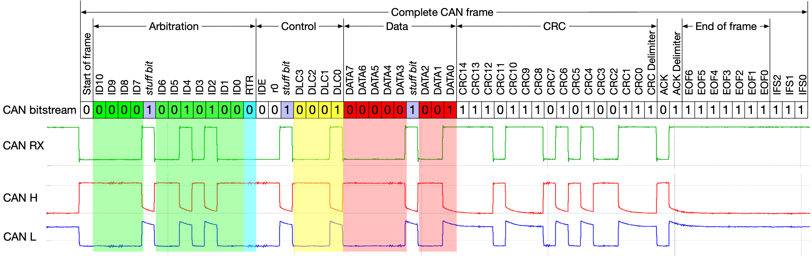

# Controller Area Network (CAN)

[toc]

## Bus

Controller Area Network (CAN) is a message-based serial communication system for reliable multi-node networks. A node normally contains

| Part | Function |
|---|---|
| Microcontroller Unit (MCU) | Runs the application |
| CAN controller | Creates and checks frames, performs arbitration, bit timing, acknowledgment, filtering, and error handling |
| CAN transceiver | Converts logic-level Transmit Data (TXD) and Receive Data (RXD) to CAN High (CAN_H) and CAN Low (CAN_L) |

*Each node connects through a CAN transceiver to the same linear bus. Termination is placed at the two physical ends.*

CAN is broadcast and message-oriented. The identifier represents message meaning and arbitration priority; it is not inherently a source or destination address. Acceptance filters determine which valid frames are stored for software.

High-speed CAN uses dominant and recessive states. Dominant normally represents logic `0` and overrides recessive logic `1`.

$$
V_{\text{diff}}
=
V_{\text{CAN\_H}}-V_{\text{CAN\_L}}
$$

A high-speed bus normally uses a linear twisted pair with a termination resistor at each physical end, commonly $120\ \Omega$ each. With power removed,

$$
R_{\text{measured}}
=
120\ \Omega\parallel120\ \Omega
\approx
60\ \Omega
$$

Stubs should be short. Star wiring, long branches, and termination at every node create signal-integrity problems.

## Frame Types

Classical CAN defines four frame types

| Frame | Function |
|---|---|
| Data frame | Carries 0 to 8 data bytes |
| Remote frame | Requests the Data Frame associated with an identifier |
| Error frame | Signals a detected protocol error and invalidates the current frame |
| Overload frame | Delays the next Data or Remote Frame |

A standard-format Classical CAN Data Frame contains

| Field | Length | Function |
|---|---:|---|
| Start of Frame (SOF) | 1 bit | Marks frame start and provides hard synchronization |
| Identifier | 11 bits | Message identity and arbitration priority |
| Remote Transmission Request (RTR) | 1 bit | Dominant for a Data Frame; recessive for a Remote Frame |
| Identifier Extension (IDE) | 1 bit | Selects standard or extended format |
| Reserved bit | 1 bit | Reserved protocol bit |
| Data Length Code (DLC) | 4 bits | Encodes data length |
| Data | 0–8 bytes | Application payload |
| Cyclic Redundancy Check (CRC) sequence | 15 bits | Detects frame corruption |
| CRC delimiter | 1 bit | Recessive delimiter |
| Acknowledge (ACK) slot | 1 bit | Valid receivers overwrite the transmitter's recessive bit with dominant |
| ACK delimiter | 1 bit | Recessive delimiter |
| End of Frame (EOF) | 7 bits | Recessive frame ending |

The frame ends with EOF. It is followed by an Intermission of three recessive bits before another node may start a Data or Remote Frame.

The extended format uses a 29-bit identifier. Standard and extended frames can share a bus, but arbitration also includes control bits, not only the numerical identifier.

A Remote Frame has no Data Field. It uses the identifier of the requested Data Frame, and its DLC indicates the expected data length. If a Data Frame and Remote Frame with the same identifier start together, the Data Frame wins at the RTR bit. Remote Frames are not supported by CAN Flexible Data-Rate (CAN FD).

CAN FD carries up to $64$ data bytes and may use a higher bit rate in the data phase. Its frame format, CRC, and stuffing rules differ from Classical CAN.

## Bit Stuffing and Timing

Classical CAN uses Non-Return-to-Zero (NRZ) coding. In Data and Remote Frames, bit stuffing applies from SOF through the final bit of the CRC sequence.

After five consecutive transmitted bits of the same value, the transmitter inserts one complementary stuff bit. The receiver removes it before interpreting the frame. Six consecutive equal bits in the stuffed region indicate a stuff error.

The CRC delimiter, ACK field, and EOF have fixed formats and are not dynamically bit-stuffed.

$$
N_{\text{wire}}
=
N_{\text{frame without stuff}}
+
N_{\text{stuff}}
$$

Bit stuffing provides edges for synchronization and makes an Active Error Flag, which begins with six dominant bits, violate the normal frame rule.

CAN nodes do not share a clock line. Each node uses a local oscillator and divides one nominal bit into Time Quanta (TQ).

| Segment | Function |
|---|---|
| Synchronization Segment | Contains the expected edge and is one TQ |
| Propagation Segment | Compensates for bus and transceiver delay |
| Phase Segment 1 | May be lengthened during resynchronization |
| Phase Segment 2 | May be shortened during resynchronization |

$$
T_{\text{bit}}
=
T_{\text{Sync}}
+
T_{\text{Prop}}
+
T_{\text{Phase1}}
+
T_{\text{Phase2}}
$$

$$
R_{\text{bit}}
=
\frac{1}{N_{\text{TQ}}T_{\text{TQ}}}
$$

The sample point is normally at the end of Phase Segment 1. Hard synchronization occurs at SOF. Later edges may resynchronize the receiver by an amount limited by the Synchronization Jump Width (SJW).

All nodes must use the same nominal bit rate and compatible sample points. Oscillator tolerance, transceiver delay, cable length, and stub length limit the usable bit rate and bus length.

## Arbitration and ACK

Several nodes may begin transmitting when the bus is idle. Each transmitter compares the bit it sends with the observed bus state.

| Transmitted | Observed | Result during arbitration |
|---|---|---|
| Dominant `0` | Dominant `0` | Continue |
| Recessive `1` | Recessive `1` | Continue |
| Recessive `1` | Dominant `0` | Lose arbitration and stop transmitting |

The winning frame is not corrupted. For standard Data Frames, the lower binary identifier normally wins because it sends a dominant bit at the first differing identifier position.

A normal transmission is

| Step | Operation |
|---:|---|
| 1 | Software supplies identifier, frame type, DLC, and payload |
| 2 | The controller waits for an idle bus and starts transmission |
| 3 | Competing transmitters perform bitwise arbitration |
| 4 | The winner transmits the remaining fields, stuff bits, and CRC |
| 5 | Receivers check stuffing, format, and CRC |
| 6 | Every protocol-valid receiver drives the ACK slot dominant |
| 7 | The transmitter reports success or retries after an error when automatic retransmission is enabled |

ACK proves that at least one other active node received a protocol-valid frame. It does not identify the receiver and does not prove that application software processed the message. Acceptance filtering normally occurs after protocol validation and does not prevent ACK.

## Errors and Software Use

CAN checks frames using bit monitoring, stuff checking, CRC checking, form checking, and ACK checking.

| Check | Error condition |
|---|---|
| Bit error | A transmitter observes a different bus state outside arbitration and ACK exceptions |
| Stuff error | The bit-stuffing rule is violated |
| CRC error | Received and calculated CRC values differ |
| Form error | A fixed-format field has an invalid level |
| ACK error | The transmitter does not observe a dominant ACK |

A node detecting an error transmits an Error Frame. An error-active node sends an Active Error Flag beginning with six dominant bits, causing every node to discard the corrupted frame. The transmitter normally retries after the error delimiter and required bus-idle interval.

Each node maintains a Transmit Error Counter (TEC) and Receive Error Counter (REC).

| State | Condition | Behavior |
|---|---|---|
| Error active | TEC and REC are below $128$ | May send an Active Error Flag |
| Error passive | TEC or REC is at least $128$ | Sends a Passive Error Flag and follows additional restrictions |
| Bus off | TEC is greater than $255$ | Stops participating in bus communication |

A CAN controller normally exposes bit-timing configuration, identifier filters, transmit storage, receive storage, status/interrupt flags, and error counters. Exact register and message-memory names are controller-specific and are not part of the CAN protocol.

A CAN frame carries raw bytes. Byte order, signedness, scaling, units, update rate, timeout, and identifier meaning are defined by the application or a higher-level protocol such as CANopen or J1939.

Common faults are missing or excessive termination, star wiring, long stubs, mismatched bit timing, incorrect transceiver standby control, and connecting logic-level controller pins directly to CAN_H/CAN_L without a transceiver.
