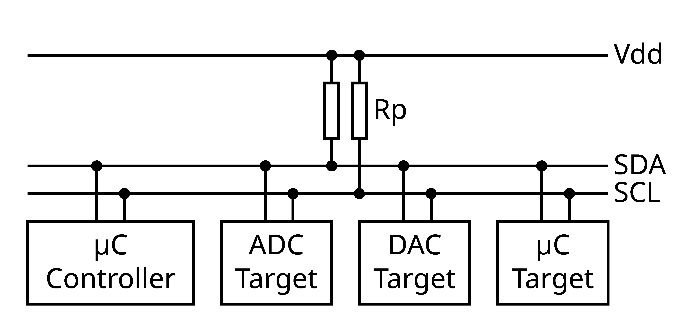
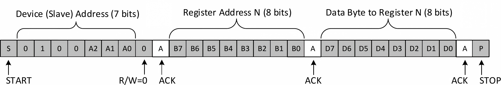
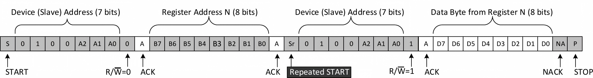

# Inter-Integrated Circuit (I²C)

[toc]

## Bus

Inter-Integrated Circuit (I²C) is a synchronous, shared, two-wire serial bus using Serial Data (SDA) and Serial Clock (SCL). `I2C` and `IIC` are common plain-text spellings.

Official terminology uses controller and target. Older documents may use master and slave.

| Role | Function |
|---|---|
| Controller | Starts and ends transfers, generates SCL, and selects a target address |
| Target | Responds after its address is selected |
| Transmitter | Places address or data bits on SDA |
| Receiver | Samples SDA and generates Acknowledge (ACK) or Not Acknowledge (NACK) |

During a write, the controller is normally the transmitter. During a read, the controller still generates SCL, while the target transmits data.

*One controller and multiple targets share SDA and SCL. Each line has one bus pull-up resistor.*

SDA and SCL use open-drain or open-collector outputs. A device either pulls a line low or releases it; the pull-up resistor returns the released line high.

With released output represented by `1` and pulled-low output represented by `0`, the shared line performs a wired-AND function

$$
B_{\text{bus}}
=
B_1\land B_2\land\cdots\land B_n
$$

One low output therefore forces the bus low. This property enables ACK, clock stretching, clock synchronization, and arbitration.

The pull-up resistance $R_p$ and bus capacitance $C_b$ determine the rising edge

$$
\tau
=
R_pC_b
$$

A pull-up that is too large gives a slow rise time. A pull-up that is too small increases sink current. The device datasheets and required bus speed determine the acceptable range.

| Mode | Maximum SCL frequency |
|---|---:|
| Standard-mode (Sm) | $100\ \text{kHz}$ |
| Fast-mode (Fm) | $400\ \text{kHz}$ |
| Fast-mode Plus (Fm+) | $1\ \text{MHz}$ |

## Transfer Format

A high-to-low SDA transition while SCL is high is a START condition. A low-to-high SDA transition while SCL is high is a STOP condition. A repeated START begins another transfer without releasing the bus.

Except for START and STOP, SDA must remain stable while SCL is high and normally changes while SCL is low.

Each byte contains eight bits transmitted Most Significant Bit (MSB) first, followed by a ninth SCL pulse for ACK or NACK.

| Clock pulses | Content |
|---|---|
| 1–8 | Address or data byte |
| 9 | ACK or NACK |

During the ninth clock, the transmitter releases SDA. The receiver pulls SDA low for ACK or leaves it high for NACK. The controller generates SCL in both write and read transfers.

For common 7-bit addressing, the first byte after START contains the target address and the Read/Write bit

$$
B_{\text{address}}
=
(A_6A_5A_4A_3A_2A_1A_0R/\overline{W})_2
$$

$R/\overline{W}=0$ selects a write and $R/\overline{W}=1$ selects a read. The target address is the seven bits $A_6$ through $A_0$, not the complete transmitted byte. Ten-bit addressing also exists but is less common in sensor and peripheral connections.

A NACK is observed when no target recognizes the address, when the addressed target is not ready or cannot accept more data, or when a controller-receiver ends a read. In the first case, no target drives the ACK bit low.

## Register Transfers

A register address is not defined by I²C itself. It is device-specific data interpreted by the target.

A typical register write is

| Order | Bus item | Transmitter | ACK generated by |
|---:|---|---|---|
| 1 | START | Controller | — |
| 2 | Target address + Write | Controller | Target |
| 3 | Register address | Controller | Target |
| 4 | Data byte or bytes | Controller | Target |
| 5 | STOP | Controller | — |

A typical register read uses a combined transfer

| Order | Bus item | Purpose |
|---:|---|---|
| 1 | START | Acquire the bus |
| 2 | Target address + Write | Select the target for writing |
| 3 | Register address | Set the target internal address pointer |
| 4 | Repeated START | Change direction without releasing the bus |
| 5 | Target address + Read | Select the target for reading |
| 6 | Data byte or bytes | Target transmits data |
| 7 | NACK after the final byte | End the read |
| 8 | STOP | Release the bus |

The controller sends ACK after each received byte when it wants another byte. Register-address width, automatic address increment, burst length, and byte order are device-specific.

## Clock Stretching and Arbitration

A target may hold SCL low after the controller releases it. This clock stretching delays the next clock-high period. The controller must observe the actual SCL level and wait until it becomes high.

In a multi-controller system, a controller loses arbitration when it releases SDA to transmit high but observes low while SCL is high. It stops transmitting, and the winning message continues without corruption.

Clock synchronization also uses the wired-AND SCL line. The longest low period determines the shared SCL low period, and the shortest high period determines the shared high period.

These mechanisms are unnecessary in a single-controller system, but the electrical open-drain behavior remains the same.

## Software Use

An I²C peripheral normally exposes configuration/timing, transfer control, transmit/receive data, and status/error functions. Exact register names are device-specific and are not part of the I²C specification.

A controller transfer follows this software sequence

| Step | Operation |
|---:|---|
| 1 | Configure timing and the target address |
| 2 | Select write or read direction and request START |
| 3 | Write transmit data or read received data when requested |
| 4 | Check ACK/NACK, transfer-complete, STOP, arbitration-loss, and bus-error status |
| 5 | End with STOP or issue a repeated START for a combined transfer |

Polling is sufficient for short transfers. Interrupts or Direct Memory Access (DMA) can move larger data blocks, but software must still handle NACK, STOP, arbitration loss, and bus errors.

Common faults are missing pull-ups, wrong voltage levels, excessive bus capacitance, an incorrect 7-bit address, applying an address shift twice, and ignoring NACK. A logic analyzer should verify START, address, ACK ownership, repeated START, byte order, and STOP.
