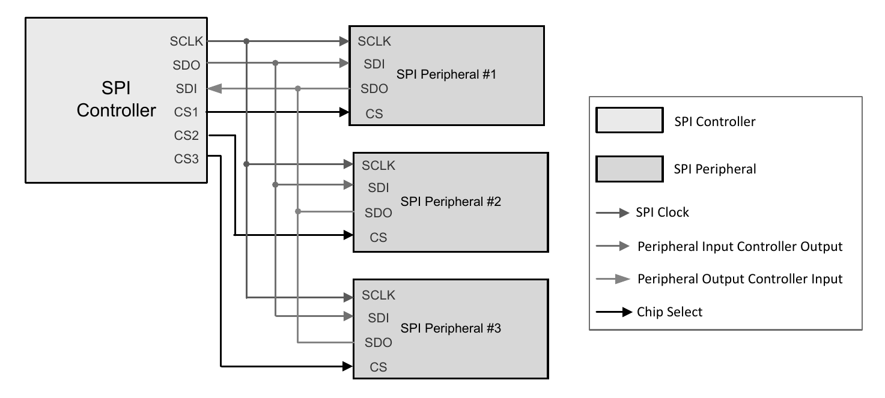
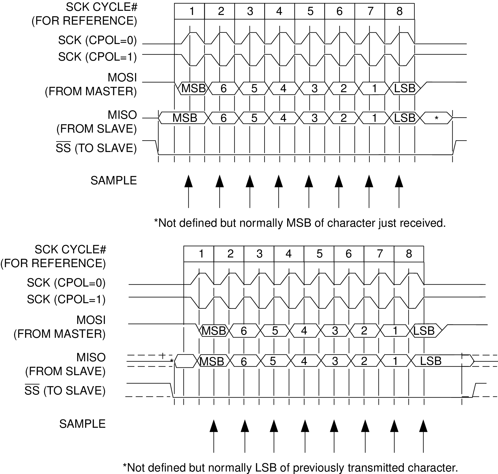

# Serial Peripheral Interface (SPI)

[toc]

## Bus

Serial Peripheral Interface (SPI) is a synchronous serial interface. A controller generates the clock and selects a peripheral. Older documents may use master and slave.

| Signal | Full name | Normal direction |
|---|---|---|
| `SCK` or `SCLK` | Serial Clock | Controller to peripheral |
| `MOSI` or `COPI` | Master Out Slave In, or Controller Out Peripheral In | Controller to peripheral |
| `MISO` or `CIPO` | Master In Slave Out, or Controller In Peripheral Out | Peripheral to controller |
| `CS`, `SS`, or `NSS` | Chip Select or Slave Select | Controller to peripheral |

*The clock and data lines may be shared. Each peripheral normally has a separate chip-select line.*

Chip Select (CS) is commonly active low. A transaction starts when the controller asserts CS and ends when it deasserts CS.

Standard four-wire SPI is full duplex. On each clock cycle, both sides shift one bit

$$
N_{\text{controller bits}}
=
N_{\text{peripheral bits}}
=
N_{\text{SCK cycles}}
$$

SPI does not define a universal frame, address, acknowledgment, checksum, register map, or command set. The peripheral datasheet defines command bits, address fields, dummy clocks, word length, bit order, byte order, response timing, and CS behavior.

## Clock Modes

Clock Polarity (CPOL) selects the idle level of SCK. Clock Phase (CPHA) selects the sampling edge. The table uses the common SPI mode numbering; the peripheral datasheet remains the authority for CPOL and CPHA settings.

| Mode | CPOL | CPHA | SCK idle | Sampling edge |
|---:|---:|---:|---|---|
| 0 | 0 | 0 | Low | Rising |
| 1 | 0 | 1 | Low | Falling |
| 2 | 1 | 0 | High | Falling |
| 3 | 1 | 1 | High | Rising |

When CPHA is `0`, the first data bit must be valid before the first sampling edge. When CPHA is `1`, data changes on the leading edge and is sampled on the trailing edge.

The controller and peripheral must use the same CPOL, CPHA, bit order, word length, and permitted clock frequency.

The ideal raw bit rate in each direction is

$$
R_{\text{bit}}
=
f_{\text{SCK}}
$$

For an $N$-bit word,

$$
T_{\text{word}}
=
\frac{N}{f_{\text{SCK}}}
$$

The actual transaction also includes CS setup/hold time, command and address fields, dummy clocks, and inter-word delays.

## Register Transfers

A typical SPI transaction contains command, address, and data phases, but their exact format is device-specific.

| Phase | MOSI/COPI | MISO/CIPO |
|---|---|---|
| Command/address | Read or write command and register address | Undefined data, previous data, or status |
| Write data | Data to store | Usually undefined |
| Read data | Dummy bits supplied to generate SCK | Requested data |

A common register write is

| Order | Controller action |
|---:|---|
| 1 | Configure mode, bit order, word length, and SCK frequency |
| 2 | Assert CS |
| 3 | Transmit write command and register address |
| 4 | Transmit data byte or bytes |
| 5 | Wait for the final bit to complete and deassert CS |

A common register read is

| Order | MOSI/COPI | MISO/CIPO |
|---:|---|---|
| 1 | Read command and register address | Undefined data or status |
| 2 | Dummy byte or dummy clocks | Requested data |
| 3 | Additional dummy bytes if required | Additional data |

The controller must transmit dummy bits because the peripheral cannot return data without SCK. Data received during the command phase may need to be discarded.

An unselected peripheral must release MISO into a high-impedance state. Bit order and byte order are independent and must both be checked in the peripheral datasheet. Some devices use three-wire half-duplex or daisy-chain connections, but only when explicitly supported.

## Software Use and Errors

An SPI peripheral normally exposes configuration, transmit/receive data, and status/error functions. Exact register names are device-specific and are not part of SPI.

A transfer follows this software sequence

| Step | Operation |
|---:|---|
| 1 | Configure CPOL, CPHA, clock rate, word size, bit order, and CS |
| 2 | Assert the selected peripheral's CS |
| 3 | Write each command, address, dummy, or data word |
| 4 | Read the simultaneously received word |
| 5 | Wait until the final bus transfer is complete |
| 6 | Deassert CS and check errors |

Every transmitted word normally creates a received word. Failing to read received data can cause an overrun. Direct Memory Access (DMA) is useful for displays, memories, converters, and high-rate sensors, but DMA completion may occur before the final SCK edge; CS must remain active until the SPI transfer itself is complete.

SPI has no mandatory ACK or NACK. Communication is commonly checked by reading a fixed identification register, reading back configuration, or checking device status.

| Symptom | Common cause |
|---|---|
| All `1` or all `0` | Wrong CS, wiring, power, or undriven MISO |
| Shifted data | Wrong CPHA, word size, or dummy-clock count |
| Reversed multi-byte value | Byte-order mismatch |
| Errors only at high speed | Excessive SCK frequency or poor timing margin |
| First byte correct, later bytes wrong | Incorrect CS boundary or auto-increment rule |

A logic analyzer should verify CS, SCK, MOSI, MISO, mode, command/address fields, dummy clocks, and transaction boundaries.
