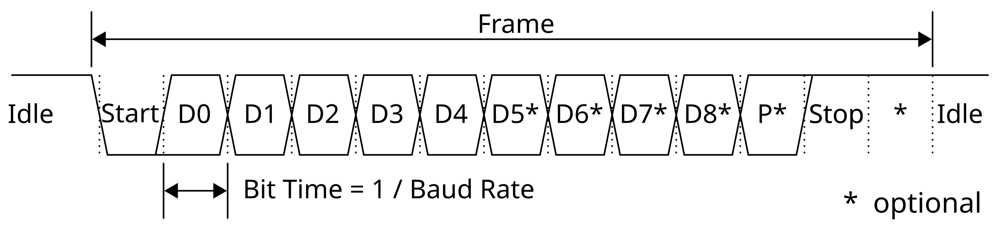
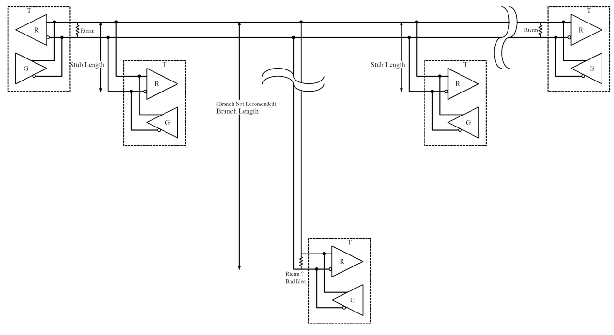

# Universal Asynchronous Receiver/Transmitter (UART)

[toc]

## Frame

Universal Asynchronous Receiver/Transmitter (UART) is an asynchronous serial interface. A basic full-duplex connection uses Transmit (TX), Receive (RX), and a common ground. TX of one device connects to RX of the other device.

UART has no clock line. Both devices must use compatible baud rate, data length, parity, stop-bit, and polarity settings.

In conventional non-inverted UART, the line is high while idle. A character frame contains

| Field | Function | Common form |
|---|---|---|
| Start bit | Marks the beginning of a character | One low bit |
| Data bits | Carry the character | Usually Least Significant Bit (LSB) first |
| Parity bit | Provides limited error detection | Optional even or odd parity |
| Stop bits | End the character and return the line to idle | Usually one or two high bits |

*UART character frame. The exact number of data, parity, and stop bits is configurable.*

The notation `8-N-1` means eight data bits, no parity, and one stop bit.

$$
N_{\text{frame}}
=
N_{\text{start}}
+
N_{\text{data}}
+
N_{\text{parity}}
+
N_{\text{stop}}
$$

For `8-N-1`, $N_{\text{frame}}=10$ bits.

Even parity makes the total number of `1` bits in the data and parity fields even. Odd parity makes it odd. Parity detects every single-bit error and any odd number of changed bits, but it cannot correct errors.

## Baud Rate and Sampling

Baud rate is the number of transmitted symbols per second. Binary UART carries one bit per symbol, so baud rate and bit rate have the same numerical value.

$$
T_{\text{bit}}
=
\frac{1}{R_{\text{baud}}}
$$

$$
T_{\text{frame}}
=
\frac{N_{\text{frame}}}{R_{\text{baud}}}
$$

For `8-N-1` at $115200$ baud,

$$
T_{\text{frame}}
=
\frac{10}{115200}
\approx
86.8\ \mu\text{s}
$$

The maximum continuous payload rate is

$$
R_{\text{payload}}
=
R_{\text{baud}}
\frac{N_{\text{data}}}{N_{\text{frame}}}
$$

For `8-N-1` at $115200$ baud, this is $11520\ \text{byte/s}$.

The receiver detects the start-bit transition and samples later bits near their centers. Oversampling by $8$ or $16$ is common. The allowable baud-rate mismatch depends on frame length, oversampling, clock accuracy, and signal distortion.

## Data Transfer

A transmitter waits until the transmit data path can accept a character, writes the character, and repeats. Before disabling the peripheral or an external line driver, software must wait until the final stop bit has left the TX pin.

A receiver waits for a complete character, reads it, and checks the status flags.

| Status | Meaning |
|---|---|
| Transmit ready | The peripheral can accept another character |
| Transmission complete | The final character has completely left the TX pin |
| Receive ready | A received character is available |
| Parity error | Received parity does not match the configured rule |
| Framing error | The expected stop-bit level was not detected |
| Overrun | New data arrived before previous data was removed |

UART hardware is normally controlled through four functional register groups configuration, baud-rate generation, transmit/receive data, and status/error flags. Exact register names are device-specific and are not part of the UART protocol.

Polling is sufficient for occasional characters. Interrupts or Direct Memory Access (DMA) are more suitable for continuous streams. UART frames individual characters only; packet length, delimiters, checksums, timeouts, and retransmission belong to the application protocol.

Standard input/output redirection can route functions such as `printf()` to UART. The required low-level hook depends on the C library and toolchain. Polling output is blocking, so large debug messages should not run in a time-critical control loop.

## RS-232 and RS-485

Recommended Standard 232 (RS-232) is a single-ended, point-to-point electrical interface. It uses bipolar voltages and inverted logic relative to conventional logic-level UART. A logic-level UART pin must connect through an RS-232 transceiver rather than directly to an RS-232 cable.

Request To Send (RTS) and Clear To Send (CTS) may provide hardware flow control. RS-232 defines electrical signaling and interface conventions; it does not add packet addressing or error recovery to UART.

Recommended Standard 485 (RS-485) is a differential, multipoint electrical interface. UART characters are often transported over RS-485, but RS-485 does not define the UART frame or the application packet.

*Linear RS-485 bus with termination at the two physical ends.*

Most two-wire RS-485 networks are half duplex. Only one driver may actively control the bus at a time. Software enables the driver before transmission and disables it only after UART transmission complete.

A linear bus is normally terminated at both physical ends with resistors close to the cable characteristic impedance, commonly $120\ \Omega$. Long stubs and star wiring should be avoided. Device addressing, message fields, and checksums are supplied by a higher-level protocol such as Modbus Remote Terminal Unit (Modbus RTU).
