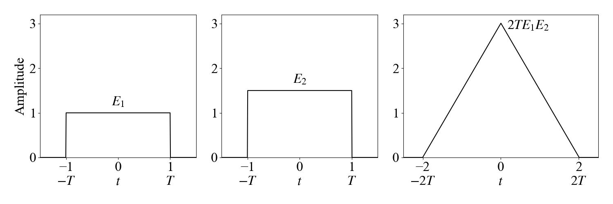
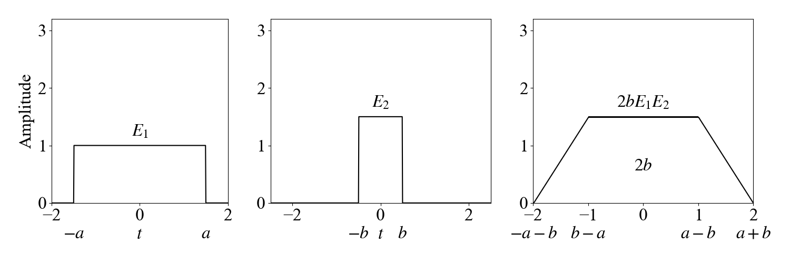

# Convolution

[toc]

### Continuous-Time Convolution

##### Definition and standard shapes

The continuous-time convolution is

$$
(f*g)(t)=\int_{-\infty}^{\infty}f(\tau)g(t-\tau)d\tau
$$

Equal-width rectangular pulses convolve to a triangular pulse

Unequal-width rectangular pulses convolve to a trapezoidal pulse

##### Properties

Commutativity

$$
x_1(t)*x_2(t)=x_2(t)*x_1(t)
$$

Distributivity

$$
x(t)*(h_1(t)+h_2(t))=x(t)*h_1(t)+x(t)*h_2(t)
$$

Associativity

$$
[x(t)*h_1(t)]*h_2(t)=x(t)*[h_1(t)*h_2(t)]
$$

Shifts

$$
x(t-t_1)*h(t-t_2)=y(t-t_1-t_2)
$$

Impulse identities

$$
x(t)*\delta(t)=x(t)
$$

$$
x(t)*\delta(t-t_0)=x(t-t_0)
$$

$$
x(t)*\delta'(t)=x'(t)
$$

Integration and differentiation

$$
x(t)*u(t)=\int_{-\infty}^{t}x(\tau)d\tau
$$

$$
u(t)*\delta'(t)=\delta(t)
$$

$$
\frac{d}{dt}[x_1(t)*x_2(t)]=\frac{dx_1(t)}{dt}*x_2(t)=x_1(t)*\frac{dx_2(t)}{dt}
$$

### Frequency-Domain Convolution Relations

##### Transform-domain products

For CTFT

$$
x(t)*y(t)\xleftrightarrow{\mathcal{F}}X(j\Omega)Y(j\Omega)
$$

$$
x(t)y(t)\xleftrightarrow{\mathcal{F}}\frac{1}{2\pi}X(j\Omega)*Y(j\Omega)
$$

For DTFT

$$
x[n]*y[n]\xleftrightarrow{\mathrm{DTFT}}X(e^{j\omega})Y(e^{j\omega})
$$

$$
x[n]y[n]\xleftrightarrow{\mathrm{DTFT}}\frac{1}{2\pi}X(e^{j\omega})\circledast Y(e^{j\omega})
$$

For Fourier series

$$
\tilde{x}(t)\tilde{y}(t)\xleftrightarrow{\mathrm{CFS}}a_k*b_k
$$

$$
\tilde{x}(t)\circledast\tilde{y}(t)\xleftrightarrow{\mathrm{CFS}}T a_kb_k
$$

For DFS

$$
\tilde{x}[n]\tilde{y}[n]\xleftrightarrow{\mathrm{DFS}}a_k\circledast_N b_k
$$

$$
\tilde{x}[n]\circledast_N\tilde{y}[n]\xleftrightarrow{\mathrm{DFS}}N a_kb_k
$$

### Discrete-Time Linear Convolution

##### Definition and length

The discrete-time convolution is

$$
y[n]=(x*h)[n]=\sum_{k=-\infty}^{\infty}h[k]x[n-k]
$$

If $x[n]$ has length $N_1$ and $h[n]$ has length $N_2$, the linear convolution length is

$$
N_1+N_2-1
$$

The lower and upper indices of the output are the sums of the corresponding lower and upper indices of the inputs

##### Example

For

$$
x[n]=\{1,1,2,-1\}\quad n=-1,0,1,2
$$

$$
h[n]=\{3,2,1,-1\}\quad n=-1,0,1,2
$$

The linear convolution is

$$
y[n]=x[n]*h[n]=\{3,5,9,1,-1,-3,1\}
$$

The same result follows from the table expansion

$$
y[n]=3x[n+1]+2x[n]+x[n-1]-x[n-2]
$$

A direct table method requires $O(N^2)$ operations for length-$N$ sequences. For lengths $N_1$ and $N_2$, the number of products is

$$
N_1N_2
$$

and the number of additions is

$$
N_1N_2-(N_1+N_2-1)
$$

### Correlation

##### Cross-correlation and autocorrelation

Correlation measures similarity under relative shift

$$
r_{xy}[m]=\sum_{n=-\infty}^{\infty}x[n]y^*[n-m]
$$

Equivalently

$$
r_{xy}[m]=x[n]*y^*[-n]\big|_{n=m}
$$

Autocorrelation is

$$
r_x[m]=\sum_{n=-\infty}^{\infty}x[n]x^*[n-m]
$$

For real signals

$$
r_{xy}[m]=r_{yx}[-m]
$$

$$
r_x[m]=r_x[-m]
$$

The autocorrelation value at the origin is the signal energy

$$
r_x[0]=\sum_{n=-\infty}^{\infty}|x[n]|^2
$$

### Circular Convolution

##### Definition

Circular convolution is defined on the periodized versions of finite-length sequences. For two length-$N$ sequences

$$
y_c[n]=x[n]\circledast_N h[n]
$$

$$
y_c[n]=\left[\sum_{k=0}^{N-1}x[k]h[((n-k))_N]\right]R_N[n]
$$

Equivalently

$$
y_c[n]=\left[\sum_{k=0}^{N-1}h[k]x[((n-k))_N]\right]R_N[n]
$$

To make circular convolution equal linear convolution, zero pad both sequences to length $N$ such that

$$
N\ge N_1+N_2-1
$$

Then

$$
x[n]\circledast_N h[n]=x[n]*h[n]
$$

within the chosen principal interval. If $N<N_1+N_2-1$, the linear-convolution result wraps around

$$
y_c[n]=\sum_{r=-\infty}^{\infty}y_l[n-rN]
$$

##### DFT relation

Circular convolution corresponds to multiplication in the DFT domain

$$
x[n]\circledast_N h[n]\xleftrightarrow{\mathrm{DFT}}X[k]H[k]
$$

Pointwise multiplication in time corresponds to circular convolution in frequency

$$
x[n]h[n]\xleftrightarrow{\mathrm{DFT}}\frac{1}{N}X[k]\circledast_N H[k]
$$

The polynomial view writes circular convolution as reduction modulo

$$
M(z)=z^{-N}-1
$$

$$
\tilde{Y}(z)=X(z)H(z)\bmod M(z)
$$

The root-of-unity identity behind circular convolution is

$$
\sum_{k=0}^{N-1}W_N^{mk}=\begin{cases}
N & m=((0))_N\\
0 & m\ne ((0))_N
\end{cases}
$$

##### Example

For

$$
x_1[n]=\{1,2,0,1\}
$$

$$
x_2[n]=\{2,2,1,1\}
$$

Linear convolution gives

$$
x_1[n]*x_2[n]=\{2,6,5,5,4,1,1\}
$$

Four-point circular convolution gives

$$
x_1[n]\circledast_4 x_2[n]=\{6,7,6,5\}
$$

Five-point circular convolution gives

$$
x_1[n]\circledast_5 x_2[n]=\{3,7,5,5,4\}
$$

These circular results can be obtained by wrapping the linear convolution

$$
y_l[n]=\{2,6,5,5,4,1,1\}
$$

For $N=4$

$$
\{2+4,6+1,5+1,5\}=\{6,7,6,5\}
$$

For $N=5$

$$
\{2+1,6+1,5,5,4\}=\{3,7,5,5,4\}
$$
