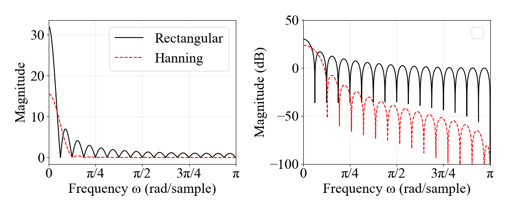
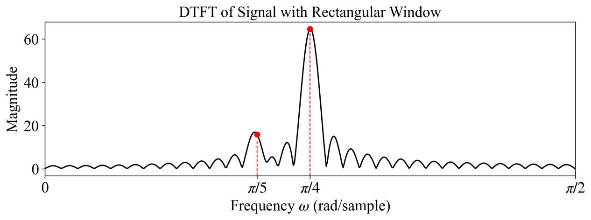
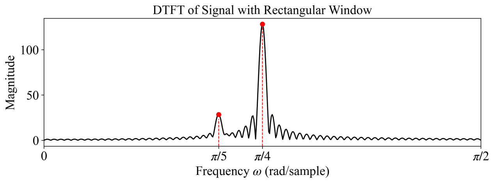
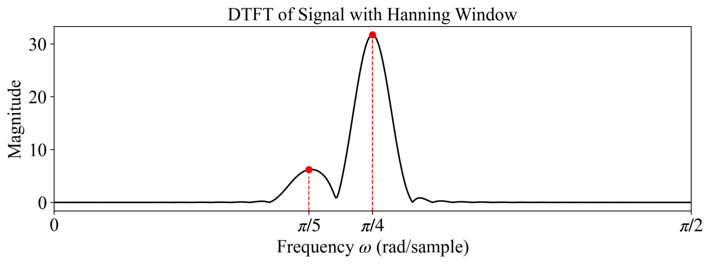
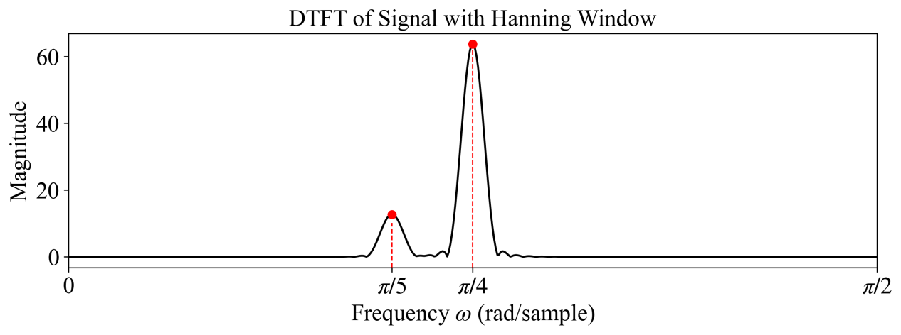

# Discrete Fourier Transform

[toc]

### DFT Definition and Matrix Form

##### Periodic extension and principal value

For a length-$N$ sequence $x[n]$ supported on the principal interval $0\le n\le N-1$ and zero outside that interval, its period-$N$ extension is

$$
\tilde{x}[n]=\sum_{r=-\infty}^{\infty}x[n+rN]=x[((n))_N]
$$

The equality to $x[((n))_N]$ requires that only one shifted copy is nonzero for each $n$; otherwise, the summation represents periodic aliasing.

The principal value is

$$
x[n]=\tilde{x}[n]R_N[n]
$$

The DFT samples one period of the periodic sequence spectrum.

$$
\tilde{X}[k]=\tilde{X}[((k))_N]
$$

The principal value of the periodic spectrum is

$$
X[k]=\tilde{X}[k]R_N[k]
$$

##### DFT and IDFT

Let

$$
W_N=e^{-j2\pi/N}
$$

The $N$-point DFT is

$$
X[k]=\sum_{n=0}^{N-1}x[n]W_N^{nk}=\sum_{n=0}^{N-1}x[n]e^{-j\frac{2\pi}{N}kn}
$$

$$
k=0,1,\ldots,N-1
$$

The IDFT is

$$
x[n]=\frac{1}{N}\sum_{k=0}^{N-1}X[k]W_N^{-nk}=\frac{1}{N}\sum_{k=0}^{N-1}X[k]e^{j\frac{2\pi}{N}kn}
$$

$$
n=0,1,\ldots,N-1
$$

The direct DFT requires $O(N^2)$ operations. Computing all $N$ output samples directly needs

$$
N^2
$$

complex multiplications and

$$
N(N-1)
$$

complex additions.

##### DFT matrix

$$
\boldsymbol{X}=\boldsymbol{W}_N\boldsymbol{x}
$$

$$
\boldsymbol{x}=\frac{1}{N}\boldsymbol{W}_N^H\boldsymbol{X}
$$

where

$$
[\boldsymbol{W}_N]_{k,n}=W_N^{kn}
$$

For $N=4$

$$
\boldsymbol{W}_4=
\begin{bmatrix}
1&1&1&1\\
1&-j&-1&j\\
1&-1&1&-1\\
1&j&-1&-j
\end{bmatrix}
$$

### Relation to DTFT DFS and Z Transform

##### Frequency sampling view

The $N$-point DFT is the Z transform sampled at $N$ equally spaced points on the unit circle.

$$
X[k]=X(z)\big|_{z=W_N^{-k}}
$$

It is also the DTFT sampled on $[0,2\pi)$.

$$
X[k]=X(e^{j\omega})\big|_{\omega=2\pi k/N}
$$

The inverse DFT produces the principal value of the corresponding period-$N$ sequence.

$$
\tilde{x}[n]=\operatorname{IDFT}\{X[k]\}=x[((n))_N]
$$

| Transform | Time-domain signal | Frequency-domain representation |
|---|---|---|
| DTFT | aperiodic discrete sequence | continuous and $2\pi$-periodic |
| DFS | periodic discrete sequence | discrete and periodic |
| Z transform | discrete sequence with ROC | continuous function on the $z$-plane |
| DFT | finite principal value | finite principal value of DFS samples |

The DFT can therefore be viewed as both a sampled DTFT and the principal value of a DFS.

### DFT Properties

##### Circular shift modulation and symmetry

Linearity

$$
ax[n]+bh[n]\xleftrightarrow{\mathrm{DFT}}aX[k]+bH[k]
$$

Circular time shift

$$
x_m[n]=x[((n+m))_N]R_N[n]
$$

$$
x_m[n]\xleftrightarrow{\mathrm{DFT}}W_N^{-mk}X[k]
$$

Modulation

$$
W_N^{nl}x[n]\xleftrightarrow{\mathrm{DFT}}X[((k+l))_N]R_N[k]
$$

Circular convolution

$$
x[n]\circledast_N h[n]\xleftrightarrow{\mathrm{DFT}}X[k]H[k]
$$

Pointwise multiplication

$$
x[n]h[n]\xleftrightarrow{\mathrm{DFT}}\frac{1}{N}X[k]\circledast_N H[k]
$$

Parseval relation

$$
\sum_{n=0}^{N-1}|x[n]|^2=\frac{1}{N}\sum_{k=0}^{N-1}|X[k]|^2
$$

##### Circular conjugate symmetry

A finite sequence can be decomposed into circular conjugate-symmetric and circular conjugate-antisymmetric parts.

$$
x_{ep}[n]=\frac{1}{2}\left(x[((n))_N]+x^*[((N-n))_N]\right)R_N[n]
$$

$$
x_{op}[n]=\frac{1}{2}\left(x[((n))_N]-x^*[((N-n))_N]\right)R_N[n]
$$

They satisfy

$$
x_{ep}[n]=x_{ep}^*[((N-n))_N]R_N[n]
$$

$$
x_{op}[n]=-x_{op}^*[((N-n))_N]R_N[n]
$$

The DFT relation is

$$
x_{ep}[n]\xleftrightarrow{\mathrm{DFT}}\operatorname{Re}\{X[k]\}
$$

$$
x_{op}[n]\xleftrightarrow{\mathrm{DFT}}j\operatorname{Im}\{X[k]\}
$$

For real $x[n]$

$$
X[k]=X^*[((N-k))_N]
$$

Therefore $X[0]$ is real. If $N$ is even, $X[N/2]$ is also real.

##### Computing two real DFTs by one complex DFT

Let $x_1[n]$ and $x_2[n]$ be two real $N$-point sequences. Construct

$$
w[n]=x_1[n]+jx_2[n]
$$

and compute

$$
W[k]=\operatorname{DFT}\{w[n]\}=X_1[k]+jX_2[k]
$$

Then

$$
X_1[k]=\frac{1}{2}\left(W[k]+W^*[((N-k))_N]\right)
$$

$$
X_2[k]=\frac{1}{2j}\left(W[k]-W^*[((N-k))_N]\right)
$$

##### Computing one real $2N$-point DFT by one complex $N$-point DFT

Let $x[n]$ be a real $2N$-point sequence. Split it into even and odd subsequences.

$$
g[n]=x[2n]
$$

$$
h[n]=x[2n+1]
$$

Construct

$$
w[n]=g[n]+jh[n]
$$

After one $N$-point DFT $W[k]$, recover

$$
G[k]=\frac{1}{2}\left(W[k]+W^*[((N-k))_N]\right)
$$

$$
H[k]=\frac{1}{2j}\left(W[k]-W^*[((N-k))_N]\right)
$$

Then the $2N$-point DFT of $x[n]$ is

$$
X[k]=G[((k))_N]+W_{2N}^{k}H[((k))_N]
$$

$$
k=0,1,\ldots,2N-1
$$

### Frequency-Domain Sampling Theory

##### Sampling theorem in frequency

Sampling $X(z)$ on the unit circle produces

$$
\tilde{X}[k]=X(z)\big|_{z=W_N^{-k}}=\sum_{n=-\infty}^{\infty}x[n]W_N^{nk}
$$

The IDFT is the periodized sequence.

$$
\tilde{x}[n]=\operatorname{IDFT}\{\tilde{X}[k]\}=\sum_{r=-\infty}^{\infty}x[n+rN]
$$

If $x[n]$ is confined to one length-$N$ principal interval, so that the shifted copies do not overlap, this reduces to

$$
\tilde{x}[n]=x[((n))_N]
$$

If $x[n]$ has length $M$, exact recovery from frequency samples requires

$$
N\ge M
$$

When $N<M$, time-domain aliasing occurs.

A useful example is a four-point DFT. For

$$
x[n]=\{1,2,3,4\}
$$

with $n=0,1,2,3$

$$
X[0]=10
$$

$$
X[1]=-2+2j
$$

$$
X[2]=-2
$$

$$
X[3]=-2-2j
$$

### DFT-Based Spectrum Analysis

##### Sampling truncation and frequency sampling

The processing chain is

$$
x_a(t)\xrightarrow{t=nT}x[n]\xrightarrow{\text{window}}x[n]R_N[n]\xrightarrow{\text{DFT}}X[k]
$$

The frequency variables satisfy

$$
f_s=\frac{1}{T}
$$

$$
T_p=NT=\frac{1}{\Delta f}
$$

$$
\Delta f=\frac{f_s}{N}=\frac{1}{T_p}
$$

$$
N=T_p f_s
$$

The continuous-time Fourier transform can be approximated at sampled frequencies by

$$
X_a(jk\Omega_0)\approx T\sum_{n=0}^{N-1}x(nT)e^{-jk\Omega_0nT}
$$

$$
X_a(jk\Omega_0)\approx T X[k]
$$

where

$$
\Omega_0=2\pi\Delta f
$$

##### Window effects

The rectangular window has spectrum

$$
W(e^{j\omega})=\frac{\sin(\omega N/2)}{\sin(\omega/2)}e^{-j\omega(N-1)/2}
$$

The approximate main-lobe width is

$$
\Delta\omega\approx\frac{4\pi}{N}
$$

The Hanning window is

$$
w[n]=\frac{1}{2}\left(1-\cos\frac{2\pi n}{N-1}\right)R_N[n]
$$

$$
w[n]=\sin^2\left(\frac{\pi n}{N-1}\right)R_N[n]
$$

Its approximate main-lobe width is

$$
\Delta\omega\approx\frac{8\pi}{N}
$$

Rectangular windows have a narrower main lobe but larger sidelobes. Hanning windows suppress sidelobes but widen the main lobe.

##### Resolution leakage and picket-fence effect

The DFT frequency-bin spacing is controlled by the record length.

$$
\Delta f=\frac{1}{T_p}=\frac{f_s}{N}
$$

Increasing the true record length improves resolution. Zero padding only interpolates the sampled spectrum.

Spectral leakage is caused by time-domain truncation.

$$
\hat{X}(e^{j\omega})=\frac{1}{2\pi}X(e^{j\omega})\circledast W(e^{j\omega})
$$

To reduce leakage, increase the window length or choose a smoother window.

The picket-fence effect means the DFT observes only discrete frequency samples. Increasing DFT length by zero padding makes frequency samples denser but does not improve true resolution.

For a desired resolution bandwidth $F$, practical constraints are

$$
f_s\ge 2f_m
$$

$$
N\ge k\frac{f_s}{F}
$$

$$
T_p\ge \frac{k}{F}
$$

For a rectangular window $k=1$. For a Hanning window a common approximation is $k=1.5$.

The three main errors in DFT spectrum analysis are

| Cause | Effect | Main remedy |
|---|---|---|
| time sampling | spectral aliasing | increase $f_s$ or use an anti-aliasing filter |
| time truncation | spectral leakage | increase record length or use a smoother window |
| frequency sampling | picket-fence effect | zero pad to make frequency samples denser |

