# Digital Signals

[toc]

### Elementary Signals

##### Unit step and unit impulse

The discrete-time unit step and impulse are written as $u[n]$ and $\delta[n]$

$$
u[n]=
\begin{cases}
1 & n\ge 0\\
0 & n<0
\end{cases}
$$

$$
u[n]+u[-n]=1+\delta[n]
$$

For continuous time

$$
\delta(t)=\frac{d u(t)}{dt}
$$

$$
\int_{-\infty}^{t}\delta(\tau)d\tau=u(t)
$$

$$
\int_{-\infty}^{\infty}\delta(\tau)d\tau=1
$$

For discrete time

$$
\delta[n]=u[n]-u[n-1]
$$

$$
\sum_{k=-\infty}^{n}\delta[k]=u[n]
$$

$$
\sum_{k=-\infty}^{\infty}\delta[k]=1
$$

The sifting property is

$$
x(t)\delta(t-t_0)=x(t_0)\delta(t-t_0)
$$

$$
x[n]\delta[n-n_0]=x[n_0]\delta[n-n_0]
$$

For the impulse derivative

$$
\int_{-\infty}^{\infty}x(\tau)\delta'(\tau-t_0)d\tau=-x'(t_0)
$$

$$
x(t)\delta'(t-t_0)=x(t_0)\delta'(t-t_0)-x'(t_0)\delta(t-t_0)
$$

##### Rectangular and sinusoidal sequences

The length-$N$ rectangular sequence is

$$
R_N[n]=u[n]-u[n-N]=
\begin{cases}
1 & 0\le n\le N-1\\
0 & \text{otherwise}
\end{cases}
$$

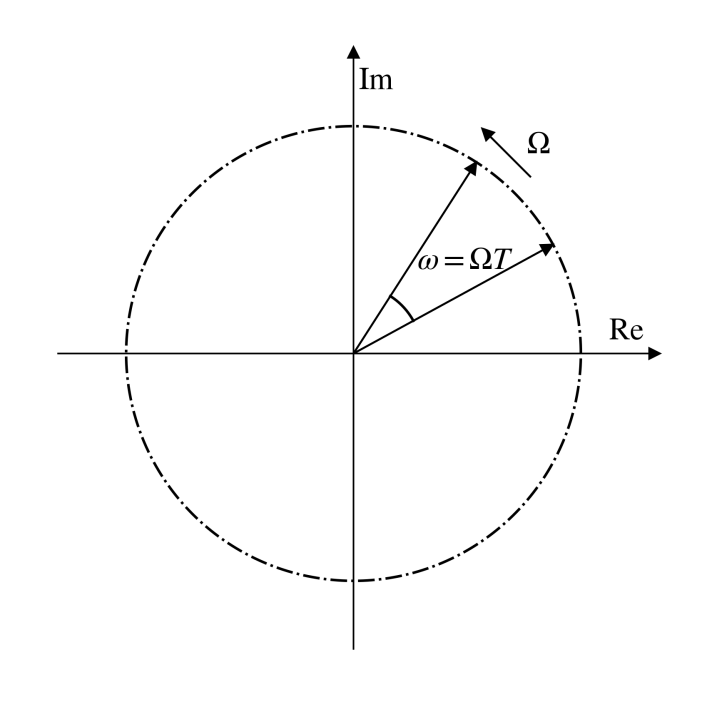

A discrete-time sinusoid sampled from a continuous-time sinusoid satisfies

$$
x[n]=x(t)\big|_{t=nT}=\sin(\Omega nT)=\sin(\omega n)
$$

$$
\omega=\Omega T=\frac{\Omega}{f_s}
$$

The sequence $x[n]=\sin(\omega_0 n)$ is periodic if there are integers $N>0$ and $k$ such that

$$
N\omega_0=2\pi k
$$

If $2\pi/\omega_0=P/Q$ with coprime integers $P,Q$, the fundamental period is $N=P$

For a sampled sinusoid $x[n]=\sin(\Omega_0 nT_s)$, the sequence remains periodic when

$$
\frac{T_s}{T_0}=\frac{\omega_0}{2\pi}
$$

is rational, where $T_0=2\pi/\Omega_0$

$$
x[n]=e^{j\frac{2\pi}{N}n}
$$

is periodic with period $N$, while $x[n]=e^{jn}$ is not periodic

### Time Scaling and Sampling Operations

##### Continuous-time scaling

For $x(t)\rightarrow x(At+B)$, use shift, scale, then reversal according to the sign of $A$

$$
x(t)\rightarrow x(t+B)\rightarrow x(At+B)
$$

Equivalently

$$
x(At+B)=x\left(A\left(t+\frac{B}{A}\right)\right)
$$

If

$$
x(t)\xleftrightarrow{\mathcal{F}}X(j\Omega)
$$

then

$$
x(at)\xleftrightarrow{\mathcal{F}}\frac{1}{|a|}X\left(j\frac{\Omega}{a}\right)
$$

Special cases

$$
\delta(at)=\frac{1}{|a|}\delta(t)
$$

$$
\delta(at+b)=\frac{1}{|a|}\delta\left(t+\frac{b}{a}\right)
$$

For example

$$
y(t)=x(3-2t)=x\left[-2\left(t-\frac{3}{2}\right)\right]
$$

The waveform is reversed, compressed by $2$, and shifted to the right by $3/2$. Its highest angular frequency becomes $2\Omega_m$ if $x(t)$ is bandlimited to $\Omega_m$

If $x[n]\xleftrightarrow{\mathrm{DTFT}}X(e^{j\omega})$, then

$$
e^{-j4\omega}X(e^{-j\omega})\xleftrightarrow{\mathrm{IDTFT}}x[4-n]
$$

For a discrete-time expression such as $x[-3n+2]$, one safe operation order is shift, decimate or interpolate, then reverse

$$
x[n]\rightarrow x[n+2]\rightarrow x[3n+2]\rightarrow x[-3n+2]
$$

##### Discrete-time decimation and expansion

Downsampling by $M$ keeps one sample out of every $M$ samples

$$
y[n]=x[Mn]
$$

Upsampling by $M$ inserts $M-1$ zeros between adjacent samples

$$
y[n]=
\begin{cases}
x[n/M] & n=lM,\quad l\in\mathbb{Z}\\
0 & \text{otherwise}
\end{cases}
$$

For the following cascade, $x_{(2)}[n]$ denotes upsampling by $2$

$$
S_1:y[n]=x_{(2)}[n]
$$

$$
S_2:y[n]=x[n]+\frac{1}{2}x[n-1]+\frac{1}{4}x[n-2]
$$

$$
S_3:y[n]=x[2n]
$$

Let $x_i[n]$ and $y_i[n]$ denote the input and output of $S_i$. Since $x_2[n]=y_1[n]$ and $x_3[n]=y_2[n]$,

$$
\begin{aligned}
y_3[n]
&=x_3[2n]\\
&=y_2[2n]\\
&=x_2[2n]+\frac{1}{2}x_2[2n-1]+\frac{1}{4}x_2[2n-2]\\
&=y_1[2n]+\frac{1}{2}y_1[2n-1]+\frac{1}{4}y_1[2n-2]\\
&=x_1[n]+\frac{1}{4}x_1[n-1]
\end{aligned}
$$

Therefore, the input-output relation is

$$
y[n]=x[n]+\frac{1}{4}x[n-1]
$$

In multirate systems, downsampling may cause aliasing unless the signal is filtered before decimation. Upsampling creates spectral images and is usually followed by an interpolation filter

### Sampling Theory

##### Bandlimited signals

Bandwidth is the effective frequency support of a signal or system

$$
B=f_{\max}-f_{\min}
$$

A lowpass bandlimited signal has support approximately in $|f|\le B$. A bandpass bandlimited signal centered at $f_c$ has support

$$
f_c-\frac{B}{2}\le f\le f_c+\frac{B}{2}
$$

A strictly bandlimited signal cannot be both time-limited and nonzero. Engineering bandlimited signals are usually approximate bandlimited signals

##### Impulse-train sampling

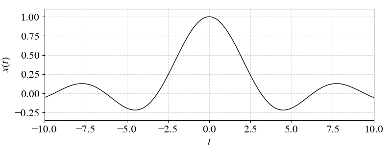

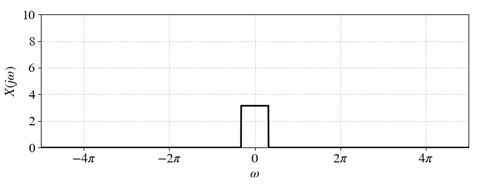

For impulse-train sampling

$$
x_p(t)=x(t)\sum_{n=-\infty}^{\infty}\delta(t-nT)
$$

$$
x_p(t)=\sum_{n=-\infty}^{\infty}x(nT)\delta(t-nT)
$$

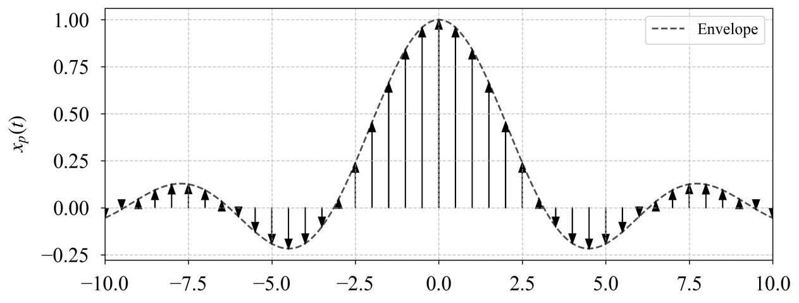

The CTFT is a periodic replication of the original spectrum

$$
X_p(j\Omega)=\frac{1}{T}\sum_{k=-\infty}^{\infty}X\left(j(\Omega-k\Omega_s)\right)
$$

$$
\Omega_s=\frac{2\pi}{T}
$$

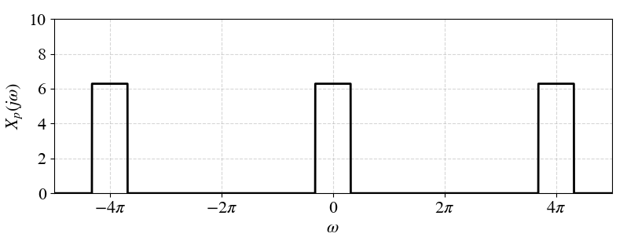

The corresponding discrete-time sequence is

$$
x[n]=x(nT)
$$

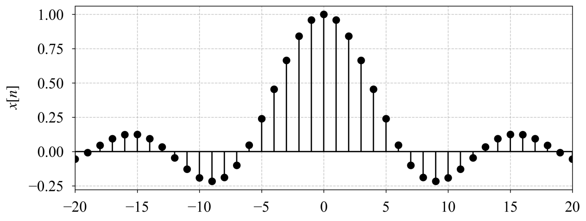

The DTFT is

$$
X(e^{j\omega})=X_p\left(j\frac{\omega}{T}\right)=\frac{1}{T}\sum_{k=-\infty}^{\infty}X\left(j\frac{\omega-2\pi k}{T}\right)
$$

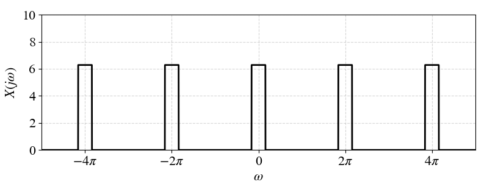

##### Aliasing and sampling rate

Aliasing occurs when shifted spectral copies overlap

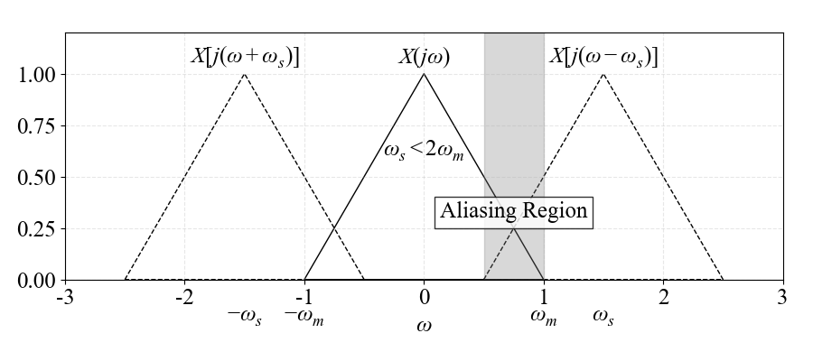

The Nyquist-Shannon sampling condition is

$$
f_s>2f_{\max}
$$

$$
\Omega_s>2\Omega_{\max}
$$

The Nyquist rate is

$$
f_s^{\mathrm{Nyq}}=2f_{\max}
$$

An anti-aliasing filter is an analog lowpass filter before the ADC. It suppresses components above the allowed band before sampling, so that high-frequency components do not fold into the useful band

##### Bandpass sampling

For a narrowband signal with

$$
B=f_H-f_L\ll f_c
$$

bandpass sampling may avoid aliasing with a sampling rate below the lowpass Nyquist rate

For $m=1$

$$
f_s\ge 2f_H
$$

For

$$
2\le m\le \left\lfloor\frac{f_H}{B}\right\rfloor
$$

the allowable range is

$$
\frac{2f_H}{m}\le f_s\le \frac{2f_L}{m-1}
$$

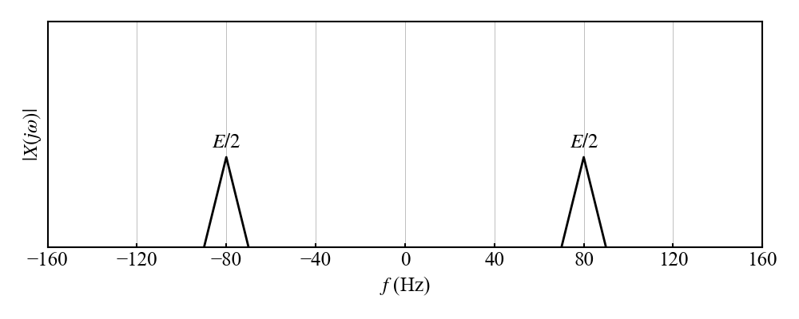

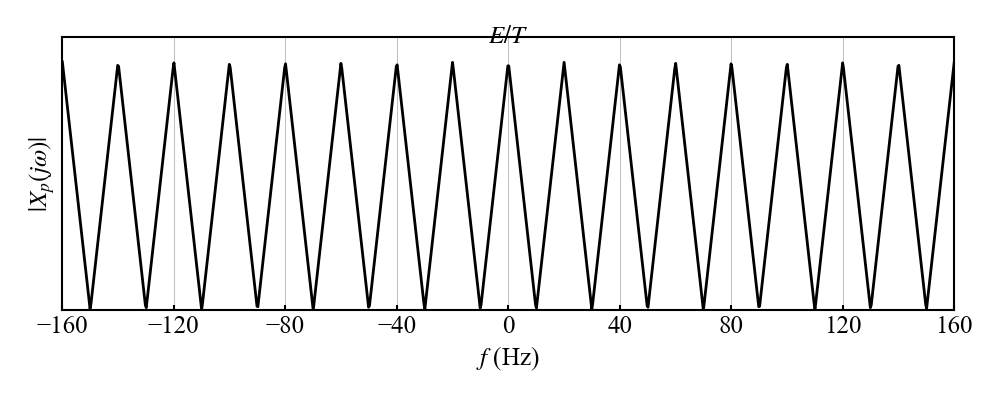

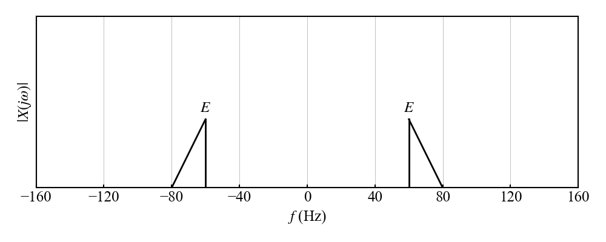

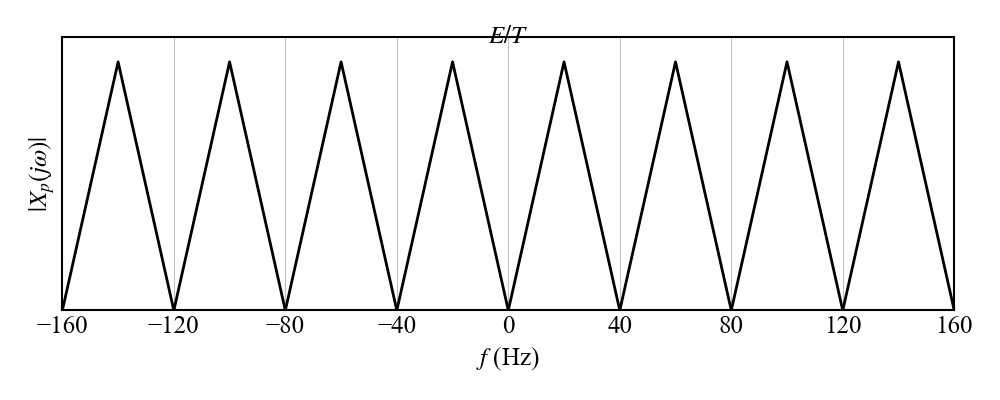

For symmetric bandpass spectra, two shifted replicas may touch or exactly overlap in a symmetric way without distortion only when the positive and negative frequency components do not create mirror interference. Otherwise overlap means aliasing

### Periodic Extension and Reconstruction

##### Periodic extension in frequency

For a rectangular pulse

$$
x(t)=E\left[u\left(t+\frac{T_1}{2}\right)-u\left(t-\frac{T_1}{2}\right)\right]
$$

$$
\operatorname{Sa}(x)=\frac{\sin x}{x}
$$

$$
X(j\Omega)=ET_1\operatorname{Sa}\left(\frac{\Omega T_1}{2}\right)
$$

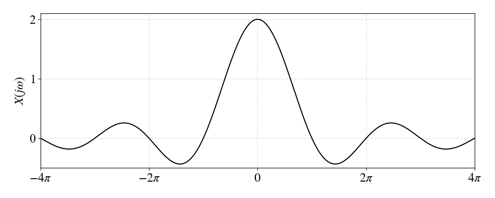

If $x(t)$ is periodically extended with period $T$

$$
\tilde{x}(t)=\sum_{n=-\infty}^{\infty}x(t-nT)
$$

then its spectrum is sampled in frequency

$$
\tilde{X}(j\Omega)=\Omega_0\sum_{k=-\infty}^{\infty}X(jk\Omega_0)\delta(\Omega-k\Omega_0)
$$

$$
\Omega_0=\frac{2\pi}{T}
$$

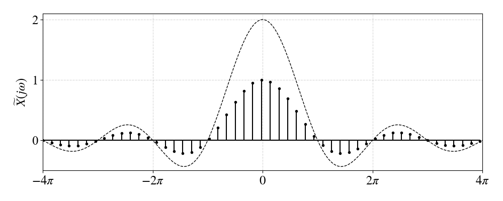

##### Ideal reconstruction

The ideal reconstruction filter has

$$
H_r(j\Omega)=
\begin{cases}
T & |\Omega|<\Omega_c\\
0 & \text{otherwise}
\end{cases}
$$

where the cutoff satisfies $\Omega_m<\Omega_c<\Omega_s-\Omega_m$. A common ideal choice for lowpass reconstruction is $\Omega_c=\pi/T$

$$
h_r(t)=\frac{T\sin(\Omega_ct)}{\pi t}
$$

The reconstructed signal is

$$
x_r(t)=x_p(t)*h_r(t)=\sum_{n=-\infty}^{\infty}x(nT)h_r(t-nT)
$$

$$
x_r(t)=\frac{T}{\pi}\sum_{n=-\infty}^{\infty}x(nT)\frac{\sin\left(\Omega_c(t-nT)\right)}{t-nT}
$$
