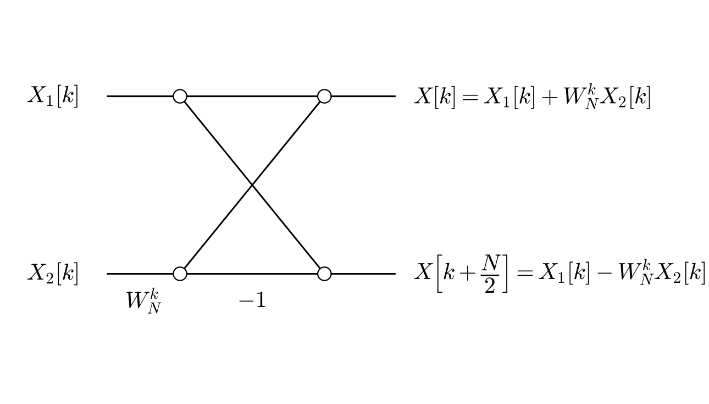
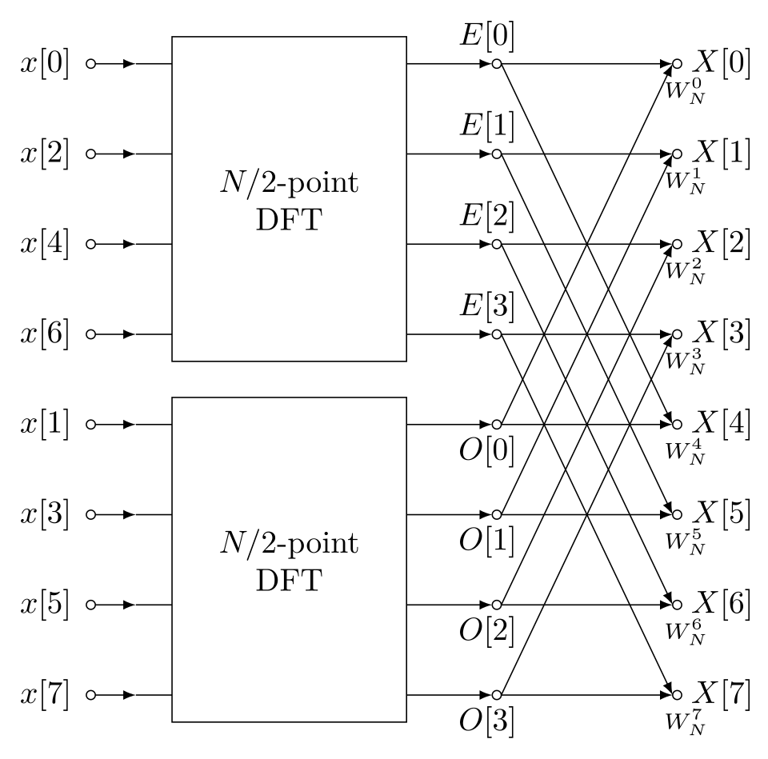
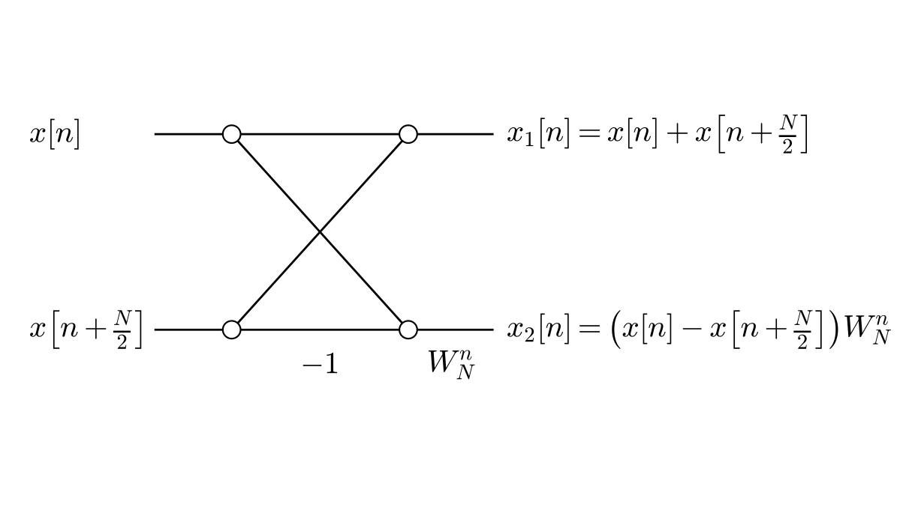

# Fast Fourier Transform

[toc]

### Radix-2 FFT

##### DFT decomposition

For an $N$-point DFT

$$
X[k]=\sum_{n=0}^{N-1}x[n]W_N^{nk}
$$

$$
W_N=e^{-j2\pi/N}
$$

Radix-2 FFT assumes

$$
N=2^L
$$

For $N=8$, the DFT can first be split into even and odd indexed samples

$$
X[k]=\sum_{r=0}^{3}x[2r]W_4^{rk}+W_8^k\sum_{r=0}^{3}x[2r+1]W_4^{rk}
$$

The subsequences are then split again until only two-point butterflies remain

$$
\{0,2,4,6\}\rightarrow\{0,4\},\{2,6\}
$$

$$
\{1,3,5,7\}\rightarrow\{1,5\},\{3,7\}
$$

The twiddle factors satisfy

$$
W_N^{(n+lN)k}=W_N^{nk}
$$

$$
W_N^{-nk}=W_N^{(N-n)k}
$$

$$
W_N^{(n+N/2)k}=(-1)^kW_N^{nk}
$$

$$
W_N^{2nk}=W_{N/2}^{nk}
$$

### Decimation in Time FFT

##### Even-odd decomposition

Split the input into even-index and odd-index subsequences

$$
x_1[r]=x[2r]
$$

$$
x_2[r]=x[2r+1]
$$

Then

$$
X[k]=\sum_{r=0}^{N/2-1}x[2r]W_N^{2rk}+\sum_{r=0}^{N/2-1}x[2r+1]W_N^{(2r+1)k}
$$

Using $W_N^{2rk}=W_{N/2}^{rk}$

$$
X[k]=X_1[k]+W_N^kX_2[k]
$$

where $X_1[k]$ and $X_2[k]$ are $N/2$-point DFTs

For $k=0,1,\ldots,N/2-1$

$$
X[k]=X_1[k]+W_N^kX_2[k]
$$

$$
X[k+N/2]=X_1[k]-W_N^kX_2[k]
$$

##### Complexity and storage

An $N=2^L$ FFT has $L$ stages. Each stage has $N/2$ butterflies

Complex multiplications

$$
C_M=\frac{N}{2}\log_2N
$$

Complex additions

$$
C_A=N\log_2N
$$

The time complexity is

$$
O(N\log N)
$$

Because each butterfly output can overwrite its input locations, radix-2 FFT supports in-place computation with $O(N)$ storage

The DIT radix-2 input order is bit reversed and the output order is natural

For $N=8$, bit reversal gives

| natural index | binary | reversed binary | bit-reversed index |
|---:|---:|---:|---:|
| 0 | 000 | 000 | 0 |
| 1 | 001 | 100 | 4 |
| 2 | 010 | 010 | 2 |
| 3 | 011 | 110 | 6 |
| 4 | 100 | 001 | 1 |
| 5 | 101 | 101 | 5 |
| 6 | 110 | 011 | 3 |
| 7 | 111 | 111 | 7 |

For one butterfly, there is one complex multiplication and two complex additions. Therefore each stage has $N/2$ multiplications and $N$ additions

### Decimation in Frequency FFT

##### Sum-difference decomposition

Split the DFT into even and odd frequency indices. For $m=0,1,\ldots,N/2-1$

$$
X[2m]=\sum_{n=0}^{N/2-1}\left(x[n]+x[n+N/2]\right)W_{N/2}^{mn}
$$

$$
X[2m+1]=\sum_{n=0}^{N/2-1}\left(x[n]-x[n+N/2]\right)W_N^n W_{N/2}^{mn}
$$

Define

$$
x_1[n]=x[n]+x[n+N/2]
$$

$$
x_2[n]=\left(x[n]-x[n+N/2]\right)W_N^n
$$

Then

$$
X[2m]=\operatorname{DFT}_{N/2}\{x_1[n]\}
$$

$$
X[2m+1]=\operatorname{DFT}_{N/2}\{x_2[n]\}
$$

For radix-2 DIF, the input order is natural and the output order is bit reversed. This is the opposite ordering pattern of radix-2 DIT

### Using One Complex FFT

##### Two real DFTs from one complex DFT

Let $x[n]$ and $h[n]$ be two real $N$-point sequences. Construct

$$
w[n]=x[n]+jh[n]
$$

Compute one complex FFT

$$
W[k]=X[k]+jH[k]
$$

Then separate the two DFTs using circular conjugate symmetry

$$
X[k]=\frac{1}{2}\left(W[k]+W^*[((N-k))_N]\right)
$$

$$
H[k]=\frac{1}{2j}\left(W[k]-W^*[((N-k))_N]\right)
$$

##### One real $2N$-point DFT from one complex $N$-point DFT

For a real $2N$-point sequence $x[n]$, split even and odd samples

$$
x_1[r]=x[2r]
$$

$$
x_2[r]=x[2r+1]
$$

Construct

$$
y[r]=x_1[r]+jx_2[r]
$$

After one $N$-point FFT, recover $X_1[k]$ and $X_2[k]$ as the conjugate-symmetric and conjugate-antisymmetric parts

$$
X_1[k]=\frac{1}{2}\left(Y[k]+Y^*[((N-k))_N]\right)
$$

$$
X_2[k]=\frac{1}{2j}\left(Y[k]-Y^*[((N-k))_N]\right)
$$

Then combine

$$
X[k]=X_1[k]+W_{2N}^kX_2[k]
$$

$$
X[k+N]=X_1[k]-W_{2N}^kX_2[k]
$$

$$
k=0,1,\ldots,N-1
$$

### IFFT Algorithm

##### Computing IFFT by FFT

The IDFT is

$$
x[n]=\frac{1}{N}\sum_{k=0}^{N-1}X[k]W_N^{-nk}
$$

Taking conjugates gives

$$
x^*[n]=\frac{1}{N}\sum_{k=0}^{N-1}X^*[k]W_N^{nk}
$$

Therefore

$$
x[n]=\frac{1}{N}\left(\operatorname{DFT}\{X^*[k]\}\right)^*
$$

The practical rule is conjugate the spectrum, run the FFT, conjugate again, and divide by $N$

Equivalently

$$
\operatorname{IFFT}\{X[k]\}=\frac{1}{N}\left(\operatorname{FFT}\{X^*[k]\}\right)^*
$$

##### Two real IFFTs from one complex IFFT

If $X[k]$ and $Y[k]$ are DFTs of real sequences $x[n]$ and $y[n]$, define

$$
W[k]=X[k]+jY[k]
$$

Compute

$$
w[n]=\operatorname{IDFT}\{W[k]\}
$$

Then

$$
x[n]=\operatorname{Re}\{w[n]\}
$$

$$
y[n]=\operatorname{Im}\{w[n]\}
$$

Equivalently

$$
x[n]=\frac{1}{2}\left(w[n]+w^*[n]\right)
$$

$$
y[n]=\frac{1}{2j}\left(w[n]-w^*[n]\right)
$$
