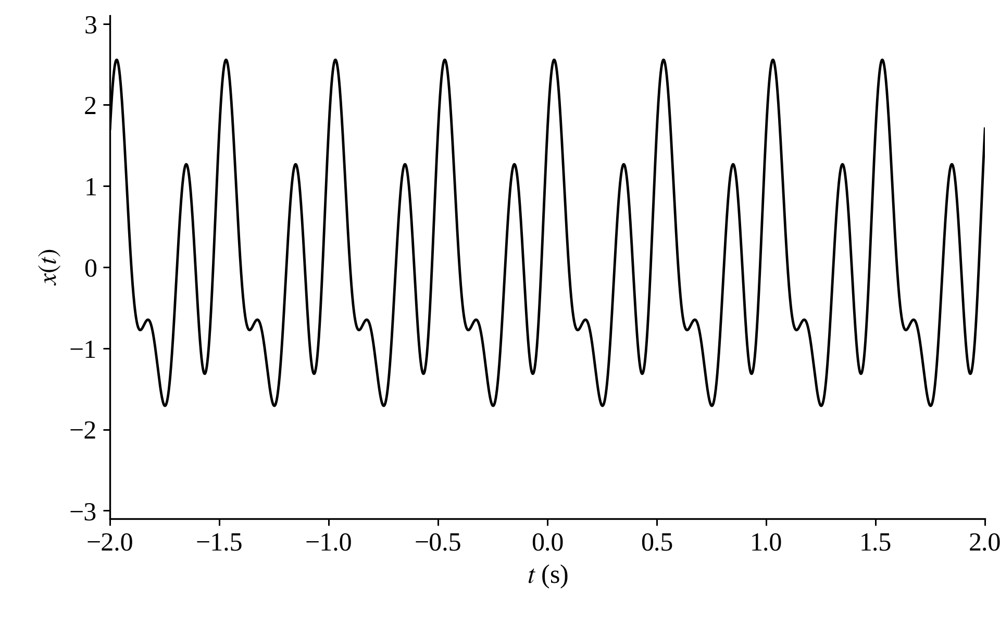
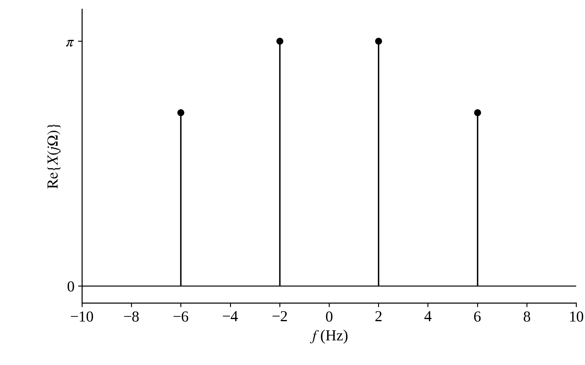
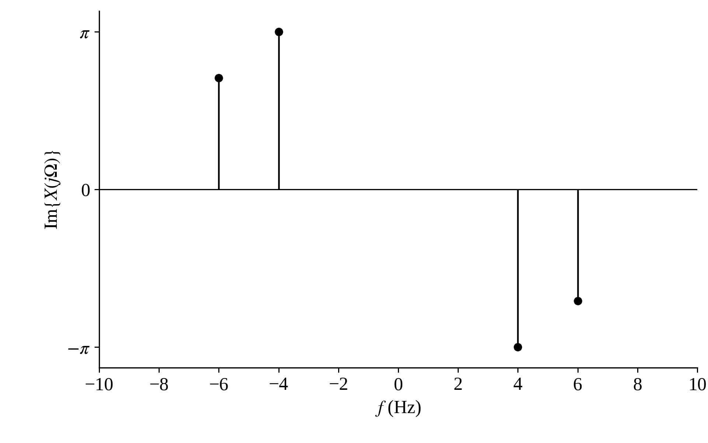
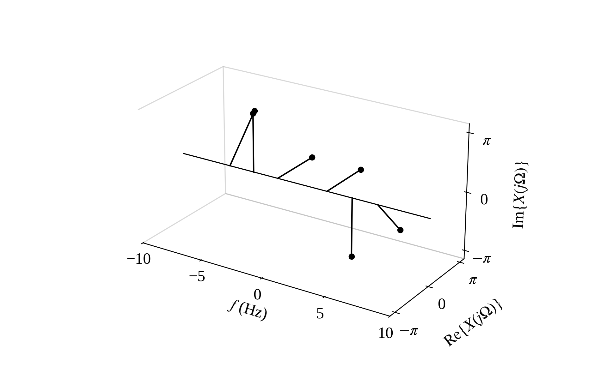
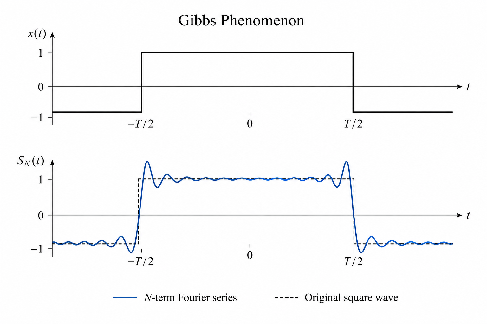

# Fourier Transform

[toc]

### From Coordinates to Fourier Transforms

##### Coordinates

Let $\{\boldsymbol e_1,\boldsymbol e_2,\boldsymbol e_3\}$ be an orthonormal basis and $E=[\boldsymbol e_1\ \boldsymbol e_2\ \boldsymbol e_3]$. A vector is synthesized as a linear combination of basis vectors.

$$
\boldsymbol x=c_1\boldsymbol e_1+c_2\boldsymbol e_2+c_3\boldsymbol e_3=E\boldsymbol c
$$

Its coordinates are obtained by projection.

$$
c_i=\langle\boldsymbol x,\boldsymbol e_i\rangle=\boldsymbol e_i^T\boldsymbol x,
\qquad
\boldsymbol c=E^T\boldsymbol x
$$

For two orthonormal coordinate frames, if the columns of $R$ are the axes of frame $B$ expressed in frame $A$

$$
\boldsymbol x_A=R\boldsymbol x_B,
\qquad
\boldsymbol x_B=R^T\boldsymbol x_A=R^{-1}\boldsymbol x_A
$$

The first relation synthesizes a vector by linear combination; the inverse relation recovers coordinates by projection.

##### Integral Transforms

For real square-integrable functions, the inner product is

$$
\langle f,g\rangle=\int_a^b f(t)g(t)dt
$$

It is the continuous analogue of a vector dot product.

$$
\int_a^b f(t)g(t)dt
=\lim_{N\to\infty}\sum_{n=1}^{N}f(t_n)g(t_n)\Delta t
$$

For an orthonormal function basis $\{\phi_k(t)\}$, analysis is projection and synthesis is linear combination.

$$
c_k=\langle f,\phi_k\rangle,
\qquad
f(t)=\sum_k c_k\phi_k(t)
$$

For a continuously indexed orthogonal family satisfying

$$
\langle\phi_\alpha,\phi_\beta\rangle
=N(\alpha)\delta(\alpha-\beta)
$$

the corresponding integral transform is

$$
F(\alpha)=\langle f,\phi_\alpha\rangle
=\int f(t)\phi_\alpha(t)dt
$$

and the original function is synthesized from its projections.

$$
f(t)=\int\frac{F(\alpha)}{N(\alpha)}\phi_\alpha(t)d\alpha
$$

Thus an integral transform is the continuous analogue of coordinate projection and reconstruction.

##### Complex Spaces

For complex vectors, conjugation is required in the inner product.

$$
\langle\boldsymbol z,\boldsymbol w\rangle
=\sum_n z_n w_n^*,
\qquad
\langle\boldsymbol z,\boldsymbol z\rangle
=\sum_n|z_n|^2
$$

For a complex number

$$
zz^*=|z|^2
$$

The corresponding function inner product is

$$
\langle f,g\rangle=\int f(t)g^*(t)dt
$$

For a continuously indexed complex orthogonal family

$$
\langle\phi_\alpha,\phi_\beta\rangle
=N(\alpha)\delta(\alpha-\beta)
$$

analysis and synthesis become

$$
F(\alpha)
=\int f(t)\phi_\alpha^*(t)dt
$$

$$
f(t)
=\int\frac{F(\alpha)}{N(\alpha)}\phi_\alpha(t)d\alpha
$$

##### Eigenfunctions

For a linear operator $\mathcal L$, a nonzero $\phi$ is an eigenfunction if

$$
\mathcal L\phi=\lambda\phi
$$

This is the function-space analogue of the matrix eigenvector equation $A\boldsymbol v=\lambda\boldsymbol v$. Eigenvectors associated with distinct eigenvalues are linearly independent, and an operator acts diagonally on an eigenfunction expansion.

$$
\mathcal L\left(\sum_k c_k\phi_k\right)
=\sum_k\lambda_k c_k\phi_k
$$

Differentiation has exponential eigenfunctions.

$$
\frac{d}{dt}e^{st}=se^{st}
$$

For periodic harmonics

$$
\frac{d}{dt}e^{jk\Omega_0t}=jk\Omega_0e^{jk\Omega_0t}
$$

On the zero-mean periodic subspace, inverse differentiation gives

$$
D^{-1}e^{jk\Omega_0t}
=\frac{1}{jk\Omega_0}e^{jk\Omega_0t},
\qquad k\ne0
$$

An ordinary indefinite integral contains an arbitrary constant, so the integration operator requires a boundary or zero-mean condition before this eigenfunction relation is defined.

Complex exponentials are useful basis functions because differentiation and integration change only their scale, harmonically related exponentials are orthogonal over a period, and complex exponentials are eigenfunctions of LTI systems.

$$
\mathcal H\{e^{st}\}=H(s)e^{st}
$$

Euler's relation connects the exponential basis to sinusoidal signals.

$$
e^{j\Omega t}=\cos(\Omega t)+j\sin(\Omega t)
$$

##### Fourier Derivation

Use the complex exponential family as the continuously indexed basis.

$$
\phi_\Omega(t)=e^{j\Omega t},
\qquad
\phi_\Omega^*(t)=e^{-j\Omega t}
$$

Its generalized orthogonality relation is

$$
\langle\phi_\Omega,\phi_{\Omega'}\rangle
=\int_{-\infty}^{\infty}e^{j(\Omega-\Omega')t}dt
=2\pi\delta(\Omega-\Omega')
$$

Hence $N(\Omega)=2\pi$. Applying the preceding complex integral-transform analysis formula gives

$$
X(j\Omega)
=\langle x,\phi_\Omega\rangle
=\int_{-\infty}^{\infty}x(t)e^{-j\Omega t}dt
$$

Applying the synthesis formula gives

$$
x(t)
=\frac{1}{2\pi}
\int_{-\infty}^{\infty}X(j\Omega)e^{j\Omega t}d\Omega
$$

Substituting the analysis formula into synthesis verifies the reconstruction.

$$
\begin{aligned}
x(t)
&=\frac{1}{2\pi}
\int_{-\infty}^{\infty}
\left[
\int_{-\infty}^{\infty}
x(\tau)e^{-j\Omega\tau}d\tau
\right]
e^{j\Omega t}d\Omega\\
&=\int_{-\infty}^{\infty}
x(\tau)
\left[
\frac{1}{2\pi}
\int_{-\infty}^{\infty}
e^{j\Omega(t-\tau)}d\Omega
\right]d\tau\\
&=\int_{-\infty}^{\infty}
x(\tau)\delta(t-\tau)d\tau
=x(t)
\end{aligned}
$$

The Fourier transform represents a signal by its **projections** onto **an infinite orthogonal family of complex exponential basis functions**.

### Signal Space and Fourier Representations

##### Basis signals

A basis is a set of elementary signals used to represent signals by linear combination. Orthogonality means zero inner product between different basis signals. Completeness means the basis spans the signal space.

For continuous-time complex exponentials

$$
\int_{-\infty}^{\infty}e^{j\Omega_1 t}e^{-j\Omega_2 t}dt=2\pi\delta(\Omega_1-\Omega_2)
$$

##### Four Fourier forms

For continuous-time periodic signals with $\Omega_0=2\pi/T_0$

$$
a_k=\frac{1}{T_0}\int_{\langle T_0\rangle}x(t)e^{-jk\Omega_0t}dt
$$

$$
x(t)=\sum_{k=-\infty}^{\infty}a_k e^{jk\Omega_0t}
$$

For continuous-time aperiodic signals

$$
X(j\Omega)=\int_{-\infty}^{\infty}x(t)e^{-j\Omega t}dt
$$

$$
x(t)=\frac{1}{2\pi}\int_{-\infty}^{\infty}X(j\Omega)e^{j\Omega t}d\Omega
$$

For discrete-time periodic signals with $\omega_0=2\pi/N$

$$
a_k=\frac{1}{N}\sum_{n=\langle N\rangle}x[n]e^{-jk\omega_0n}
$$

$$
x[n]=\sum_{k=\langle N\rangle}a_k e^{jk\omega_0n}
$$

For discrete-time aperiodic signals

$$
X(e^{j\omega})=\sum_{n=-\infty}^{\infty}x[n]e^{-j\omega n}
$$

$$
x[n]=\frac{1}{2\pi}\int_{\langle 2\pi\rangle}X(e^{j\omega})e^{j\omega n}d\omega
$$

Discrete time corresponds to periodic frequency. Periodic time corresponds to discrete frequency.

| Representation | Signal | Spectrum | Analysis | Synthesis |
|---|---|---|---|---|
| CFS | continuous periodic | discrete aperiodic | one-period integral | harmonic sum |
| CTFT | continuous aperiodic | continuous aperiodic | infinite integral | inverse infinite integral |
| DFS | discrete periodic | discrete periodic | one-period sum | one-period harmonic sum |
| DTFT | discrete aperiodic | continuous periodic | infinite sum | one-period inverse integral |

For a nonperiodic signal that is periodically extended, the periodic signal spectrum samples the original nonperiodic spectrum. The original nonperiodic spectrum is the envelope of the periodic-signal line spectrum.

### Common Fourier Transform Pairs

##### CTFT pairs

$$
e^{-at}u(t)\xleftrightarrow{\mathcal{F}}\frac{1}{a+j\Omega}\quad a>0
$$

$$
e^{-a|t|}\xleftrightarrow{\mathcal{F}}\frac{2a}{a^2+\Omega^2}\quad a>0
$$

$$
\delta(t)\xleftrightarrow{\mathcal{F}}1
$$

$$
1\xleftrightarrow{\mathcal{F}}2\pi\delta(\Omega)
$$

$$
\frac{\sin Wt}{\pi t}\xleftrightarrow{\mathcal{F}}
\begin{cases}
1 & |\Omega|<W\\
0 & |\Omega|>W
\end{cases}
$$

$$
u(t)\xleftrightarrow{\mathcal{F}}\pi\delta(\Omega)+\frac{1}{j\Omega}
$$

$$
\cos(\Omega_0t)\xleftrightarrow{\mathcal{F}}\pi\left[\delta(\Omega-\Omega_0)+\delta(\Omega+\Omega_0)\right]
$$

$$
\sin(\Omega_0t)\xleftrightarrow{\mathcal{F}}\frac{\pi}{j}\left[\delta(\Omega-\Omega_0)-\delta(\Omega+\Omega_0)\right]
$$

##### DTFT pairs

$$
a^n u[n]\xleftrightarrow{\mathrm{DTFT}}\frac{1}{1-ae^{-j\omega}}\quad |a|<1
$$

$$
\delta[n]\xleftrightarrow{\mathrm{DTFT}}1
$$

$$
1\xleftrightarrow{\mathrm{DTFT}}2\pi\sum_{k=-\infty}^{\infty}\delta(\omega-2\pi k)
$$

$$
u[n]\xleftrightarrow{\mathrm{DTFT}}\frac{1}{1-e^{-j\omega}}+\pi\sum_{k=-\infty}^{\infty}\delta(\omega-2\pi k)
$$

$$
\cos(\omega_0 n)\xleftrightarrow{\mathrm{DTFT}}\pi\sum_{k=-\infty}^{\infty}\left[\delta(\omega-\omega_0-2\pi k)+\delta(\omega+\omega_0-2\pi k)\right]
$$

$$
\sin(\omega_0 n)\xleftrightarrow{\mathrm{DTFT}}\frac{\pi}{j}\sum_{k=-\infty}^{\infty}\left[\delta(\omega-\omega_0-2\pi k)-\delta(\omega+\omega_0-2\pi k)\right]
$$

For a finite rectangular sequence

$$
x[n]=u[n+N_1]-u[n-N_1-1]
$$

$$
X(e^{j\omega})=\frac{\sin\left((N_1+1/2)\omega\right)}{\sin(\omega/2)}
$$

The two-sided exponential pair is

$$
a^{|n|}\xleftrightarrow{\mathrm{DTFT}}\frac{1-a^2}{1-2a\cos\omega+a^2}\quad |a|<1
$$

### Fourier Transform Properties

##### CTFT and DTFT properties

Linearity

$$
ax(t)+by(t)\xleftrightarrow{\mathcal{F}}aX(j\Omega)+bY(j\Omega)
$$

$$
ax[n]+by[n]\xleftrightarrow{\mathrm{DTFT}}aX(e^{j\omega})+bY(e^{j\omega})
$$

Time shift

$$
x(t-t_0)\xleftrightarrow{\mathcal{F}}e^{-j\Omega t_0}X(j\Omega)
$$

$$
x[n-n_0]\xleftrightarrow{\mathrm{DTFT}}e^{-j\omega n_0}X(e^{j\omega})
$$

Frequency shift

$$
e^{j\Omega_0t}x(t)\xleftrightarrow{\mathcal{F}}X(j(\Omega-\Omega_0))
$$

$$
e^{j\omega_0n}x[n]\xleftrightarrow{\mathrm{DTFT}}X(e^{j(\omega-\omega_0)})
$$

Time reversal

$$
x(-t)\xleftrightarrow{\mathcal{F}}X(-j\Omega)
$$

$$
x[-n]\xleftrightarrow{\mathrm{DTFT}}X(e^{-j\omega})
$$

Continuous-time scaling

$$
x(at)\xleftrightarrow{\mathcal{F}}\frac{1}{|a|}X\left(j\frac{\Omega}{a}\right)
$$

Convolution

$$
x(t)*y(t)\xleftrightarrow{\mathcal{F}}X(j\Omega)Y(j\Omega)
$$

$$
x[n]*y[n]\xleftrightarrow{\mathrm{DTFT}}X(e^{j\omega})Y(e^{j\omega})
$$

Multiplication

$$
x(t)y(t)\xleftrightarrow{\mathcal{F}}\frac{1}{2\pi}X(j\Omega)*Y(j\Omega)
$$

$$
x[n]y[n]\xleftrightarrow{\mathrm{DTFT}}\frac{1}{2\pi}X(e^{j\omega})\circledast Y(e^{j\omega})
$$

Differentiation and multiplication by the independent variable

$$
\frac{dx(t)}{dt}\xleftrightarrow{\mathcal{F}}j\Omega X(j\Omega)
$$

$$
tx(t)\xleftrightarrow{\mathcal{F}}j\frac{dX(j\Omega)}{d\Omega}
$$

$$
x[n]-x[n-1]\xleftrightarrow{\mathrm{DTFT}}(1-e^{-j\omega})X(e^{j\omega})
$$

$$
nx[n]\xleftrightarrow{\mathrm{DTFT}}j\frac{dX(e^{j\omega})}{d\omega}
$$

##### Conjugate symmetry

For real continuous-time signals

$$
X(-j\Omega)=X^*(j\Omega)
$$

Thus the real part of the CTFT is even and the imaginary part is odd.

$$
\operatorname{Re}\{X(-j\Omega)\}=\operatorname{Re}\{X(j\Omega)\}
$$

$$
\operatorname{Im}\{X(-j\Omega)\}=-\operatorname{Im}\{X(j\Omega)\}
$$

Hence the magnitude spectrum is even and the phase spectrum is odd.

$$
|X(j\Omega)|=|X(-j\Omega)|
$$

$$
\angle X(j\Omega)=-\angle X(-j\Omega)
$$

For a continuous-time signal, the conjugate-even and conjugate-odd parts are

$$
x_e(t)=\frac{1}{2}\left[x(t)+x^*(-t)\right]
$$

$$
x_o(t)=\frac{1}{2}\left[x(t)-x^*(-t)\right]
$$

and their CTFTs satisfy

$$
x_e(t)\xleftrightarrow{\mathcal{F}}\operatorname{Re}\{X(j\Omega)\}
$$

$$
x_o(t)\xleftrightarrow{\mathcal{F}}j\operatorname{Im}\{X(j\Omega)\}
$$

For real $x(t)$, these reduce to the ordinary even and odd parts. Therefore, a real even signal has a real even spectrum, while a real odd signal has a purely imaginary odd spectrum.

For example

$$
x(t)=\cos(4\pi t)+\sin(8\pi t)+\sin\left(12\pi t+\frac{\pi}{4}\right)
$$

contains both even and odd components. The figures use ordinary frequency $f=\Omega/(2\pi)$, so the spectral lines occur at $\pm2$, $\pm4$, and $\pm6$ Hz.

For real discrete-time signals

$$
X(e^{-j\omega})=X^*(e^{j\omega})
$$

Hence the magnitude spectrum is even and the phase spectrum is odd.

$$
|X(e^{j\omega})|=|X(e^{-j\omega})|
$$

$$
\angle X(e^{j\omega})=-\angle X(e^{-j\omega})
$$

For a sequence

$$
x_e[n]=\frac{1}{2}\left(x[n]+x^*[-n]\right)
$$

$$
x_o[n]=\frac{1}{2}\left(x[n]-x^*[-n]\right)
$$

The DTFT relation is

$$
x_e[n]\xleftrightarrow{\mathrm{DTFT}}\operatorname{Re}\{X(e^{j\omega})\}
$$

$$
x_o[n]\xleftrightarrow{\mathrm{DTFT}}j\operatorname{Im}\{X(e^{j\omega})\}
$$

If $x[n]$ is real and causal, then for $n>0$

$$
x[n]=2x_o[n]
$$

Thus the imaginary part of $X(e^{j\omega})$ determines all positive-time samples of a real causal sequence, while $x[0]$ is determined separately from the real part or from $X(0)$.

### Fourier Series Properties

##### Gibbs phenomenon

The Gibbs phenomenon appears when finite Fourier series approximate a signal with jump discontinuities.

##### CFS and DFS

CFS time shift and frequency shift

$$
x(t-t_0)\xleftrightarrow{\mathrm{CFS}}e^{-jk\Omega_0t_0}a_k
$$

$$
e^{jM\Omega_0t}x(t)\xleftrightarrow{\mathrm{CFS}}a_{k-M}
$$

DFS time shift and frequency shift

$$
x[n-n_0]\xleftrightarrow{\mathrm{DFS}}e^{-jk\omega_0n_0}a_k
$$

$$
e^{jM\omega_0n}x[n]\xleftrightarrow{\mathrm{DFS}}a_{k-M}
$$

Time reversal

$$
x(-t)\xleftrightarrow{\mathrm{CFS}}a_{-k}
$$

$$
x[-n]\xleftrightarrow{\mathrm{DFS}}a_{-k}
$$

Differentiation and difference

$$
\frac{dx(t)}{dt}\xleftrightarrow{\mathrm{CFS}}jk\Omega_0a_k
$$

$$
x[n]-x[n-1]\xleftrightarrow{\mathrm{DFS}}(1-e^{-jk\omega_0})a_k
$$

For real periodic signals

$$
a_{-k}=a_k^*
$$

For CFS integration, if $a_0=0$, a periodic integral $y'(t)=x(t)$ has coefficients

$$
b_k=\frac{a_k}{jk\Omega_0}\quad k\ne 0
$$

For DFS accumulation, if $a_0=0$, a periodic accumulated sequence satisfying $y[n]-y[n-1]=x[n]$ has coefficients

$$
b_k=\frac{a_k}{1-e^{-jk\omega_0}}\quad k\ne 0
$$

### Special Values Duality and Energy

##### Special values

For CTFT

$$
X(0)=\int_{-\infty}^{\infty}x(t)dt
$$

$$
x(0)=\frac{1}{2\pi}\int_{-\infty}^{\infty}X(j\Omega)d\Omega
$$

For DTFT

$$
X(0)=\sum_{n=-\infty}^{\infty}x[n]
$$

$$
x[0]=\frac{1}{2\pi}\int_{\langle 2\pi\rangle}X(e^{j\omega})d\omega
$$

For Fourier series

$$
a_0=\frac{1}{T_0}\int_{\langle T_0\rangle}x(t)dt
$$

$$
a_0=\frac{1}{N}\sum_{n=\langle N\rangle}x[n]
$$

##### Duality

If

$$
x(t)\xleftrightarrow{\mathcal{F}}X(j\Omega)
$$

then

$$
X(jt)\xleftrightarrow{\mathcal{F}}2\pi x(-\Omega)
$$

For DFS duality

$$
x[n]\xleftrightarrow{\mathrm{DFS}}a_k
$$

$$
a_n\xleftrightarrow{\mathrm{DFS}}\frac{1}{N}x[-k]
$$

##### Parseval relations

For CTFT energy signals

$$
E=\int_{-\infty}^{\infty}|x(t)|^2dt=\frac{1}{2\pi}\int_{-\infty}^{\infty}|X(j\Omega)|^2d\Omega
$$

For DTFT energy signals

$$
E=\sum_{n=-\infty}^{\infty}|x[n]|^2=\frac{1}{2\pi}\int_{\langle 2\pi\rangle}|X(e^{j\omega})|^2d\omega
$$

For continuous-time periodic power signals

$$
P=\frac{1}{T_0}\int_{\langle T_0\rangle}|x(t)|^2dt=\sum_{k=-\infty}^{\infty}|a_k|^2
$$

For discrete-time periodic power signals

$$
P=\frac{1}{N}\sum_{n=\langle N\rangle}|x[n]|^2=\sum_{k=\langle N\rangle}|a_k|^2
$$

### Short Examples

##### Examples using symmetry and duality

If

$$
e^{-at}u(t)\xleftrightarrow{\mathcal{F}}\frac{1}{a+j\Omega}\quad a>0
$$

then time reversal gives

$$
e^{at}u(-t)\xleftrightarrow{\mathcal{F}}\frac{1}{a-j\Omega}
$$

Adding the two sides gives

$$
e^{-a|t|}\xleftrightarrow{\mathcal{F}}\frac{2a}{a^2+\Omega^2}
$$

If $x(t)\xleftrightarrow{\mathcal{F}}X(j\Omega)$, duality gives

$$
X(jt)\xleftrightarrow{\mathcal{F}}2\pi x(-\Omega)
$$

##### Hilbert transformer and sign function

The ideal $90^\circ$ phase shifter has

$$
H(j\Omega)=
\begin{cases}
-j & \Omega>0\\
j & \Omega<0
\end{cases}
$$

Its impulse response is

$$
h(t)=\frac{1}{\pi t}
$$

The sign function has

$$
\operatorname{sgn}(t)=2u(t)-1
$$

$$
\operatorname{sgn}(t)\xleftrightarrow{\mathcal{F}}\frac{2}{j\Omega}
$$
