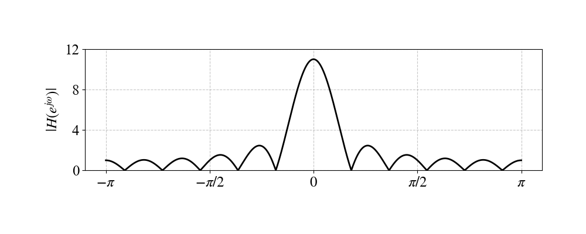

# LTI Systems

[toc]

### System Properties

##### Linearity and time invariance

A discrete-time system $T\{\cdot\}$ is linear if it satisfies additivity and homogeneity

$$
T\{x_1[n]+x_2[n]\}=T\{x_1[n]\}+T\{x_2[n]\}
$$

$$
T\{\alpha x[n]\}=\alpha T\{x[n]\}
$$

$$
T\left\{\sum_k\alpha_k x_k[n]\right\}=\sum_k\alpha_kT\{x_k[n]\}
$$

It is time invariant if a delay in the input produces the same delay in the output

$$
T\{x[n-n_0]\}=y[n-n_0]
$$

A system such as $y[n]=x[-n]$ is time varying because

$$
T\{x[n-n_0]\}=x[-n-n_0]\ne x[-n+n_0]=y[n-n_0]
$$

##### Memoryless causal stable and invertible systems

A memoryless system depends only on the current input sample

$$
y[n]=F(x[n])
$$

For an LTI system, causality is equivalent to a right-sided impulse response

$$
h[n]=0\quad n<0
$$

BIBO stability is equivalent to absolute summability of the impulse response

$$
\sum_{k=-\infty}^{\infty}|h[k]|<\infty
$$

An LTI system is invertible if there is an inverse impulse response $h_i[n]$ such that

$$
h[n]*h_i[n]=\delta[n]
$$

Examples

$$
y[n]=e^{x[n]}
$$

is nonlinear because

$$
e^{ax_1[n]+bx_2[n]}\ne ae^{x_1[n]}+be^{x_2[n]}
$$

The system

$$
y[n]=x[-n]
$$

is time varying because shifting the input and shifting the output do not give the same result

The system

$$
y[n]=\sum_{k=0}^{n}x[k]
$$

is time varying because the lower limit is fixed at $0$. By contrast, the accumulator

$$
y[n]=\sum_{k=-\infty}^{n}x[k]
$$

is LTI with impulse response $u[n]$, but it is not BIBO stable since $\sum_n|u[n]|$ diverges

$$
y[n]=x[n-1]
$$

is invertible with

$$
x[n]=y[n+1]
$$

$$
y[n]=x[2n]
$$

is not invertible because odd-indexed samples are lost

The first-difference system

$$
y[n]=x[n]-x[n-1]
$$

is BIBO stable, but it is not uniquely invertible without an initial value because adding a constant to $x[n]$ gives the same difference. With a fixed initial condition, its inverse is an accumulator

### Difference Equations and Initial Conditions

##### Relaxed systems

A difference equation alone does not uniquely determine a system. Linearity, time invariance, causality, and stability depend on the initial conditions

A relaxed system has no stored energy at the initial time. Its output is the zero-state response

For

$$
y[n]-ay[n-1]=x[n]
$$

with relaxed initial condition, the impulse response is

$$
h[n]=a^n u[n]
$$

The same algebraic transfer function

$$
H(z)=\frac{1}{1-az^{-1}}
$$

can represent different systems under different ROCs

$$
h[n]=a^n u[n]\quad |z|>|a|
$$

$$
h[n]=-a^n u[-n-1]\quad |z|<|a|
$$

Thus the difference equation must be combined with initial-state or ROC information to determine the actual system

### LTI Representation

##### Impulse response and convolution

The unit impulse response is

$$
h[n]=T\{\delta[n]\}
$$

Any discrete-time signal can be represented as shifted impulses

$$
x[n]=\sum_{k=-\infty}^{\infty}x[k]\delta[n-k]
$$

For an LTI system

$$
y[n]=T\{x[n]\}=\sum_{k=-\infty}^{\infty}x[k]h[n-k]
$$

$$
y[n]=x[n]*h[n]
$$

This impulse decomposition is the reason that a unit impulse response completely characterizes an LTI system

##### Eigenfunctions

For an LTI system, complex exponentials are eigenfunctions

$$
x[n]=a^n
$$

$$
T\{a^n\}=\sum_{k=-\infty}^{\infty}h[k]a^{n-k}=a^n\sum_{k=-\infty}^{\infty}h[k]a^{-k}
$$

The eigenvalue is

$$
\lambda(a)=\sum_{k=-\infty}^{\infty}h[k]a^{-k}
$$

For $a=e^{j\omega}$, the eigenvalue is the frequency response

$$
H(e^{j\omega})=\sum_{k=-\infty}^{\infty}h[k]e^{-j\omega k}
$$

Thus

$$
x[n]\xleftrightarrow{\mathrm{DTFT}}X(e^{j\omega})
$$

$$
y[n]\xleftrightarrow{\mathrm{DTFT}}Y(e^{j\omega})=H(e^{j\omega})X(e^{j\omega})
$$

For a periodic input with DFS coefficients $a_k$

$$
x[n]=\sum_{k=\langle N\rangle}a_k e^{jk\omega_0n}
$$

$$
y[n]=\sum_{k=\langle N\rangle}a_kH(e^{jk\omega_0})e^{jk\omega_0n}
$$

### Accumulator and Difference Systems

##### Moving sum system

For an $(N+1)$-point moving sum

$$
y[n]=\sum_{m=0}^{N}x[n-m]
$$

The impulse response is

$$
h[n]=u[n]-u[n-N-1]=\sum_{m=0}^{N}\delta[n-m]
$$

The frequency response is

$$
H(e^{j\omega})=\sum_{m=0}^{N}e^{-j\omega m}=\frac{1-e^{-j\omega(N+1)}}{1-e^{-j\omega}}
$$

$$
H(e^{j\omega})=e^{-j\omega N/2}\frac{\sin\left(\frac{N+1}{2}\omega\right)}{\sin\left(\frac{\omega}{2}\right)}
$$

The magnitude and linear-phase term are

$$
|H(e^{j\omega})|=\left|\frac{\sin\left(\frac{N+1}{2}\omega\right)}{\sin\left(\frac{\omega}{2}\right)}\right|
$$

$$
\phi_{\mathrm{lin}}(\omega)=-\frac{N}{2}\omega
$$

##### First difference system

For

$$
y[n]=x[n]-x[n-1]
$$

The impulse response and frequency response are

$$
h[n]=\delta[n]-\delta[n-1]
$$

$$
H(e^{j\omega})=1-e^{-j\omega}
$$

$$
|H(e^{j\omega})|=2\left|\sin\frac{\omega}{2}\right|
$$

$$
\angle H(e^{j\omega})=\frac{\pi}{2}-\frac{\omega}{2},\qquad 0<\omega<2\pi
$$
