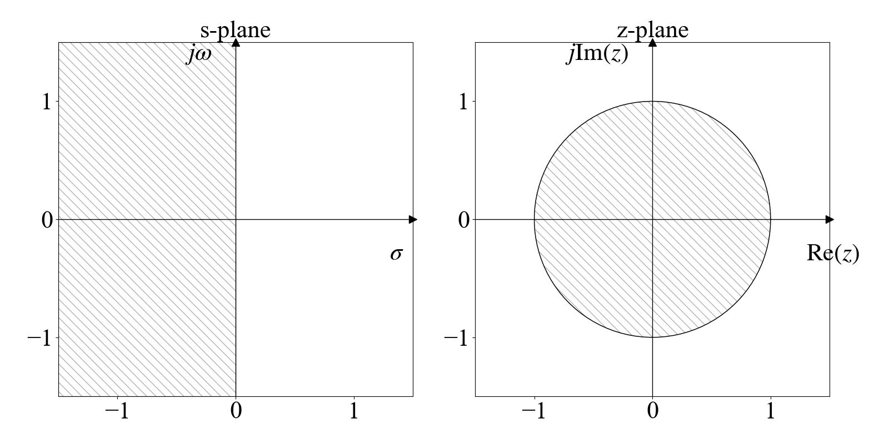
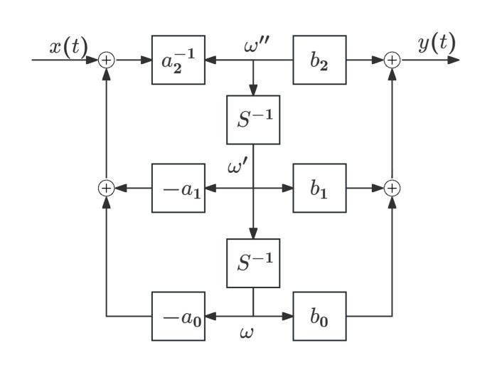
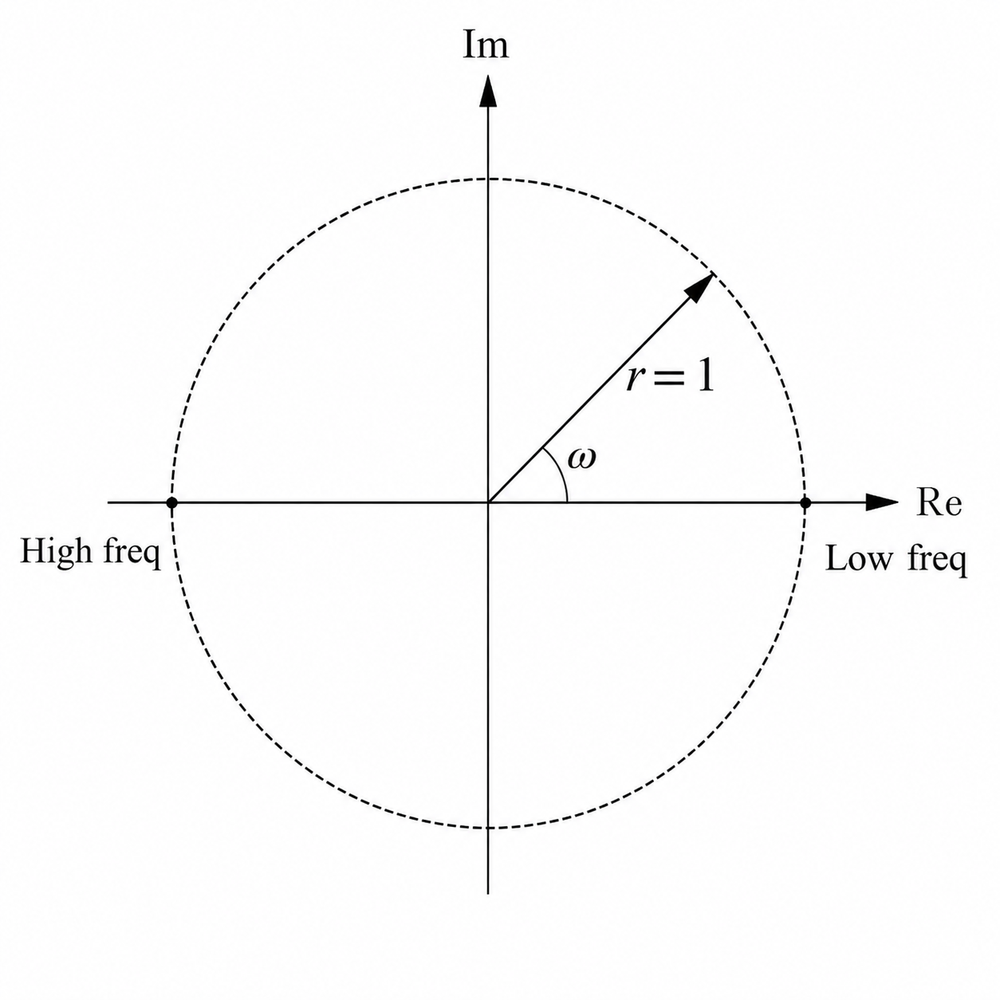
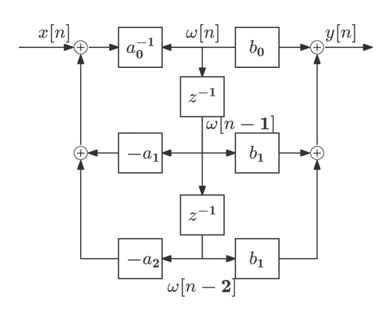
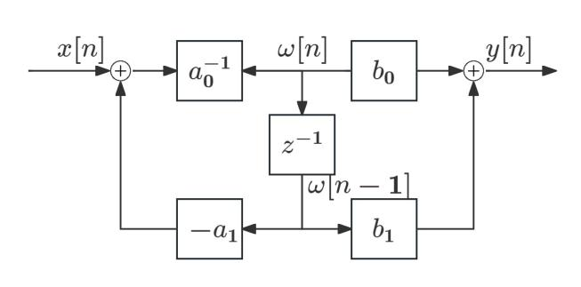
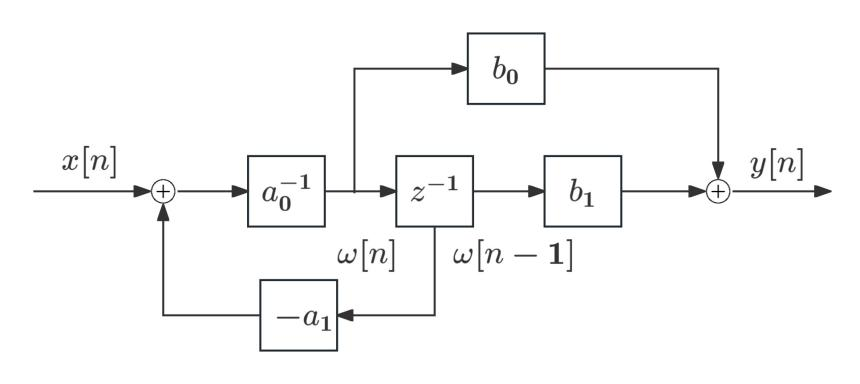
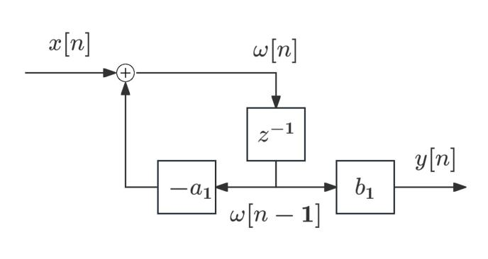

# Laplace and Z Transform

[toc]

### Fourier and Laplace

##### Fourier Existence

The Dirichlet conditions are sufficient, but not necessary, conditions for the existence of the Fourier transform:

- $x(t)$ is absolutely integrable over all time.

$$
\int_{-\infty}^{\infty}|x(t)|dt<\infty
$$

- $x(t)$ has a finite number of maxima and minima within any finite interval.
- $x(t)$ has a finite number of discontinuities within any finite interval, and each discontinuity is finite.

Absolute integrability is a sufficient condition for convergence of the Fourier-transform integral.

##### Laplace Extension

Let $s=\sigma+j\Omega$. The bilateral Laplace transform can be written as

$$
X(s)=\int_{-\infty}^{\infty}x(t)e^{-\sigma t}e^{-j\Omega t}dt
=\mathcal{F}\left\{x(t)e^{-\sigma t}\right\}
$$

Thus the Laplace transform is the Fourier transform of an exponentially weighted signal. The factor $e^{-\sigma t}$ can make the weighted signal absolutely integrable even when $x(t)$ itself is not, so the Laplace transform may converge when the Fourier transform does not. The values of $s$ for which it converges form the region of convergence (ROC).

The Fourier transform represents a signal using complex sinusoids $e^{j\Omega t}$. The Laplace transform extends this representation to general complex exponentials.

$$
e^{st}=e^{\sigma t}e^{j\Omega t}
$$

For each $\sigma$ in the ROC, $X(\sigma+j\Omega)$ is the Fourier transform of the exponentially weighted signal $x(t)e^{-\sigma t}$. The real part $\sigma$ controls exponential weighting, while $\Omega$ is the angular frequency.

##### Transform Relations

For the forward transforms,

$$
X(s)=\mathcal{F}\left\{x(t)e^{-\sigma t}\right\},\qquad s=\sigma+j\Omega
$$

If the $j\Omega$-axis lies in the ROC, then $\sigma=0$ is allowed and

$$
X(j\Omega)=X(s)\big|_{s=j\Omega}=\mathcal{F}\{x(t)\}
$$

Applying the inverse Fourier transform to $x(t)e^{-\sigma t}$ gives

$$
x(t)e^{-\sigma t}=\frac{1}{2\pi}\int_{-\infty}^{\infty}X(\sigma+j\Omega)e^{j\Omega t}d\Omega
$$

and therefore

$$
x(t)=\frac{1}{2\pi j}\int_{\sigma-j\infty}^{\sigma+j\infty}X(s)e^{st}ds
$$

where the vertical integration line $\operatorname{Re}\{s\}=\sigma$ lies in the ROC.

### Bilateral Laplace Transform

##### Definition and ROC

The bilateral Laplace transform is

$$
X(s)=\int_{-\infty}^{\infty}x(t)e^{-st}dt
$$

$$
x(t)=\frac{1}{2\pi j}\int_{\sigma-j\infty}^{\sigma+j\infty}X(s)e^{st}ds
$$

The ROC is a vertical strip or half-plane in the $s$-plane and contains no poles. A stable signal has an ROC including the $j\Omega$-axis.

For a right-sided signal the ROC is to the right of the rightmost pole. For a left-sided signal the ROC is to the left of the leftmost pole. For a two-sided signal the ROC is a vertical strip between poles.

Common pairs

$$
e^{-at}u(t)\xleftrightarrow{\mathcal{L}}\frac{1}{s+a}\quad \operatorname{Re}\{s\}>-a
$$

$$
-e^{-at}u(-t)\xleftrightarrow{\mathcal{L}}\frac{1}{s+a}\quad \operatorname{Re}\{s\}<-a
$$

$$
e^{-a|t|}\xleftrightarrow{\mathcal{L}}\frac{2a}{a^2-s^2}\quad -a<\operatorname{Re}\{s\}<a,\quad a>0
$$

$$
u(t)\xleftrightarrow{\mathcal{L}}\frac{1}{s}\quad \operatorname{Re}\{s\}>0
$$

$$
\delta(t)\xleftrightarrow{\mathcal{L}}1
$$

$$
t^n u(t)\xleftrightarrow{\mathcal{L}}\frac{n!}{s^{n+1}}\quad \operatorname{Re}\{s\}>0
$$

$$
t^n e^{-at}u(t)\xleftrightarrow{\mathcal{L}}\frac{n!}{(s+a)^{n+1}}\quad \operatorname{Re}\{s\}>-a
$$

$$
\cos(\Omega_0t)u(t)\xleftrightarrow{\mathcal{L}}\frac{s}{s^2+\Omega_0^2}\quad \operatorname{Re}\{s\}>0
$$

$$
\sin(\Omega_0t)u(t)\xleftrightarrow{\mathcal{L}}\frac{\Omega_0}{s^2+\Omega_0^2}\quad \operatorname{Re}\{s\}>0
$$

$$
\cos(\Omega_0t)e^{-at}u(t)\xleftrightarrow{\mathcal{L}}\frac{s+a}{(s+a)^2+\Omega_0^2}\quad \operatorname{Re}\{s\}>-a
$$

$$
\sin(\Omega_0t)e^{-at}u(t)\xleftrightarrow{\mathcal{L}}\frac{\Omega_0}{(s+a)^2+\Omega_0^2}\quad \operatorname{Re}\{s\}>-a
$$

##### Properties

Linearity

$$
ax(t)+by(t)\xleftrightarrow{\mathcal{L}}aX(s)+bY(s)
$$

Time shift and complex-frequency shift

$$
x(t-t_0)\xleftrightarrow{\mathcal{L}}e^{-st_0}X(s)
$$

$$
e^{s_0t}x(t)\xleftrightarrow{\mathcal{L}}X(s-s_0)
$$

Time scaling

$$
x(at)\xleftrightarrow{\mathcal{L}}\frac{1}{|a|}X\left(\frac{s}{a}\right)
$$

Differentiation

$$
\frac{dx(t)}{dt}\xleftrightarrow{\mathcal{L}}sX(s)
$$

This bilateral form assumes the boundary term $x(t)e^{-st}|_{-\infty}^{\infty}$ vanishes in the ROC.

Multiplication by time

$$
tx(t)\xleftrightarrow{\mathcal{L}}-\frac{dX(s)}{ds}
$$

Initial and final value theorems

$$
x(0^+)=\lim_{s\to\infty}sX(s)
$$

$$
\lim_{t\to\infty}x(t)=\lim_{s\to 0}sX(s)
$$

The initial-value theorem applies to causal signals with finite $x(0^+)$ and no impulse at $t=0$. The final-value theorem requires that the limit exists and that all poles of $sX(s)$ lie in the open left-half plane; equivalently, $X(s)$ may have at most a simple pole at the origin and all its other poles must lie in the open left-half plane.

For real $x(t)$, poles and zeros occur in conjugate pairs.

$$
x^*(t)\xleftrightarrow{\mathcal{L}}X^*(s^*)
$$

### Unilateral Laplace Transform and System Structure

##### One-sided transform

The unilateral Laplace transform is

$$
\tilde{X}(s)=\int_{0^-}^{\infty}x(t)e^{-st}dt
$$

For causal signals, $\tilde{X}(s)=X(s)$.

Example

$$
e^{-at}u(t)\xleftrightarrow{\mathcal{L}_+}\frac{1}{s+a}\quad \operatorname{Re}\{s\}>-a
$$

Derivative properties include initial conditions.

$$
x'(t)\xleftrightarrow{\mathcal{L}_+}s\tilde{X}(s)-x(0^-)
$$

$$
x''(t)\xleftrightarrow{\mathcal{L}_+}s^2\tilde{X}(s)-sx(0^-)-x'(0^-)
$$

$$
x'''(t)\xleftrightarrow{\mathcal{L}_+}
s^3\tilde{X}(s)-s^2x(0^-)-sx'(0^-)-x''(0^-)
$$

The initial-value term follows directly from integration by parts

$$
\mathcal{L}_+\{x'(t)\}
=\left[x(t)e^{-st}\right]_{0^-}^{\infty}
+s\int_{0^-}^{\infty}x(t)e^{-st}dt
=s\tilde{X}(s)-x(0^-)
$$

assuming $x(t)e^{-st}\to0$ as $t\to\infty$. Differentiation does not retain an additive constant, so the initial value cannot in general be recovered from $x'(t)$ alone. The boundary term $-x(0^-)$ carries this initial-condition information into the transformed equation.

##### Continuous-time block diagram

For the differential equation

$$
a_2y''+a_1y'+a_0y=b_2x''+b_1x'+b_0x
$$

introduce an internal variable $w(t)$.

$$
a_2w''+a_1w'+a_0w=x
$$

$$
y=b_2w''+b_1w'+b_0w
$$

### Bilateral Z Transform

##### Definition and ROC

The bilateral Z transform is

$$
X(z)=\sum_{n=-\infty}^{\infty}x[n]z^{-n}
$$

$$
x[n]=\frac{1}{2\pi j}\oint_C X(z)z^{n-1}dz
$$

The ROC is an annular region in the $z$-plane and contains no poles. A stable sequence has an ROC containing the unit circle.

For a right-sided sequence the ROC is outside the outermost pole. For a left-sided sequence the ROC is inside the innermost pole. For a two-sided sequence the ROC is an annulus between poles. A finite-duration sequence has an ROC that may include the whole $z$-plane except possibly $0$ or $\infty$.

For the DTFT

$$
X(e^{j\omega})=X(z)\big|_{z=e^{j\omega}}
$$

provided the unit circle is in the ROC.

For a causal stable LTI system, the ROC is outside the outermost pole and includes the unit circle.

##### Common Z-transform pairs

$$
a^n u[n]\xleftrightarrow{\mathcal{Z}}\frac{1}{1-az^{-1}}\quad |z|>|a|
$$

$$
-a^n u[-n-1]\xleftrightarrow{\mathcal{Z}}\frac{1}{1-az^{-1}}\quad |z|<|a|
$$

$$
u[n]\xleftrightarrow{\mathcal{Z}}\frac{1}{1-z^{-1}}\quad |z|>1
$$

$$
-u[-n-1]\xleftrightarrow{\mathcal{Z}}\frac{1}{1-z^{-1}}\quad |z|<1
$$

$$
\delta[n]\xleftrightarrow{\mathcal{Z}}1
$$

$$
\cos(\omega_0 n)u[n]\xleftrightarrow{\mathcal{Z}}\frac{1-z^{-1}\cos\omega_0}{1-2z^{-1}\cos\omega_0+z^{-2}}\quad |z|>1
$$

$$
\sin(\omega_0 n)u[n]\xleftrightarrow{\mathcal{Z}}\frac{z^{-1}\sin\omega_0}{1-2z^{-1}\cos\omega_0+z^{-2}}\quad |z|>1
$$

$$
na^n u[n]\xleftrightarrow{\mathcal{Z}}\frac{az^{-1}}{(1-az^{-1})^2}\quad |z|>|a|
$$

For the length-$N$ rectangular sequence

$$
R_N[n]\xleftrightarrow{\mathcal{Z}}\frac{1-z^{-N}}{1-z^{-1}}
$$

Its zeros are

$$
z=e^{j2\pi r/N}\quad r=1,2,\ldots,N-1
$$

##### Z-transform properties

Linearity

$$
ax[n]+by[n]\xleftrightarrow{\mathcal{Z}}aX(z)+bY(z)
$$

Time shift

$$
x[n-n_0]\xleftrightarrow{\mathcal{Z}}z^{-n_0}X(z)
$$

Multiplication by exponential

$$
z_0^n x[n]\xleftrightarrow{\mathcal{Z}}X\left(\frac{z}{z_0}\right)
$$

Time reversal

$$
x[-n]\xleftrightarrow{\mathcal{Z}}X(z^{-1})
$$

Multiplication by $n$

$$
nx[n]\xleftrightarrow{\mathcal{Z}}-z\frac{dX(z)}{dz}
$$

Initial and final values

$$
x[0]=\lim_{z\to\infty}X(z)
$$

$$
\lim_{n\to\infty}x[n]=\lim_{z\to 1}(z-1)X(z)
$$

The initial-value theorem applies when $x[n]=0$ for $n<0$. The final-value theorem requires that the limit exists and that all poles of $(z-1)X(z)$ lie strictly inside the unit circle; equivalently, $X(z)$ may have at most a simple pole at $z=1$ and all its other poles must lie strictly inside the unit circle.

For real $x[n]$

$$
x^*[n]\xleftrightarrow{\mathcal{Z}}X^*(z^*)
$$

### Inverse Z Transform and Difference Equations

##### Residues and partial fractions

Using the contour integral

$$
x[n]=\frac{1}{2\pi j}\oint_C X(z)z^{n-1}dz
$$

Let

$$
F(z)=X(z)z^{n-1}
$$

Then

$$
x[n]=\sum_k\operatorname{Res}\{F(z),z_k\}
$$

where $z_k$ are the poles inside $C$.

For a simple pole

$$
\operatorname{Res}\{F(z),z_k\}=\lim_{z\to z_k}(z-z_k)F(z)
$$

For a proper rational $X(z)$ with first-order nonzero poles, a partial fraction form is

$$
X(z)=A_0+\sum_{m=1}^{N}\frac{A_mz}{z-z_m}
$$

The ROC decides whether each pole contributes a right-sided or left-sided sequence.

For example

$$
X(z)=\frac{1}{1-az^{-1}}=\frac{z}{z-a}
$$

has two possible inverse Z transforms.

$$
x[n]=a^n u[n]\quad |z|>|a|
$$

$$
x[n]=-a^n u[-n-1]\quad |z|<|a|
$$

For a proper rational $X(z)$ with first-order nonzero poles

$$
X(z)=A_0+\sum_{m=1}^{M}\frac{A_m}{1-p_mz^{-1}}
$$

Each term is expanded according to the ROC.

##### Difference equations

For an linear constant-coefficient differential equation(LCCDE)

$$
\sum_{k=0}^{M}a_ky[n-k]=\sum_{k=0}^{N}b_kx[n-k]
$$

For the unilateral Z transform

$$
\tilde{X}(z)=\sum_{n=0}^{\infty}x[n]z^{-n}
$$

delays include the samples before $n=0$.

$$
x[n-1]\xleftrightarrow{\mathcal{Z}_+}z^{-1}\tilde{X}(z)+x[-1]
$$

$$
x[n-2]\xleftrightarrow{\mathcal{Z}_+}z^{-2}\tilde{X}(z)+z^{-1}x[-1]+x[-2]
$$

$$
x[n-3]\xleftrightarrow{\mathcal{Z}_+}
z^{-3}\tilde{X}(z)+z^{-2}x[-1]+z^{-1}x[-2]+x[-3]
$$

For the first delay, let $m=n-1$:

$$
\begin{aligned}
\mathcal{Z}_+\{x[n-1]\}
&=\sum_{n=0}^{\infty}x[n-1]z^{-n}\\
&=z^{-1}\sum_{m=-1}^{\infty}x[m]z^{-m}\\
&=z^{-1}\left(x[-1]z+\sum_{m=0}^{\infty}x[m]z^{-m}\right)\\
&=z^{-1}\tilde{X}(z)+x[-1].
\end{aligned}
$$

The additional $x[-1]$ appears because the one-sample delay brings the pre-initial sample $x[-1]$ into the unilateral summation range. Under zero initial conditions, these extra terms vanish and the usual delay property $x[n-k]\xleftrightarrow{\mathcal{Z}}z^{-k}X(z)$ is recovered.

The system function is

$$
H(z)=\frac{Y(z)}{X(z)}=\frac{\sum_{k=0}^{N}b_kz^{-k}}{\sum_{k=0}^{M}a_kz^{-k}}
$$

Zero-state response is driven only by the input. Zero-input response is driven only by the initial state.

Natural response is determined by the system poles or the homogeneous equation. Forced response is determined by the input form. In a stable system, the transient response decays to zero and the steady-state response remains.

### Discrete-Time System Structures

##### Direct forms

For the second-order equation

$$
a_2y[n-2]+a_1y[n-1]+a_0y[n]=b_2x[n-2]+b_1x[n-1]+b_0x[n]
$$

introduce $w[n]$.

$$
x[n]=a_2w[n-2]+a_1w[n-1]+a_0w[n]
$$

$$
y[n]=b_2w[n-2]+b_1w[n-1]+b_0w[n]
$$

For a first-order system

$$
a_1y[n-1]+a_0y[n]=b_1x[n-1]+b_0x[n]
$$

$$
H(z)=\frac{b_1z^{-1}+b_0}{a_1z^{-1}+a_0}
$$

For

$$
a_1y[n-1]+y[n]=b_1x[n-1]
$$

$$
H(z)=\frac{b_1z^{-1}}{1+a_1z^{-1}}
$$

### Relation Between Z Transform and DTFT

##### Mapping from Laplace to Z domain

The sampling relation is

$$
z=e^{sT}
$$

With $s=\sigma+j\Omega$

$$
z=e^{\sigma T}e^{j\Omega T}
$$

Thus

$$
r=e^{\sigma T}
$$

$$
\omega=\Omega T
$$

The unit circle $r=1$ corresponds to the $j\Omega$-axis. The DTFT is the Z transform evaluated on the unit circle.

$$
X(e^{j\omega})=X(z)\big|_{z=e^{j\omega}}
$$

Because

$$
e^{\sigma T}e^{j(\Omega T+2\pi k)}=e^{\sigma T}e^{j\Omega T}
$$

mapping from the $s$-plane to the $z$-plane is many-to-one. One principal strip maps to the punctured $z$-plane $\mathbb{C}\setminus\{0\}$.

$$
-\frac{\pi}{T}\le \Omega<\frac{\pi}{T}
$$
