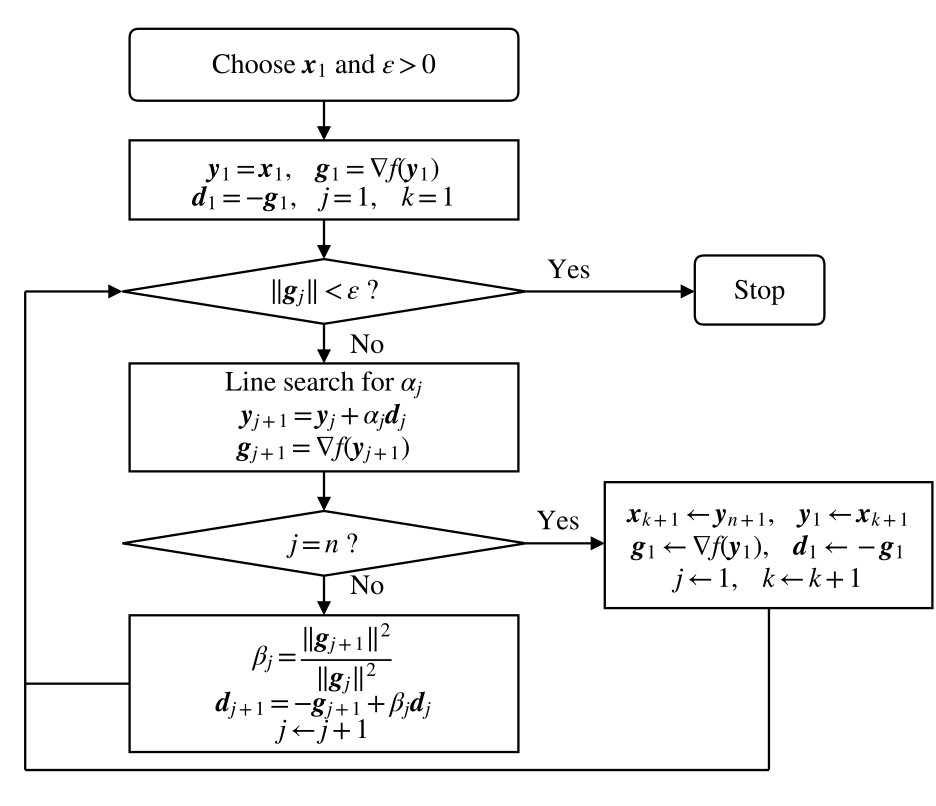

# Conjugate Gradient Method

[toc]

##### Conjugate directions

Let $\boldsymbol{A}$ be a symmetric positive definite matrix. Two nonzero directions $\boldsymbol{d}_i$ and $\boldsymbol{d}_j$ are conjugate with respect to $\boldsymbol{A}$ if

$$
\boldsymbol{d}_i^T\boldsymbol{A}\boldsymbol{d}_j=0
$$

A set of directions $\boldsymbol{d}_1,\boldsymbol{d}_2,\ldots,\boldsymbol{d}_k$ is $\boldsymbol{A}$-conjugate if

$$
\boldsymbol{d}_i^T\boldsymbol{A}\boldsymbol{d}_j=0
\qquad
 i\ne j
$$

If $\boldsymbol{A}=\boldsymbol{I}$, conjugacy reduces to ordinary orthogonality.

For the quadratic function

$$
f(\boldsymbol{x})
=
\frac{1}{2}
(\boldsymbol{x}-\boldsymbol{x}^*)^T
\boldsymbol{A}
(\boldsymbol{x}-\boldsymbol{x}^*)
$$

the level sets are ellipsoids centered at $\boldsymbol{x}^*$. At a point $\boldsymbol{x}_1$,

$$
\nabla f(\boldsymbol{x}_1)
=
\boldsymbol{A}(\boldsymbol{x}_1-\boldsymbol{x}^*)
$$

If $\boldsymbol{d}_1$ is tangent to the level set at $\boldsymbol{x}_1$, then

$$
\boldsymbol{d}_1^T\nabla f(\boldsymbol{x}_1)=0
$$

Let

$$
\boldsymbol{d}_2=
\boldsymbol{x}^*-\boldsymbol{x}_1
$$

Then

$$
\boldsymbol{d}_1^T\boldsymbol{A}\boldsymbol{d}_2=0
$$

Thus a tangent direction and the direction from the point to the minimizer are conjugate with respect to $\boldsymbol{A}$.

##### Linear independence

If $\boldsymbol{A}\succ\boldsymbol{0}$ and $\boldsymbol{d}_1,\ldots,\boldsymbol{d}_k$ are nonzero $\boldsymbol{A}$-conjugate directions, then they are linearly independent.

Proof

Assume

$$
\sum_{j=1}^{k}\alpha_j\boldsymbol{d}_j
=
\boldsymbol{0}
$$

Left-multiply by $\boldsymbol{d}_i^T\boldsymbol{A}$

$$
\alpha_i
\boldsymbol{d}_i^T\boldsymbol{A}\boldsymbol{d}_i
=
0
$$

Since $\boldsymbol{A}\succ\boldsymbol{0}$ and $\boldsymbol{d}_i\ne\boldsymbol{0}$,

$$
\boldsymbol{d}_i^T\boldsymbol{A}\boldsymbol{d}_i>0
$$

Therefore

$$
\alpha_i=0
$$

for every $i$.

##### Expanding subspace theorem

Consider

$$
f(\boldsymbol{x})
=
\frac{1}{2}\boldsymbol{x}^T\boldsymbol{A}\boldsymbol{x}
+
\boldsymbol{b}^T\boldsymbol{x}
+
c
$$

where $\boldsymbol{A}\succ\boldsymbol{0}$. Let $\boldsymbol{d}_1,\ldots,\boldsymbol{d}_k$ be nonzero $\boldsymbol{A}$-conjugate directions. Starting from any $\boldsymbol{x}_1$, perform exact line search successively along these directions and obtain $\boldsymbol{x}_{k+1}$.

Let

$$
\mathcal{B}_k
=
\left\{
\boldsymbol{x}
\mid
\boldsymbol{x}=
\sum_{i=1}^{k}\lambda_i\boldsymbol{d}_i
\right\}
$$

Then $\boldsymbol{x}_{k+1}$ is the unique minimizer of $f$ on the affine space

$$
\boldsymbol{x}_1+
\mathcal{B}_k
$$

In particular, if $k=n$, then $\boldsymbol{x}_{n+1}$ is the unique minimizer of $f$ on $\mathbb{R}^n$.

Proof

Since $\boldsymbol{x}_{k+1}\in \boldsymbol{x}_1+\mathcal{B}_k$, any point in $\boldsymbol{x}_1+\mathcal{B}_k$ can be written as

$$
\boldsymbol{x}
=
\boldsymbol{x}_{k+1}+\boldsymbol{p}
\qquad
\boldsymbol{p}\in\mathcal{B}_k
$$

Using the quadratic expansion at $\boldsymbol{x}_{k+1}$,

$$
f(\boldsymbol{x}_{k+1}+\boldsymbol{p})
=
f(\boldsymbol{x}_{k+1})
+
\boldsymbol{g}_{k+1}^T\boldsymbol{p}
+
\frac{1}{2}\boldsymbol{p}^T\boldsymbol{A}\boldsymbol{p}
$$

Since

$$
\boldsymbol{p}
=
\sum_{j=1}^{k}\lambda_j\boldsymbol{d}_j
$$

$$
\boldsymbol{g}_{k+1}^T\boldsymbol{d}_j=0
\qquad
j\le k
$$

$$
\boldsymbol{g}_{k+1}^T\boldsymbol{p}
=
\boldsymbol{g}_{k+1}^T
\sum_{j=1}^{k}\lambda_j\boldsymbol{d}_j
=
\sum_{j=1}^{k}
\lambda_j
\boldsymbol{g}_{k+1}^T\boldsymbol{d}_j
=
0
$$

we have
$$
f(\boldsymbol{x}_{k+1}+\boldsymbol{p})
=
f(\boldsymbol{x}_{k+1})
+
\frac{1}{2}\boldsymbol{p}^T\boldsymbol{A}\boldsymbol{p}
$$

Because $\boldsymbol{A}\succ\boldsymbol{0}$,

$$
\boldsymbol{p}^T\boldsymbol{A}\boldsymbol{p}>0
\qquad
\boldsymbol{p}\ne\boldsymbol{0}
$$

Therefore

$$
f(\boldsymbol{x}_{k+1}+\boldsymbol{p})
>
f(\boldsymbol{x}_{k+1})
\qquad
\boldsymbol{p}\ne\boldsymbol{0}
$$

Hence $\boldsymbol{x}_{k+1}$ is the unique minimizer of $f$ on $\boldsymbol{x}_1+\mathcal{B}_k$.

Proof the gradient at $\boldsymbol{x}_{k+1}$ is orthogonal to the subspace spanned by the searched directions.
$$
\boldsymbol{g}_{k+1}^T\boldsymbol{d}_j=0
\qquad
j\le k
$$
Since
$$
\boldsymbol{x}_{i+1}
=
\boldsymbol{x}_i+\alpha_i\boldsymbol{d}_i
$$

$$
\boldsymbol{g}_{i+1}
=
\boldsymbol{A}\boldsymbol{x}_{i+1}+\boldsymbol{b}
=
\boldsymbol{A}(\boldsymbol{x}_i+\alpha_i\boldsymbol{d}_i)+\boldsymbol{b}
=
\boldsymbol{g}_i+\alpha_i\boldsymbol{A}\boldsymbol{d}_i
$$

By exact line search along $\boldsymbol{d}_i$,

$$
0
=
\frac{d}{d\alpha}
f(\boldsymbol{x}_i+\alpha\boldsymbol{d}_i)
\bigg|_{\alpha=\alpha_i}
=
\boldsymbol{g}_{i+1}^T\boldsymbol{d}_i
$$

For $j<i$, repeatedly using $\boldsymbol{A}$-conjugacy,

$$
\boldsymbol{g}_{i+1}^T\boldsymbol{d}_j
=
(\boldsymbol{g}_i+\alpha_i\boldsymbol{A}\boldsymbol{d}_i)^T\boldsymbol{d}_j
=
\boldsymbol{g}_i^T\boldsymbol{d}_j
+
\alpha_i\boldsymbol{d}_i^T\boldsymbol{A}\boldsymbol{d}_j
=
\boldsymbol{g}_i^T\boldsymbol{d}_j
$$

$$
\boldsymbol{g}_{k+1}^T\boldsymbol{d}_j
=
\boldsymbol{g}_{k}^T\boldsymbol{d}_j
=
\cdots
=
\boldsymbol{g}_{j+1}^T\boldsymbol{d}_j
=
0
\qquad
j<k
$$

Together with

$$
\boldsymbol{g}_{k+1}^T\boldsymbol{d}_k=0
$$

we obtain
$$
\boldsymbol{g}_{k+1}^T\boldsymbol{d}_j=0
\qquad
j\le k
$$

##### Quadratic FR method

The Fletcher-Reeves conjugate gradient method combines steepest descent with conjugate directions.

Consider

$$
f(\boldsymbol{x})
=
\frac{1}{2}\boldsymbol{x}^T\boldsymbol{A}\boldsymbol{x}
+
\boldsymbol{b}^T\boldsymbol{x}
+
c
$$

where $\boldsymbol{A}\succ\boldsymbol{0}$. The gradient is

$$
\boldsymbol{g}_k
=
\boldsymbol{A}\boldsymbol{x}_k+\boldsymbol{b}
$$

Start with the negative gradient

$$
\boldsymbol{d}_1=-\boldsymbol{g}_1
$$

Given $\boldsymbol{x}_k$ and $\boldsymbol{d}_k$, perform exact line search

$$
\boldsymbol{x}_{k+1}
=
\boldsymbol{x}_k+
\alpha_k\boldsymbol{d}_k
$$

where

$$
f(\boldsymbol{x}_k+
\alpha_k\boldsymbol{d}_k)
=
\min_{\alpha}
f(\boldsymbol{x}_k+
\alpha\boldsymbol{d}_k)
$$

Let

$$
\phi(\alpha)
=
f(\boldsymbol{x}_k+\alpha\boldsymbol{d}_k)
$$

For a quadratic function, the exact step length has the explicit form
$$
\phi(\alpha)
=
f(\boldsymbol{x}_k)
+
\alpha\boldsymbol{g}_k^T\boldsymbol{d}_k
+
\frac{1}{2}\alpha^2
\boldsymbol{d}_k^T\boldsymbol{A}\boldsymbol{d}_k
$$

$$
\phi'(\alpha)
=
\boldsymbol{g}_k^T\boldsymbol{d}_k
+
\alpha
\boldsymbol{d}_k^T\boldsymbol{A}\boldsymbol{d}_k
=
0
$$

$$
\alpha_k
=
-
\frac{
\boldsymbol{g}_k^T\boldsymbol{d}_k
}{
\boldsymbol{d}_k^T\boldsymbol{A}\boldsymbol{d}_k
}
$$

After computing $\boldsymbol{g}_{k+1}$, define

$$
\boldsymbol{d}_{k+1}
=
-\boldsymbol{g}_{k+1}
+
\beta_k\boldsymbol{d}_k
$$

Choose $\beta_k$ so that $\boldsymbol{d}_{k+1}$ and $\boldsymbol{d}_k$ are $\boldsymbol{A}$-conjugate

$$
\boldsymbol{d}_k^T\boldsymbol{A}\boldsymbol{d}_{k+1}=0
$$

Substituting the recurrence gives

$$
\boldsymbol{d}_k^T\boldsymbol{A}(-\boldsymbol{g}_{k+1}+\beta_k\boldsymbol{d}_k)=0
$$

Hence

$$
\beta_k
=
\frac{
\boldsymbol{d}_k^T\boldsymbol{A}\boldsymbol{g}_{k+1}
}{
\boldsymbol{d}_k^T\boldsymbol{A}\boldsymbol{d}_k
}
$$

For strictly convex quadratic functions with exact line search,
$$
\boldsymbol{g}_{i+1}
=
\boldsymbol{A}\boldsymbol{x}_{i+1}+\boldsymbol{b}
=
\boldsymbol{A}(
\boldsymbol{x}_{i}+
\alpha_i\boldsymbol{d}_i)
+\boldsymbol{b}
$$

$$
\boldsymbol{g}_{i}
=
\boldsymbol{A}\boldsymbol{x}_{i}+\boldsymbol{b}
$$

$$
\boldsymbol{A}\boldsymbol{d}_i=\frac{\boldsymbol{g}_{i+1}-\boldsymbol{g}_{i}}{\alpha_i}
$$

$$
\beta_i
=
\frac{\boldsymbol{g}_{i+1}^T\boldsymbol{A}\boldsymbol{d}_i}
{\boldsymbol{d}_i^T\boldsymbol{A}\boldsymbol{d}_i}
=
\frac{\boldsymbol{g}_{i+1}^T(\boldsymbol{g}_{i+1}-\boldsymbol{g}_i)}
{\boldsymbol{d}_i^T(\boldsymbol{g}_{i+1}-\boldsymbol{g}_i)}
=
\frac{\|\boldsymbol{g}_{i+1}\|^2}
{-\boldsymbol{d}_i^T\boldsymbol{g}_i}
$$

$$
\boldsymbol{d}_i^T\boldsymbol{g}_i
=
(-\boldsymbol{g}_i+\beta_{i-1}\boldsymbol{d}_{i-1})^T\boldsymbol{g}_i
=
-\|\boldsymbol{g}_i\|^2
+
\beta_{i-1}\boldsymbol{d}_{i-1}^T\boldsymbol{g}_i
=
-\|\boldsymbol{g}_i\|^2
$$

$\beta_k$ can be written without matrix multiplication as
$$
\qquad
\beta_i
=
\frac{\|\boldsymbol{g}_{i+1}\|^2}
{\|\boldsymbol{g}_i\|^2}
$$

##### Quadratic termination

For the positive definite quadratic function, the FR method with exact line search terminates after $m\le n$ searches. This property is called quadratic termination.

That is,

$$
\boldsymbol{x}_{m+1}=\boldsymbol{x}^*
\qquad
\boldsymbol{g}_{m+1}=\boldsymbol{0}
\qquad
m\le n
$$

Quadratic termination is a property of strictly convex quadratic functions with exact line search. It is not a general finite termination guarantee for nonlinear functions.

Moreover, for all $i$ with $1\le i\le m$, the following relations hold
$$
\boldsymbol{d}_i^T\boldsymbol{A}\boldsymbol{d}_j=0
\qquad
j<i
$$

$$
\boldsymbol{g}_i^T\boldsymbol{g}_j=0
\qquad
j<i
$$

$$
\boldsymbol{g}_i^T\boldsymbol{d}_i
=
-
\boldsymbol{g}_i^T\boldsymbol{g}_i

\qquad

\boldsymbol{d}_i \neq \boldsymbol 0
$$

Proof

Since

$$
\boldsymbol{g}_i^T\boldsymbol{d}_j=0
\qquad
j<i
$$

$$
\boldsymbol{g}_j
=
-\boldsymbol{d}_j+\beta_{j-1}\boldsymbol{d}_{j-1}
$$

we get

$$
\boldsymbol{g}_i^T\boldsymbol{g}_j=0
\qquad
j<i
$$

$$
\boldsymbol{g}_i^T\boldsymbol{d}_i
=
\boldsymbol{g}_i^T
\left(
-\boldsymbol{g}_i+\beta_{i-1}\boldsymbol{d}_{i-1}
\right)
=
-\boldsymbol{g}_i^T\boldsymbol{g}_i
$$

Use induction. Assume that before constructing $\boldsymbol{d}_i$,

$$
\boldsymbol{d}_r^T\boldsymbol{A}\boldsymbol{d}_s=0
\qquad
s<r<i
$$

Since
$$
\boldsymbol{g}_i^T\boldsymbol{g}_j=0
\qquad
j<i
$$

$$
\boldsymbol{d}_i
=
-\boldsymbol{g}_i+\beta_{i-1}\boldsymbol{d}_{i-1}
$$

$$
\boldsymbol{A}\boldsymbol{d}_j
=
\frac{\boldsymbol{g}_{j+1}-\boldsymbol{g}_j}{\alpha_j}
$$

we have

$$
\left\{
\begin{aligned}
\boldsymbol{d}_i^T\boldsymbol{A}\boldsymbol{d}_j
&=
-\boldsymbol{g}_i^T\boldsymbol{A}\boldsymbol{d}_j
+
\beta_{i-1}
\boldsymbol{d}_{i-1}^T\boldsymbol{A}\boldsymbol{d}_j
\\
&=
-\frac{
\boldsymbol{g}_i^T(\boldsymbol{g}_{j+1}-\boldsymbol{g}_j)
}{
\alpha_j
}
+
0
=
0
\qquad \qquad \qquad \qquad
j<i-1
\\[10pt]
\boldsymbol{d}_i^T\boldsymbol{A}\boldsymbol{d}_{i-1}
&=
-\boldsymbol{g}_i^T\boldsymbol{A}\boldsymbol{d}_{i-1}
+
\beta_{i-1}
\boldsymbol{d}_{i-1}^T\boldsymbol{A}\boldsymbol{d}_{i-1}
\\
&=
-\frac{
\boldsymbol{g}_i^T(\boldsymbol{g}_i-\boldsymbol{g}_{i-1})
}{
\alpha_{i-1}
}
+
\beta_{i-1}
\frac{
\boldsymbol{d}_{i-1}^T(\boldsymbol{g}_i-\boldsymbol{g}_{i-1})
}{
\alpha_{i-1}
}
\\
&=
-\frac{
\|\boldsymbol{g}_i\|^2
}{
\alpha_{i-1}
}
+
\frac{
\beta_{i-1}\|\boldsymbol{g}_{i-1}\|^2
}{
\alpha_{i-1}
}
=
0	
\qquad \qquad \qquad
j=i-1
\end{aligned}
\right.
$$

because

$$
\beta_{i-1}
=
\frac{\|\boldsymbol{g}_i\|^2}
{\|\boldsymbol{g}_{i-1}\|^2}
$$

Therefore
$$
\boldsymbol{d}_i^T\boldsymbol{A}\boldsymbol{d}_j=0
\qquad
j<i
$$

##### Algorithm for strictly convex quadratic functions

Choose an initial point $\boldsymbol{x}_1$ and set $k=1$. In the FR method, the initial search direction must be chosen as the steepest descent direction.

At iteration $k$, compute

$$
\boldsymbol{g}_k=\nabla f(\boldsymbol{x}_k)
$$

If

$$
\|\boldsymbol{g}_k\|=0
$$

stop.

Construct the direction

$$
\boldsymbol{d}_k
=
-
\boldsymbol{g}_k
+
\beta_{k-1}\boldsymbol{d}_{k-1}
$$

where
$$
\beta_{k-1}
=
\begin{cases}
0
&
k=1
\\[6pt]
\dfrac{\|\boldsymbol{g}_k\|^2}
{\|\boldsymbol{g}_{k-1}\|^2}
&
k>1
\end{cases}
$$
Compute

$$
\alpha_k
=
-
\frac{
\boldsymbol{g}_k^T\boldsymbol{d}_k
}{
\boldsymbol{d}_k^T\boldsymbol{A}\boldsymbol{d}_k
}
$$

Update

$$
\boldsymbol{x}_{k+1}
=
\boldsymbol{x}_k+
\alpha_k\boldsymbol{d}_k
$$

If $k=n$, stop. Otherwise set $k:=k+1$ and repeat.

##### Nonlinear conjugate gradient method

For a general differentiable function, the explicit quadratic step length is no longer valid. The step length must be determined by a one-dimensional search.

The nonlinear FR method uses

$$
\boldsymbol{d}_{j+1}
=
-
\nabla f(\boldsymbol{y}_{j+1})
+
\beta_j\boldsymbol{d}_j
$$

where

$$
\beta_j
=
\frac{
\|\nabla f(\boldsymbol{y}_{j+1})\|^2
}{
\|\nabla f(\boldsymbol{y}_{j})\|^2
}
$$

The iteration is restarted after $n$ steps by taking a steepest descent direction again.

A typical **restarted FR procedure** is below.

Choose an initial point $\boldsymbol{x}_1$ and a tolerance $\varepsilon>0$. Set

$$
\boldsymbol{y}_1=\boldsymbol{x}_1
\qquad
\boldsymbol{d}_1=-\nabla f(\boldsymbol{y}_1)
\qquad
j=1
\qquad
k=1
$$

At inner iteration $j$, if

$$
\|\nabla f(\boldsymbol{y}_j)\|<\varepsilon
$$

stop. Otherwise choose $\alpha_j$ by one-dimensional line search such that

$$
f(\boldsymbol{y}_j+
\alpha_j\boldsymbol{d}_j)
=
\min_{\alpha\ge 0}
f(\boldsymbol{y}_j+
\alpha\boldsymbol{d}_j)
$$

Set

$$
\boldsymbol{y}_{j+1}
=
\boldsymbol{y}_j+
\alpha_j\boldsymbol{d}_j
$$

If $j<n$, compute

$$
\beta_j
=
\frac{
\|\nabla f(\boldsymbol{y}_{j+1})\|^2
}{
\|\nabla f(\boldsymbol{y}_{j})\|^2
}
$$

$$
\boldsymbol{d}_{j+1}
=
-
\nabla f(\boldsymbol{y}_{j+1})
+
\beta_j\boldsymbol{d}_j
$$

Set

$$
j:=j+1
$$

and return to the stopping test.

If $j=n$, restart by setting

$$
\boldsymbol{x}_{k+1}=\boldsymbol{y}_{n+1}
\qquad
\boldsymbol{y}_1=\boldsymbol{x}_{k+1}
\qquad
\boldsymbol{d}_1=-\nabla f(\boldsymbol{y}_1)
$$

$$
j:=1
\qquad
k:=k+1
$$

and return to the stopping test.

##### Other beta formulas

Besides the FR formula, common choices include PRP

$$
\beta_j^{\mathrm{PRP}}
=
\frac{
\boldsymbol{g}_{j+1}^T(\boldsymbol{g}_{j+1}-\boldsymbol{g}_j)
}{
\boldsymbol{g}_j^T\boldsymbol{g}_j
}
$$

Hestenes-Stiefel type formula

$$
\beta_j^{\mathrm{HS}}
=
\frac{
\boldsymbol{g}_{j+1}^T(\boldsymbol{g}_{j+1}-\boldsymbol{g}_j)
}{
\boldsymbol{d}_j^T(\boldsymbol{g}_{j+1}-\boldsymbol{g}_j)
}
$$

and Daniel's formula

$$
\beta_j^{\mathrm{D}}
=
\frac{
\boldsymbol{d}_j^T
\nabla^2 f(\boldsymbol{x}_{j+1})
\boldsymbol{g}_{j+1}
}{
\boldsymbol{d}_j^T
\nabla^2 f(\boldsymbol{x}_{j+1})
\boldsymbol{d}_j
}
$$

For strictly convex quadratic functions with exact line search and initial direction $-\boldsymbol{g}_1$, these formulas are equivalent. For general nonlinear functions, they give different search directions.

Descent issue with inexact line search.

From

$$
\boldsymbol{d}_{k+1}
=
-
\boldsymbol{g}_{k+1}
+
\beta_k\boldsymbol{d}_k
$$

we obtain

$$
\boldsymbol{g}_{k+1}^T\boldsymbol{d}_{k+1}
=
-
\boldsymbol{g}_{k+1}^T\boldsymbol{g}_{k+1}
+
\beta_k
\boldsymbol{g}_{k+1}^T\boldsymbol{d}_k
$$

With exact line search,

$$
\boldsymbol{g}_{k+1}^T\boldsymbol{d}_k=0
$$

so

$$
\boldsymbol{g}_{k+1}^T\boldsymbol{d}_{k+1}
=
-
\|\boldsymbol{g}_{k+1}\|^2
<0
$$

When inexact line search is used, $\boldsymbol{g}_{k+1}$ and $\boldsymbol{d}_k$ are not necessarily orthogonal. It is possible that

$$
\beta_k\boldsymbol{g}_{k+1}^T\boldsymbol{d}_k>0
$$

which may lead to

$$
\boldsymbol{g}_{k+1}^T\boldsymbol{d}_{k+1}>0
$$

In this case, $\boldsymbol{d}_{k+1}$ becomes an ascent direction. A common remedy is to restart with the steepest descent direction.
