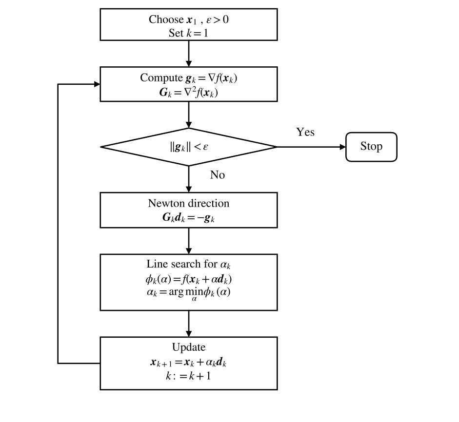

# Newton Method

[toc]

### Newton Method

##### Quadratic approximation

Consider the unconstrained problem

$$
\min_{\boldsymbol{x}\in \mathbb{R}^n} f(\boldsymbol{x})
$$

where $f:\mathbb{R}^n\to\mathbb{R}$ is twice continuously differentiable.

At iteration $k$, let
$$
\boldsymbol{g}_k=\nabla f(\boldsymbol{x}_k)
$$

$$
\boldsymbol{G}_k=\nabla^2 f(\boldsymbol{x}_k)
$$

Assume that $f$ is twice differentiable. Near $\boldsymbol{x}_k$, use the second-order Taylor approximation

$$
f(\boldsymbol{x})
\approx
\psi_k(\boldsymbol{x})
=
f(\boldsymbol{x}_k)
+
\boldsymbol{g}_k^T(\boldsymbol{x}-\boldsymbol{x}_k)
+
\frac{1}{2}
(\boldsymbol{x}-\boldsymbol{x}_k)^T
\boldsymbol{G}_k
(\boldsymbol{x}-\boldsymbol{x}_k)
$$

Let

$$
\boldsymbol{d}=\boldsymbol{x}-\boldsymbol{x}_k
$$

Then the quadratic model can be written as

$$
\psi_k(\boldsymbol{d})
=
f(\boldsymbol{x}_k)
+
\boldsymbol{g}_k^T\boldsymbol{d}
+
\frac{1}{2}
\boldsymbol{d}^T\boldsymbol{G}_k\boldsymbol{d}
$$

To find the stationary point of the model, set

$$
\nabla \psi_k(\boldsymbol{d})=
\boldsymbol{g}_k+
\boldsymbol{G}_k\boldsymbol{d}=\boldsymbol{0}
$$

we obtain the Newton equation

$$
\boldsymbol{G}_k\boldsymbol{d}_k=-\boldsymbol{g}_k
$$

If $\boldsymbol{G}_k$ is nonsingular, then

$$
\boldsymbol{d}_k
=
-\boldsymbol{G}_k^{-1}\boldsymbol{g}_k
$$

##### Newton iteration

The pure Newton method takes the full Newton step

$$
\boldsymbol{x}_{k+1}
=
\boldsymbol{x}_k+\boldsymbol{d}_k
=
\boldsymbol{x}_k
-
\boldsymbol{G}_k^{-1}\boldsymbol{g}_k
$$

The iteration is repeated by computing the new gradient and Hessian at $\boldsymbol{x}_{k+1}$.

##### Local convergence

Let $\boldsymbol{x}^*$ satisfy

$$
\nabla f(\boldsymbol{x}^*)=\boldsymbol{0}
$$

Assume that $\nabla^2 f(\boldsymbol{x}^*)^{-1}$ exists and that the initial point is sufficiently **close** to $\boldsymbol{x}^*$.

Define the Newton mapping

$$
\boldsymbol{A}(\boldsymbol{x})
=
\boldsymbol{x}
-
\nabla^2 f(\boldsymbol{x})^{-1}\nabla f(\boldsymbol{x})
$$

Let

$$
\boldsymbol{y}=\boldsymbol{A}(\boldsymbol{x})
$$

Using $\nabla f(\boldsymbol{x}^*)=\boldsymbol{0}$, we have

$$
\boldsymbol{y}-\boldsymbol{x}^*
=
\boldsymbol{x}
-
\nabla^2 f(\boldsymbol{x})^{-1}\nabla f(\boldsymbol{x})
-
\boldsymbol{x}^*
$$

$$
\boldsymbol{y}-\boldsymbol{x}^*
=
(\boldsymbol{x}-\boldsymbol{x}^*)
-
\nabla^2 f(\boldsymbol{x})^{-1}
\left[
\nabla f(\boldsymbol{x})-
\nabla f(\boldsymbol{x}^*)
\right]
$$

$$
\boldsymbol{y}-\boldsymbol{x}^*
=
\nabla^2 f(\boldsymbol{x})^{-1}
\left[
\nabla f(\boldsymbol{x}^*)
-
\nabla f(\boldsymbol{x})
-
\nabla^2 f(\boldsymbol{x})(\boldsymbol{x}^*-\boldsymbol{x})
\right]
$$

If there exist constants $k_1,k_2>0$ such that

$$
\left\|
\nabla^2 f(\boldsymbol{x})^{-1}
\right\|
\le k_1
$$

and

$$
\frac{
\left\|
\nabla f(\boldsymbol{x}^*)
-
\nabla f(\boldsymbol{x})
-
\nabla^2 f(\boldsymbol{x})(\boldsymbol{x}^*-\boldsymbol{x})
\right\|
}{
\left\|
\boldsymbol{x}^*-\boldsymbol{x}
\right\|
}
\le k_2
$$

with

$$
k_1k_2<1
$$

then

$$
\left\|
\boldsymbol{y}-\boldsymbol{x}^*
\right\|
\le
k_1k_2
\left\|
\boldsymbol{x}^*-\boldsymbol{x}
\right\|
<
\left\|
\boldsymbol{x}^*-\boldsymbol{x}
\right\|
$$

Thus the Newton mapping decreases the distance to $\boldsymbol{x}^*$ locally.

When Newton method converges, it has at least quadratic convergence locally, namely

$$
\left\|
\boldsymbol{x}_{k+1}-\boldsymbol{x}^*
\right\|
\le
c
\left\|
\boldsymbol{x}_k-\boldsymbol{x}^*
\right\|^2
$$

where $c$ is a positive constant.

##### Example

Solve
$$
\min f(\boldsymbol{x})=(x_1-1)^4+x_2^2
$$

Take

$$
\boldsymbol{x}_1=
\begin{bmatrix}
0\\
1
\end{bmatrix}
$$

The gradient and Hessian are

$$
\nabla f(\boldsymbol{x})
=
\begin{bmatrix}
4(x_1-1)^3\\
2x_2
\end{bmatrix}
$$

$$
\nabla^2 f(\boldsymbol{x})
=
\begin{bmatrix}
12(x_1-1)^2 & 0\\
0 & 2
\end{bmatrix}
$$

At $\boldsymbol{x}_1$,

$$
\boldsymbol{g}_1
=
\begin{bmatrix}
-4\\
2
\end{bmatrix}
$$

$$
\boldsymbol{G}_1
=
\begin{bmatrix}
12 & 0\\
0 & 2
\end{bmatrix}
$$

Thus

$$
\boldsymbol{x}_2
=
\boldsymbol{x}_1-
\boldsymbol{G}_1^{-1}\boldsymbol{g}_1
=
\begin{bmatrix}
0\\
1
\end{bmatrix}
-
\begin{bmatrix}
12 & 0\\
0 & 2
\end{bmatrix}^{-1}
\begin{bmatrix}
-4\\
2
\end{bmatrix}
=
\begin{bmatrix}
\frac{1}{3}\\
0
\end{bmatrix}
$$

At $\boldsymbol{x}_2$,

$$
\boldsymbol{g}_2
=
\begin{bmatrix}
-\frac{32}{27}\\
0
\end{bmatrix}
$$

$$
\boldsymbol{G}_2
=
\begin{bmatrix}
\frac{48}{9} & 0\\
0 & 2
\end{bmatrix}
$$

Therefore

$$
\boldsymbol{x}_3
=
\boldsymbol{x}_2-
\boldsymbol{G}_2^{-1}\boldsymbol{g}_2
=
\begin{bmatrix}
\frac{5}{9}\\
0
\end{bmatrix}
$$

Continuing gives

$$
\boldsymbol{x}_4
=
\begin{bmatrix}
\frac{19}{27}\\
0
\end{bmatrix}
$$

$$
\boldsymbol{x}_5
=
\begin{bmatrix}
\frac{65}{81}\\
0
\end{bmatrix}
$$

The minimizer is

$$
\boldsymbol{x}^*
=
\begin{bmatrix}
1\\
0
\end{bmatrix}
$$

##### Quadratic termination

For the strictly convex quadratic function

$$
f(\boldsymbol{x})
=
\frac{1}{2}\boldsymbol{x}^T\boldsymbol{A}\boldsymbol{x}
+
\boldsymbol{b}^T\boldsymbol{x}
+
c
$$

where

$$
\boldsymbol{A}\succ\boldsymbol{0}
$$

we have
$$
\begin{aligned}
\frac{\partial}{\partial \boldsymbol{x}}
\left(
\boldsymbol{x}^T\boldsymbol{A}\boldsymbol{x}
\right)
&=
\frac{\partial}{\partial \boldsymbol{x}}
\left[
\boldsymbol{x}^T
(\boldsymbol{A}\boldsymbol{x})
\right]
=
\left(
\frac{\partial \boldsymbol{x}}{\partial \boldsymbol{x}}
\right)^T
\boldsymbol{A}\boldsymbol{x}
+
\left(
\frac{\partial (\boldsymbol{A}\boldsymbol{x})}{\partial \boldsymbol{x}}
\right)^T
\boldsymbol{x} \\
&=
\boldsymbol{I}^T\boldsymbol{A}\boldsymbol{x}
+
\boldsymbol{A}^T\boldsymbol{x} =
\boldsymbol{A}\boldsymbol{x}
+
\boldsymbol{A}^T\boldsymbol{x} \\
&=
(\boldsymbol{A}+\boldsymbol{A}^T)\boldsymbol{x}
\end{aligned}
$$

$$
\nabla f(\boldsymbol{x})
=
\frac{1}{2}(\boldsymbol{A}+\boldsymbol{A}^T)\boldsymbol{x}+\boldsymbol{b}
=
\boldsymbol{A}\boldsymbol{x}+\boldsymbol{b}
$$

The stationary condition gives

$$
\boldsymbol{A}\boldsymbol{x}+\boldsymbol{b}=\boldsymbol{0}
$$

$$
\boldsymbol{x}^*=-\boldsymbol{A}^{-1}\boldsymbol{b}
$$

For any initial point $\boldsymbol{x}_1$,

$$
\boldsymbol{x}_2
=
\boldsymbol{x}_1
-
\boldsymbol{A}^{-1}\nabla f(\boldsymbol{x}_1)
$$

$$
\boldsymbol{x}_2
=
\boldsymbol{x}_1
-
\boldsymbol{A}^{-1}(\boldsymbol{A}\boldsymbol{x}_1+\boldsymbol{b})
=
-\boldsymbol{A}^{-1}\boldsymbol{b}
$$

Hence Newton method reaches the minimizer in one iteration for a strictly convex quadratic function. This property is called quadratic termination.

##### Limitations of Newton method

First, when the initial point is **far** from the minimizer, the Newton method may fail to converge.

The Newton direction

$$
\boldsymbol{d}
=
-
\nabla^2 f(\boldsymbol{x})^{-1}
\nabla f(\boldsymbol{x})
$$

is **not necessarily a descent direction**. The objective function value may increase. Even if the function value decreases, the full Newton step may not be the best point along the Newton direction.

Second, the computational cost can be high. At each iteration, Newton method needs to compute the Hessian matrix and solve the Newton equation

$$
\boldsymbol{G}_k\boldsymbol{d}_k
=
-
\boldsymbol{g}_k
$$

For large-scale problems, forming and storing $\boldsymbol{G}_k$ and solving the linear system can be expensive.

Third, the Hessian matrix may be singular. If

$$
\det(\boldsymbol{G}_k)=0
$$

then $\boldsymbol{G}_k^{-1}$ does not exist, and the Newton direction

$$
\boldsymbol{d}_k
=
-
\boldsymbol{G}_k^{-1}\boldsymbol{g}_k
$$

cannot be computed directly.

### Damped Newton Method

##### Basic form

The damped Newton method adds a one-dimensional search along the Newton direction.

The iteration is

$$
\boldsymbol{x}_{k+1}
=
\boldsymbol{x}_k+
\alpha_k\boldsymbol{d}_k
$$

where

$$
\boldsymbol{d}_k
=
-
\boldsymbol{G}_k^{-1}\boldsymbol{g}_k
$$

and $\alpha_k$ is chosen by line search

$$
f(\boldsymbol{x}_k+
\alpha_k\boldsymbol{d}_k)
=
\min_{\alpha}
f(\boldsymbol{x}_k+
\alpha\boldsymbol{d}_k)
$$

where $\alpha$ can be negative.

##### Algorithm

Choose an initial point $\boldsymbol{x}_1$ and a tolerance $\varepsilon>0$. Set $k=1$.

At iteration $k$, compute

$$
\boldsymbol{g}_k=\nabla f(\boldsymbol{x}_k)
$$

$$
\boldsymbol{G}_k=\nabla^2 f(\boldsymbol{x}_k)
$$

If

$$
\|\boldsymbol{g}_k\|<\varepsilon
$$

stop.

Otherwise set

$$
\boldsymbol{d}_k
=
-
\boldsymbol{G}_k^{-1}\boldsymbol{g}_k
$$

Choose $\alpha_k$ by line search

$$
\min_{\alpha}
f(\boldsymbol{x}_k+
\alpha\boldsymbol{d}_k)
=
f(\boldsymbol{x}_k+
\alpha_k\boldsymbol{d}_k)
$$

Update

$$
\boldsymbol{x}_{k+1}
=
\boldsymbol{x}_k+
\alpha_k\boldsymbol{d}_k
$$

Set $k:=k+1$ and repeat.

Because the damped Newton method uses line search, the objective function value usually decreases and does not increase under exact line search. Under suitable assumptions, it has global convergence and second-order local convergence.

### Modified Newton Method

##### Motivation

The Newton method and damped Newton method have two common difficulties.

First, the Hessian may be singular, so the Newton direction cannot be computed.

Second, even if the Hessian is nonsingular, it may not be positive definite. Then the Newton direction may fail to be a descent direction.

##### Failure example

Consider

$$
\min f(\boldsymbol{x})
=
x_1^4+x_1x_2+(1+x_2)^2
$$

Take

$$
\boldsymbol{x}_1=
\begin{bmatrix}
0\\
0
\end{bmatrix}
$$

At $\boldsymbol{x}_1$,

$$
\boldsymbol{g}_1
=
\begin{bmatrix}
0\\
2
\end{bmatrix}
$$

$$
\boldsymbol{G}_1
=
\begin{bmatrix}
0 & 1\\
1 & 2
\end{bmatrix}
$$

The Newton direction is

$$
\boldsymbol{d}_1
=
-
\boldsymbol{G}_1^{-1}\boldsymbol{g}_1
=
-
\begin{bmatrix}
0 & 1\\
1 & 2
\end{bmatrix}^{-1}
\begin{bmatrix}
0\\
2
\end{bmatrix}
=
\begin{bmatrix}
-2\\
0
\end{bmatrix}
$$

Along this direction,

$$
\phi(\alpha)
=
f(\boldsymbol{x}_1+
\alpha\boldsymbol{d}_1)
=
16\alpha^4+1
$$

Thus

$$
\phi'(\alpha)=64\alpha^3=0
$$

The one-dimensional minimizer is

$$
\alpha_1=0
$$

So the damped Newton method cannot generate a new point, although $\boldsymbol{x}_1$ is not a minimizer. The reason is that $\boldsymbol{G}_1$ is not positive definite.

##### Positive definite modification

This positive definite modification is also known as the Goldfeld modified Newton method.

The Newton equation is
$$
\boldsymbol{G}_k\boldsymbol{d}_k
=
-
\boldsymbol{g}_k
$$

The basic idea of modified Newton methods is to replace $\boldsymbol{G}_k$ by a symmetric positive definite matrix $\boldsymbol{M}_k$.

Solve

$$
\boldsymbol{M}_k\boldsymbol{d}_k
=
-
\boldsymbol{g}_k
$$

$$
\boldsymbol{d}_k
=
-
\boldsymbol{M}_k^{-1}\boldsymbol{g}_k
$$

If

$$
\boldsymbol{M}_k\succ\boldsymbol{0}
$$

$$
\boldsymbol{g}_k\ne\boldsymbol{0}
$$

then

$$
\boldsymbol{g}_k^T\boldsymbol{d}_k
=
-
\boldsymbol{g}_k^T\boldsymbol{M}_k^{-1}\boldsymbol{g}_k
<0
$$

Thus $\boldsymbol{d}_k$ is a descent direction.

A simple choice is

$$
\boldsymbol{M}_k
=
\boldsymbol{G}_k+
\varepsilon_k\boldsymbol{I}
$$

where $\varepsilon_k>0$ is chosen so that $\boldsymbol{M}_k$ is positive definite.

If $\mu_i$ is an eigenvalue of $\boldsymbol{G}_k$, then $\mu_i+\varepsilon_k$ is an eigenvalue of $\boldsymbol{M}_k$. Choosing $\varepsilon_k$ sufficiently large makes all eigenvalues positive.

##### Saddle point case

If $\boldsymbol{x}_k$ is a saddle point, then it may happen that

$$
\boldsymbol{g}_k=\boldsymbol{0}
$$

and

$$
\boldsymbol{G}_k
\text{ is indefinite}
$$

Then the equation

$$
\boldsymbol{M}_k\boldsymbol{d}_k=-\boldsymbol{g}_k
$$

cannot give a useful descent direction. In this case, choose a negative curvature direction satisfying

$$
\boldsymbol{d}_k^T\boldsymbol{G}_k\boldsymbol{d}_k<0
$$

Along such a direction, a line search can decrease the objective function.
