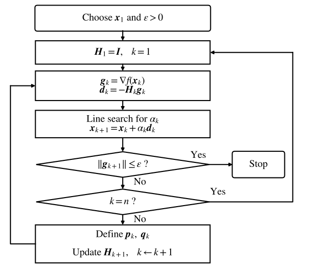

# Quasi-Newton Method

[toc]

##### Quasi-Newton condition

Newton method is fast, but it requires second derivatives and the Hessian may be non-positive definite. Quasi-Newton methods replace the inverse Hessian by a matrix updated only from first-order information.

The Newton-type iteration is

$$
\boldsymbol{x}_{k+1}
=
\boldsymbol{x}_k+
\alpha_k\boldsymbol{d}_k
$$

with

$$
\boldsymbol{d}_k
=
-
\boldsymbol{H}_k\boldsymbol{g}_k
$$

where $\boldsymbol{H}_k$ approximates $\boldsymbol{G}_k^{-1}$.

After one step, define

$$
\boldsymbol{p}_k
=
\boldsymbol{x}_{k+1}-\boldsymbol{x}_k
$$

$$
\boldsymbol{q}_k
=
\boldsymbol{g}_{k+1}-\boldsymbol{g}_k
$$

Here, $\boldsymbol{p}_k$ is the displacement vector, and $\boldsymbol{q}_k$ is the gradient difference vector.

Using the Taylor expansion of the gradient near $\boldsymbol{x}_{k+1}$,
$$
\nabla f(\boldsymbol{x}_k)
\approx
\nabla f(\boldsymbol{x}_{k+1})
+
\nabla^2 f(\boldsymbol{x}_{k+1})(\boldsymbol{x}_k-\boldsymbol{x}_{k+1})
$$

so

$$
\boldsymbol{q}_k
\approx
\nabla^2 f(\boldsymbol{x}_{k+1})\boldsymbol{p}_k
$$

If the Hessian is nonsingular, then

$$
\boldsymbol{p}_k
\approx
\nabla^2 f(\boldsymbol{x}_{k+1})^{-1}\boldsymbol{q}_k
$$

Thus the inverse Hessian approximation $\boldsymbol{H}_{k+1}$ is required to satisfy the **quasi-Newton condition**

$$
\boldsymbol{p}_k
=
\boldsymbol{H}_{k+1}\boldsymbol{q}_k
$$

This condition is also called the **secant equation**.

##### Rank-one correction

Let

$$
\boldsymbol{H}_{k+1}
=
\boldsymbol{H}_k+
\Delta\boldsymbol{H}_k
$$

A rank-one correction assumes

$$
\Delta\boldsymbol{H}_k
=
\eta_k
\boldsymbol{z}_k\boldsymbol{z}_k^T
$$

$$
\text {rank} (\Delta\boldsymbol{H}_k) = 
\min\{\text {rank}(\boldsymbol{z}_k),
\text {rank}(\boldsymbol{z}_k^T)\} = 1
$$

Imposing the secant equation gives
$$
\boldsymbol{p}_k
=
\boldsymbol{H}_k\boldsymbol{q}_k
+
\eta_k
\boldsymbol{z}_k\boldsymbol{z}_k^T\boldsymbol{q}_k
$$

$$
\boldsymbol{z}_k=
\frac{
\boldsymbol{p}_k
-
\boldsymbol{H}_k\boldsymbol{q}_k
}
{
\eta_k\boldsymbol{z}_k^T\boldsymbol{q}_k
}
$$

Left-multiplying the above equation by $\boldsymbol{q}_k^T$ and rearranging yields
$$
\boldsymbol{q}_k^T(\boldsymbol{p}_k
-
\boldsymbol{H}_k\boldsymbol{q}_k)
=
\eta_k(\boldsymbol{z}_k^T\boldsymbol{q}_k)^2
$$

$$
\eta_k
=
\frac{\boldsymbol{q}_k^T(\boldsymbol{p}_k
-
\boldsymbol{H}_k\boldsymbol{q}_k)
}{
(\boldsymbol{z}_k^T\boldsymbol{q}_k)^2
}
$$

After elimination, the rank-one update is
$$
\Delta\boldsymbol{H}_k
=
\eta_k
\boldsymbol{z}_k\boldsymbol{z}_k^T
=
\eta_k
\frac{
\boldsymbol{p}_k
-
\boldsymbol{H}_k\boldsymbol{q}_k
}
{
\eta_k\boldsymbol{z}_k^T\boldsymbol{q}_k
}
\frac{
(\boldsymbol{p}_k
-
\boldsymbol{H}_k\boldsymbol{q}_k)^T
}
{
\eta_k\boldsymbol{z}_k^T\boldsymbol{q}_k
}
=
\frac{
(\boldsymbol{p}_k-\boldsymbol{H}_k\boldsymbol{q}_k)
(\boldsymbol{p}_k-\boldsymbol{H}_k\boldsymbol{q}_k)^T
}{
\eta_k(\boldsymbol{z}_k^T\boldsymbol{q}_k)^2
}
$$

$$
\boldsymbol{H}_{k+1}
=
\boldsymbol{H}_k
+
\frac{
(\boldsymbol{p}_k-\boldsymbol{H}_k\boldsymbol{q}_k)
(\boldsymbol{p}_k-\boldsymbol{H}_k\boldsymbol{q}_k)^T
}{
\boldsymbol{q}_k^T(\boldsymbol{p}_k-\boldsymbol{H}_k\boldsymbol{q}_k)
}
$$

This update satisfies the secant equation, but positive definiteness is not always guaranteed. If $\boldsymbol{H}_k\succ\boldsymbol{0}$, the rank-one update preserves positive definiteness when

$$
\boldsymbol{q}_k^T
(\boldsymbol{p}_k-\boldsymbol{H}_k\boldsymbol{q}_k)
>0
$$

and this condition is not always guaranteed.

### DFP

##### DFP formula

DFP is named after Davidon, Fletcher, and Powell. The DFP method uses a symmetric rank-two correction

$$
\boldsymbol{H}_{k+1}
=
\boldsymbol{H}_k
+
\frac{
\boldsymbol{p}_k\boldsymbol{p}_k^T
}{
\boldsymbol{p}_k^T\boldsymbol{q}_k
}
-
\frac{
\boldsymbol{H}_k\boldsymbol{q}_k\boldsymbol{q}_k^T\boldsymbol{H}_k
}{
\boldsymbol{q}_k^T\boldsymbol{H}_k\boldsymbol{q}_k
}
$$

This formula satisfies

$$
\boldsymbol{p}_k
=
\boldsymbol{H}_{k+1}\boldsymbol{q}_k
$$

##### Rank-two correction derivation

The quasi-Newton condition requires

$$
\boldsymbol{H}_{k+1}\boldsymbol{q}_k
=
\boldsymbol{p}_k
$$

Let

$$
\boldsymbol{H}_{k+1}
=
\boldsymbol{H}_k+\Delta\boldsymbol{H}_k
$$

Then

$$
\Delta\boldsymbol{H}_k\boldsymbol{q}_k
=
\boldsymbol{p}_k-\boldsymbol{H}_k\boldsymbol{q}_k
$$

The correction should transform $\boldsymbol{q}_k$ into the difference between the desired vector $\boldsymbol{p}_k$ and the old vector $\boldsymbol{H}_k\boldsymbol{q}_k$. DFP constructs this correction by two symmetric rank-one terms.

First choose

$$
\Delta\boldsymbol{H}_k^{(1)}
=
a_k\boldsymbol{p}_k\boldsymbol{p}_k^T
$$

and require

$$
\Delta\boldsymbol{H}_k^{(1)}\boldsymbol{q}_k
=
\boldsymbol{p}_k
$$

Since

$$
\Delta\boldsymbol{H}_k^{(1)}\boldsymbol{q}_k
=
a_k\boldsymbol{p}_k\boldsymbol{p}_k^T\boldsymbol{q}_k
$$

we need

$$
a_k\boldsymbol{p}_k^T\boldsymbol{q}_k
=
1
$$

$$
a_k
=
\frac{1}{\boldsymbol{p}_k^T\boldsymbol{q}_k}
$$

$$
\Delta\boldsymbol{H}_k^{(1)}
=
\frac{
\boldsymbol{p}_k\boldsymbol{p}_k^T
}{
\boldsymbol{p}_k^T\boldsymbol{q}_k
}
$$

Second choose

$$
\Delta\boldsymbol{H}_k^{(2)}
=
-
b_k
\boldsymbol{H}_k\boldsymbol{q}_k
\boldsymbol{q}_k^T\boldsymbol{H}_k
$$

Since $\boldsymbol{H}_k$ is symmetric,

$$
\Delta\boldsymbol{H}_k^{(2)}
=
-
b_k
(\boldsymbol{H}_k\boldsymbol{q}_k)
(\boldsymbol{H}_k\boldsymbol{q}_k)^T
$$

Thus this is also a symmetric rank-one correction.

Require

$$
\Delta\boldsymbol{H}_k^{(2)}\boldsymbol{q}_k
=
-\boldsymbol{H}_k\boldsymbol{q}_k
$$

Since

$$
\Delta\boldsymbol{H}_k^{(2)}\boldsymbol{q}_k
=
-
b_k
\boldsymbol{H}_k\boldsymbol{q}_k
\boldsymbol{q}_k^T
\boldsymbol{H}_k
\boldsymbol{q}_k
$$

we need

$$
b_k
\boldsymbol{q}_k^T
\boldsymbol{H}_k
\boldsymbol{q}_k
=
1
$$

$$
b_k
=
\frac{1}{
\boldsymbol{q}_k^T
\boldsymbol{H}_k
\boldsymbol{q}_k
}
$$

$$
\Delta\boldsymbol{H}_k^{(2)}
=
-
\frac{
\boldsymbol{H}_k\boldsymbol{q}_k
\boldsymbol{q}_k^T
\boldsymbol{H}_k
}{
\boldsymbol{q}_k^T
\boldsymbol{H}_k
\boldsymbol{q}_k
}
$$

Combining the two rank-one corrections gives the rank-two correction

$$
\Delta\boldsymbol{H}_k
=
\Delta\boldsymbol{H}_k^{(1)}
+
\Delta\boldsymbol{H}_k^{(2)}
=
\frac{
\boldsymbol{p}_k\boldsymbol{p}_k^T
}{
\boldsymbol{p}_k^T\boldsymbol{q}_k
}
-
\frac{
\boldsymbol{H}_k\boldsymbol{q}_k
\boldsymbol{q}_k^T
\boldsymbol{H}_k
}{
\boldsymbol{q}_k^T
\boldsymbol{H}_k
\boldsymbol{q}_k
}
$$

Check the quasi-Newton condition

$$
\begin{aligned}
\boldsymbol{H}_{k+1}\boldsymbol{q}_k
&=
\boldsymbol{H}_k\boldsymbol{q}_k
+
\frac{
\boldsymbol{p}_k\boldsymbol{p}_k^T\boldsymbol{q}_k
}{
\boldsymbol{p}_k^T\boldsymbol{q}_k
}
-
\frac{
\boldsymbol{H}_k\boldsymbol{q}_k
\boldsymbol{q}_k^T
\boldsymbol{H}_k
\boldsymbol{q}_k
}{
\boldsymbol{q}_k^T
\boldsymbol{H}_k
\boldsymbol{q}_k
}
\\
&=
\boldsymbol{H}_k\boldsymbol{q}_k
+
\boldsymbol{p}_k
-
\boldsymbol{H}_k\boldsymbol{q}_k
\\
&=
\boldsymbol{p}_k
\end{aligned}
$$

Thus the DFP update satisfies

$$
\boldsymbol{H}_{k+1}\boldsymbol{q}_k
=
\boldsymbol{p}_k
$$

The first rank-one term adds the desired mapping from $\boldsymbol{q}_k$ to $\boldsymbol{p}_k$. The second rank-one term removes the old mapping from $\boldsymbol{q}_k$ to $\boldsymbol{H}_k\boldsymbol{q}_k$. Therefore their sum gives a symmetric rank-two correction.

##### DFP algorithm

Choose $\boldsymbol{x}_1$, a tolerance $\varepsilon>0$, and

$$
\boldsymbol{H}_1=\boldsymbol{I}
$$

At iteration $k \le n$, compute

$$
\boldsymbol{g}_k=\nabla f(\boldsymbol{x}_k)
$$

If

$$
\|\boldsymbol{g}_k\|\le \varepsilon
$$

stop.

Set

$$
\boldsymbol{d}_k=-\boldsymbol{H}_k\boldsymbol{g}_k
$$

Choose $\alpha_k$ by line search

$$
f(\boldsymbol{x}_k+
\alpha_k\boldsymbol{d}_k)
=
\min_{\alpha\ge 0}
f(\boldsymbol{x}_k+
\alpha\boldsymbol{d}_k)
$$

Update

$$
\boldsymbol{x}_{k+1}
=
\boldsymbol{x}_k+
\alpha_k\boldsymbol{d}_k
$$

If

$$
\|\nabla f(\boldsymbol{x}_{k+1})\|\le \varepsilon
$$

stop.

Otherwise define

$$
\boldsymbol{p}_k=\boldsymbol{x}_{k+1}-\boldsymbol{x}_k
$$

$$
\boldsymbol{q}_k=\boldsymbol{g}_{k+1}-\boldsymbol{g}_k
$$

and update $\boldsymbol{H}_{k+1}$ by the DFP formula.
$$
\boldsymbol{H}_{k+1}
=
\boldsymbol{H}_k
+
\frac{
\boldsymbol{p}_k\boldsymbol{p}_k^T
}{
\boldsymbol{p}_k^T\boldsymbol{q}_k
}
-
\frac{
\boldsymbol{H}_k\boldsymbol{q}_k
\boldsymbol{q}_k^T\boldsymbol{H}_k
}{
\boldsymbol{q}_k^T\boldsymbol{H}_k\boldsymbol{q}_k
}
$$
After $n$ iterations, if

$$
\|\nabla f(\boldsymbol{x}_{n+1})\|>\varepsilon
$$

then set

$$
\boldsymbol{x}_1
\leftarrow
\boldsymbol{x}_{n+1}
$$

$$
\boldsymbol{H}_1
\leftarrow
\boldsymbol{I}
$$

and restart the process.

##### Positive definiteness

If $\boldsymbol{H}_k\succ\boldsymbol{0}$ and $\boldsymbol{p}_k^T\boldsymbol{q}_k>0$, then the DFP update preserves positive definiteness.

With exact line search and $\boldsymbol{d}_k=-\boldsymbol{H}_k\boldsymbol{g}_k$,
$$
\boldsymbol{p}_k
=
\boldsymbol{x}_{k+1}-\boldsymbol{x}_k
=
\boldsymbol{x}_k+
\alpha_k\boldsymbol{d}_k-
\boldsymbol{x}_k
=
\alpha_k\boldsymbol{d}_k
$$

$$
\boldsymbol{q}_k=\boldsymbol{g}_{k+1}-\boldsymbol{g}_k
$$

$$
\boldsymbol{p}_k^T\boldsymbol{q}_k
=
\alpha_k\boldsymbol{d}_k^T(\boldsymbol{g}_{k+1}-\boldsymbol{g}_k)
$$

Since exact line search gives

$$
\boldsymbol{g}_{k+1}^T\boldsymbol{d}_k=0
$$

we have

$$
\boldsymbol{p}_k^T\boldsymbol{q}_k
=
-
\alpha_k\boldsymbol{d}_k^T\boldsymbol{g}_k
$$

Using $\boldsymbol{d}_k=-\boldsymbol{H}_k\boldsymbol{g}_k$,

$$
\boldsymbol{p}_k^T\boldsymbol{q}_k
=
\alpha_k
\boldsymbol{g}_k^T\boldsymbol{H}_k\boldsymbol{g}_k
>0
$$

Thus the DFP direction is a descent direction when $\boldsymbol{H}_k$ is positive definite.

##### Quadratic termination

For the strictly convex quadratic function

$$
f(\boldsymbol{x})
=
\frac{1}{2}\boldsymbol{x}^T\boldsymbol{A}\boldsymbol{x}
+
\boldsymbol{b}^T\boldsymbol{x}
+
c
$$

where $\boldsymbol{A}\succ\boldsymbol{0}$, the DFP method produces step vectors

$$
\boldsymbol{p}_i
=
\boldsymbol{x}_{i+1}-\boldsymbol{x}_i
=
\alpha_i\boldsymbol{d}_i
$$

that satisfy

$$
\boldsymbol{p}_i^T\boldsymbol{A}\boldsymbol{p}_j=0
\qquad
1\le i<j\le k
$$

$$
\boldsymbol{H}_{k+1}\boldsymbol{A}\boldsymbol{p}_i
=
\boldsymbol{p}_i
\qquad
1\le i\le k
$$

Proof

For the quadratic function,
$$
\boldsymbol{g}(\boldsymbol{x})
=
\nabla f(\boldsymbol{x})
=
\boldsymbol{A}\boldsymbol{x}
+
\boldsymbol{b}
$$

$$
\boldsymbol{q}_j
=
\boldsymbol{g}_{j+1}-\boldsymbol{g}_j
=
\boldsymbol{A}\boldsymbol{p}_j
$$

Assume before iteration $j$ that

$$
\boldsymbol{H}_j\boldsymbol{A}\boldsymbol{p}_i=\boldsymbol{p}_i
\qquad
\boldsymbol{p}_i^T\boldsymbol{g}_j=0
\qquad
1\le i<j
$$

Using $\boldsymbol{p}_j=\alpha_j\boldsymbol{d}_j$, $\boldsymbol{d}_j=-\boldsymbol{H}_j\boldsymbol{g}_j$, and the symmetry of $\boldsymbol{A}$ and $\boldsymbol{H}_j$,
$$
\begin{aligned}
\boldsymbol{p}_i^T\boldsymbol{A}\boldsymbol{p}_j
=
\alpha_j\boldsymbol{p}_i^T\boldsymbol{A}\boldsymbol{d}_j 
=
-\alpha_j\boldsymbol{p}_i^T\boldsymbol{A}\boldsymbol{H}_j\boldsymbol{g}_j 
=
-\alpha_j(\boldsymbol{H}_j\boldsymbol{A}\boldsymbol{p}_i)^T\boldsymbol{g}_j 
=
-\alpha_j\boldsymbol{p}_i^T\boldsymbol{g}_j
=
0
\end{aligned}
$$

Exact line search gives $\boldsymbol{p}_j^T\boldsymbol{g}_{j+1}=0$, and for $i<j$,

$$
\boldsymbol{p}_i^T\boldsymbol{g}_{j+1}
=
\boldsymbol{p}_i^T\boldsymbol{g}_j
+
\boldsymbol{p}_i^T\boldsymbol{A}\boldsymbol{p}_j
=
0
$$

Hence $\boldsymbol{p}_i^T\boldsymbol{A}\boldsymbol{p}_j=0$ is preserved.

The DFP update satisfies the secant equation

$$
\boldsymbol{H}_{j+1}\boldsymbol{q}_j
=
\boldsymbol{p}_j
$$

For $i<j$, using $\boldsymbol{H}_j\boldsymbol{q}_i=\boldsymbol{p}_i$ and $\boldsymbol{q}_j^T\boldsymbol{p}_i=\boldsymbol{p}_j^T\boldsymbol{q}_i=0$,

$$
\begin{aligned}
\boldsymbol{H}_{j+1}\boldsymbol{q}_i
&=
\boldsymbol{H}_j\boldsymbol{q}_i
+
\frac{
\boldsymbol{p}_j\boldsymbol{p}_j^T\boldsymbol{q}_i
}{
\boldsymbol{p}_j^T\boldsymbol{q}_j
}
-
\frac{
\boldsymbol{H}_j\boldsymbol{q}_j\boldsymbol{q}_j^T\boldsymbol{H}_j\boldsymbol{q}_i
}{
\boldsymbol{q}_j^T\boldsymbol{H}_j\boldsymbol{q}_j
} =
\boldsymbol{p}_i
\end{aligned}
$$

Together with $\boldsymbol{H}_{j+1}\boldsymbol{q}_j=\boldsymbol{p}_j$ and $\boldsymbol{q}_i=\boldsymbol{A}\boldsymbol{p}_i$,

$$
\boldsymbol{H}_{j+1}\boldsymbol{A}\boldsymbol{p}_i
=
\boldsymbol{p}_i
\qquad
1\le i\le j
$$

By induction,

$$
\boldsymbol{p}_i^T\boldsymbol{A}\boldsymbol{p}_j=0
\qquad
1\le i<j\le k
$$

$$
\boldsymbol{H}_{k+1}\boldsymbol{A}\boldsymbol{p}_i =
\boldsymbol{p}_i
\qquad
1\le i\le k
$$

When $k=n$, let
$$
\boldsymbol{D}
=
\begin{bmatrix}
\boldsymbol{p}_1 & \boldsymbol{p}_2 & \cdots & \boldsymbol{p}_n
\end{bmatrix}
$$

Then

$$
\boldsymbol{H}_{n+1}\boldsymbol{A}\boldsymbol{D}
=
\boldsymbol{D}
$$

Since the conjugate nonzero vectors $\boldsymbol{p}_1,\ldots,\boldsymbol{p}_n$ are linearly independent, $\boldsymbol{D}$ is nonsingular. Therefore

$$
\boldsymbol{H}_{n+1}\boldsymbol{A}=\boldsymbol{I}
$$

$$
\boldsymbol{H}_{n+1}=\boldsymbol{A}^{-1}
$$

Hence DFP has quadratic termination.

### BFGS

##### BFGS formulas

BFGS is named after Broyden, Fletcher, Goldfarb, and Shanno.

Instead of approximating the inverse Hessian, one may approximate the Hessian itself by $\boldsymbol{B}_{k+1}$ and impose
$$
\boldsymbol{q}_k
=
\boldsymbol{B}_{k+1}\boldsymbol{p}_k
$$

The BFGS update for $\boldsymbol{B}_k$ is

$$
\boldsymbol{B}_{k+1}
=
\boldsymbol{B}_k
+
\frac{
\boldsymbol{q}_k\boldsymbol{q}_k^T
}{
\boldsymbol{q}_k^T\boldsymbol{p}_k
}
-
\frac{
\boldsymbol{B}_k\boldsymbol{p}_k\boldsymbol{p}_k^T\boldsymbol{B}_k
}{
\boldsymbol{p}_k^T\boldsymbol{B}_k\boldsymbol{p}_k
}
$$

DFP and BFGS are dual to each other. Interchanging $\boldsymbol{H}_k$ with $\boldsymbol{B}_k$, and interchanging $\boldsymbol{p}_k$ with $\boldsymbol{q}_k$, transforms the DFP formula into the BFGS formula.
$$
\boldsymbol{H}_{k+1}
=
\boldsymbol{H}_k
+
\frac{
\boldsymbol{p}_k\boldsymbol{p}_k^T
}{
\boldsymbol{p}_k^T\boldsymbol{q}_k
}
-
\frac{
\boldsymbol{H}_k\boldsymbol{q}_k
\boldsymbol{q}_k^T\boldsymbol{H}_k
}{
\boldsymbol{q}_k^T\boldsymbol{H}_k\boldsymbol{q}_k
}
$$

$$
\boldsymbol{B}_{k+1}
=
\boldsymbol{B}_k
+
\frac{
\boldsymbol{q}_k\boldsymbol{q}_k^T
}{
\boldsymbol{q}_k^T\boldsymbol{p}_k
}
-
\frac{
\boldsymbol{B}_k\boldsymbol{p}_k\boldsymbol{p}_k^T\boldsymbol{B}_k
}{
\boldsymbol{p}_k^T\boldsymbol{B}_k\boldsymbol{p}_k
}
$$

If $\boldsymbol{B}_{k+1}$ is nonsingular, then the inverse Hessian approximation is

$$
\boldsymbol{H}_{k+1}
=
\boldsymbol{B}_{k+1}^{-1}
=
\left(
\boldsymbol{I}
-
\frac{
\boldsymbol{p}_k\boldsymbol{q}_k^T
}{
\boldsymbol{p}_k^T\boldsymbol{q}_k
}
\right)
\boldsymbol{H}_k
\left(
\boldsymbol{I}
-
\frac{
\boldsymbol{q}_k\boldsymbol{p}_k^T
}{
\boldsymbol{p}_k^T\boldsymbol{q}_k
}
\right)
+
\frac{
\boldsymbol{p}_k\boldsymbol{p}_k^T
}{
\boldsymbol{p}_k^T\boldsymbol{q}_k
}
$$

For comparison, the DFP update for the Hessian approximation is

$$
\boldsymbol{B}_{k+1}^{\mathrm{DFP}}
=
\left(
\boldsymbol{I}
-
\frac{
\boldsymbol{q}_k\boldsymbol{p}_k^T
}{
\boldsymbol{p}_k^T\boldsymbol{q}_k
}
\right)
\boldsymbol{B}_k
\left(
\boldsymbol{I}
-
\frac{
\boldsymbol{p}_k\boldsymbol{q}_k^T
}{
\boldsymbol{p}_k^T\boldsymbol{q}_k
}
\right)
+
\frac{
\boldsymbol{q}_k\boldsymbol{q}_k^T
}{
\boldsymbol{p}_k^T\boldsymbol{q}_k
}
$$

##### Broyden family

The DFP and BFGS inverse updates are symmetric rank-two corrections. Their weighted combination gives the Broyden family

$$
\boldsymbol{H}_{k+1}^{\theta}
=
(1-\theta)
\boldsymbol{H}_{k+1}^{\mathrm{DFP}}
+
\theta
\boldsymbol{H}_{k+1}^{\mathrm{BFGS}}
$$

where $\theta$ is a real parameter. When

$$
\theta=0
$$

we obtain DFP. When

$$
\theta=1
$$

we obtain BFGS.

For positive definiteness, $\theta$ is usually taken nonnegative. The Broyden family also satisfies the quasi-Newton condition.

### L-BFGS

##### L-BFGS idea

L-BFGS means Limited-memory BFGS. It avoids storing and updating the full matrix $\boldsymbol{H}_k$. Instead, it stores only the latest $m$ curvature pairs

$$
(\boldsymbol{p}_i,\boldsymbol{q}_i)
\qquad
i=k-r,\ldots,k-1
$$

where

$$
r=\min\{m,k-1\}
$$

The search direction is computed by the two-loop recursion

$$
\boldsymbol{d}_k
=
-\boldsymbol{H}_k\boldsymbol{g}_k
$$

without forming $\boldsymbol{H}_k$ explicitly.

##### Two-loop recursion

For each stored pair, define

$$
\rho_i
=
\frac{1}{
\boldsymbol{q}_i^T\boldsymbol{p}_i
}
$$

Set

$$
\boldsymbol{v}
=
\boldsymbol{g}_k
$$

For

$$
i=k-1,k-2,\ldots,k-r
$$

compute

$$
a_i
=
\rho_i\boldsymbol{p}_i^T\boldsymbol{v}
$$

$$
\boldsymbol{v}
\leftarrow
\boldsymbol{v}
-
a_i\boldsymbol{q}_i
$$

Choose the initial inverse Hessian approximation as

$$
\boldsymbol{H}_k^{(0)}
=
\begin{cases}
\boldsymbol{I}, & r=0
\\[6pt]
\gamma_k\boldsymbol{I}, & r>0
\end{cases}
$$

where, for $r>0$,

$$
\gamma_k
=
\frac{
\boldsymbol{p}_{k-1}^T\boldsymbol{q}_{k-1}
}{
\boldsymbol{q}_{k-1}^T\boldsymbol{q}_{k-1}
}
$$

Set

$$
\boldsymbol{z}
=
\boldsymbol{H}_k^{(0)}\boldsymbol{v}
$$

For

$$
i=k-r,k-r+1,\ldots,k-1
$$

compute

$$
b_i
=
\rho_i\boldsymbol{q}_i^T\boldsymbol{z}
$$

$$
\boldsymbol{z}
\leftarrow
\boldsymbol{z}
+
\boldsymbol{p}_i(a_i-b_i)
$$

Then

$$
\boldsymbol{d}_k
=
-\boldsymbol{z}
$$

This gives the BFGS inverse Hessian product

$$
\boldsymbol{z}
\approx
\boldsymbol{H}_k\boldsymbol{g}_k
$$

##### L-BFGS algorithm

Choose $\boldsymbol{x}_1$, a tolerance $\varepsilon>0$, and a memory size $m$.

At iteration $k$, compute

$$
\boldsymbol{g}_k
=
\nabla f(\boldsymbol{x}_k)
$$

If

$$
\|\boldsymbol{g}_k\|\le\varepsilon
$$

stop.

Use the two-loop recursion to compute

$$
\boldsymbol{d}_k
=
-\boldsymbol{H}_k\boldsymbol{g}_k
$$

Choose $\alpha_k$ by line search and update

$$
\boldsymbol{x}_{k+1}
=
\boldsymbol{x}_k
+
\alpha_k\boldsymbol{d}_k
$$

If

$$
\boldsymbol{p}_k^T\boldsymbol{q}_k>0
$$

store the new curvature pair

$$
(\boldsymbol{p}_k,\boldsymbol{q}_k)
$$

If more than $m$ pairs are stored, discard the oldest pair.

##### Difference from BFGS

BFGS stores the full inverse Hessian approximation

$$
\boldsymbol{H}_k\in\mathbb{R}^{n\times n}
$$

while L-BFGS stores only

$$
m
$$

curvature pairs. Therefore L-BFGS is more suitable for large-scale optimization, but its direction uses an implicit approximation of $\boldsymbol{H}_k$ rather than the full updated matrix.

