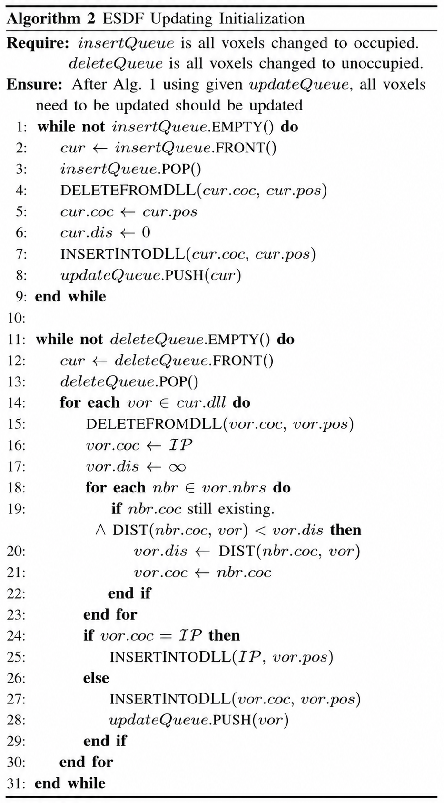
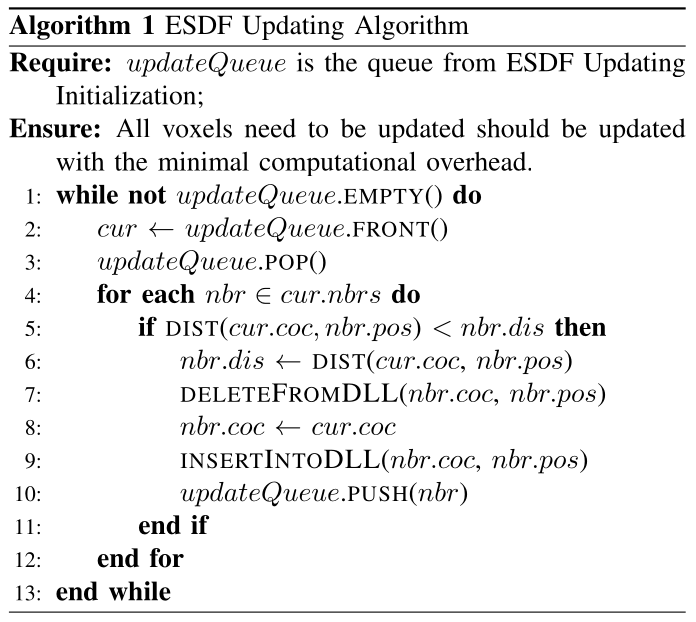
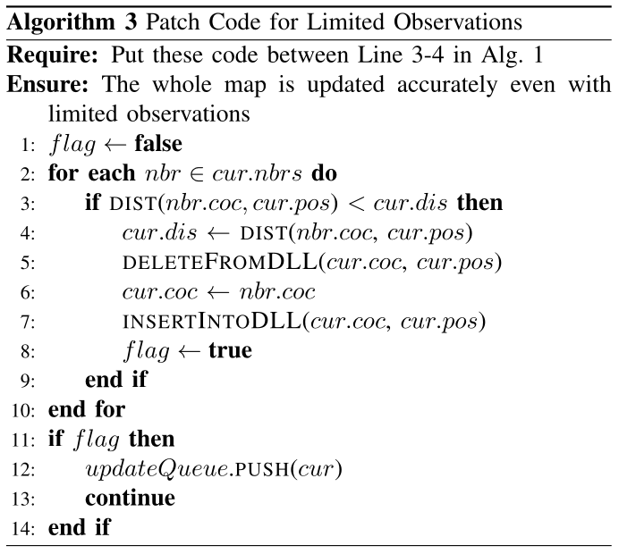

# FIESTA

[toc]

### Abstract

Euclidean Signed Distance Field (ESDF) is useful for online motion planning of aerial robots since it can easily query the distance and gradient information against obstacles. Fast incrementally built ESDF map is the bottleneck for conducting real-time motion planning. In this paper, we investigate this problem and propose a mapping system called FIESTA to build global ESDF map incrementally.

By introducing two independent updating queues for inserting and deleting obstacles separately, and using Indexing Data Structures and Doubly Linked Lists for map maintenance, our algorithm updates as few as possible nodes using a BFS framework. Our ESDF map has high computational performance and produces near-optimal results.

We show our method outperforms other up-to-date methods in term of performance and accuracy by both theory and experiments. We integrate FIESTA into a completed quadrotor system and validate it by both simulation and onboard experiments. We release our method as open-source software for the community.

### Data Structures

##### Occupancy Grid Map & Voxel Information Structure

FIESTA uses an **Occupancy Grid Map** to integrate occupancy information from depth measurements. 

The information of each voxel is stored in a **Voxel Information Structure**, abbreviated as **VIS**. A VIS contains both occupancy information and ESDF-related information. The main members and methods are in the table below.

| Name                              | Meaning                                             | Abbreviation           |
| --------------------------------- | --------------------------------------------------- | ---------------------- |
| position                          | voxel coordinate                                    | `pos`                  |
| occupancy                         | probability of occupancy                            | `occ`                  |
| ESDF                              | **Euclidean distance to the closest obstacle**      | `dis`                  |
| Closest Obstacle Voxel Coordinate | **voxel coordinate of the closest obstacle**        | `coc`                  |
| observed                          | whether this voxel is ever observed                 | `obs`                  |
| prev, next, head                  | pointers used in DLLs                               | `prev`, `next`, `head` |
| Doubly Linked List method         | **all voxels whose closest obstacle is this voxel** | `dll`                  |
| Neighborhoods method              | all observed neighbors of this voxel                | `nbrs`                 |

##### Indexing Data Structure

The **Indexing Data Structure** maps a voxel coordinate to the corresponding pointer of VIS. 

If the bounding box is known and memory is sufficient, a voxel can be queried by computing its array index directly. If the bounding box is unknown or memory is limited, Hash Table stores only observed voxels but requires higher lookup cost. FIESTA therefore uses a hash table indexes blocks, while each block stores `VIS` pointers in an array, reducing hash-table size while keeping dynamic extensibility.

##### Doubly Linked Lists

The **Doubly Linked Lists**, abbreviated as **DLLs**, are used especially for efficient ESDF updating when an occupied voxel becomes free. For a voxel `vox`, the method `vox.dll` represents all voxels whose closest obstacle is `vox`.
$$
\texttt{x.coc} = \texttt{vox.pos}
$$
At the beginning, the closest obstacles of all voxels are initialized to **Ideal Point**, namely **Point at Infinity**, denoted by `IP`.

FIESTA uses `INSERTINTODLL` and `DELETEFROMDLL` to maintain these DLLs. With the Indexing Data Structure and DLL pointers, inserting or deleting a given node can be implemented in constant time.

### Algorithm

##### ESDF Updating Initialization Algorithm

**ESDF Updating Initialization** merges `insertQueue` and `deleteQueue` into `updateQueue`.

For voxels in `insertQueue`,  a voxel that becomes occupied is itself an obstacle. Therefore, its closest obstacle coordinate becomes its own position, and its ESDF distance becomes zero.

$$
\texttt{cur.coc} \leftarrow \texttt{cur.pos}
$$

$$
\texttt{cur.dis} \leftarrow 0
$$

For voxels in `deleteQueue`, when an occupied voxel `cur` becomes unoccupied, every voxel in `cur.dll` may lose its closest obstacle. FIESTA clears these voxels back to the observed-but-not-yet-updated state, 
$$
\texttt{vox.coc} \leftarrow \texttt{IP}
$$

$$
\texttt{vox.dis} \leftarrow \texttt{infinity}
$$

then tries to reassign their `coc` and `dis` using existing closest obstacles from their observed neighbors.
$$
\texttt{vox.dis} \leftarrow \texttt{DIST(nbr.coc, vox.pos)}
$$

$$
\texttt{vox.coc} \leftarrow \texttt{nbr.coc}
$$

##### ESDF Updating Algorithm with Limited-Observation Patch  

The first `for` loop is the limited-observation patch. It makes `cur` check whether it can be updated from existing neighbors before it propagates information outward. 

The second `for` loop is the ESDF updating step. It uses `cur.coc` as the candidate closest obstacle for each `nbr`.
$$
\texttt{nbr.dis} \leftarrow \texttt{DIST}(\texttt{cur.coc}, \texttt{nbr.pos})
$$

$$
\texttt{nbr.coc} \leftarrow \texttt{cur.coc}
$$

### Theoretical Analysis

##### Optimality

FIESTA updates each voxel by checking the `coc` values of its `nbrs`, so the candidate obstacles come only from neighboring voxels instead of all obstacles in the map. 
$$
\texttt{cur.dis} \leftarrow \min_{\texttt{nbr} \in \texttt{cur.nbrs}} \texttt{{DIST}(nbr.coc, cur.pos)}
$$

with the corresponding closest obstacle coordinate updated as

$$
\texttt{cur.coc} \leftarrow \texttt{nbr}^{*}.\texttt{coc}
$$

where

$$
\texttt{nbr}^{*}
=
\arg\min_{\texttt{nbr} \in \texttt{cur.nbrs}}
\texttt{{DIST}(nbr.coc, cur.pos)}
$$

Therefore, the computed `dis` is always a **true Euclidean distance** to some obstacle, but it is not guaranteed to be the globally shortest one. If the real closest obstacle is not included in the neighbors’ `coc` set, FIESTA may produce a **near-optimal** rather than exact ESDF value. 

##### Time Complexity

For **ESDF Updating Initialization**, each voxel that is either in `insertQueue` or whose closest obstacle is in `deleteQueue` is handled only once. If an FIFO queue is used, the **time complexity** is
$$
\Theta(k)
$$

where $k$ is the number of all necessary voxels needed to be handled during initialization.

For **ESDF Updating Algorithm**, if a priority queue is used to perform the BFS procedure, every voxel is popped from `updateQueue` and handled only once to update its neighbors. The time complexity is

$$
\Theta(n \log n)
$$

where $n$ is the number of all voxels that need to be updated. The factor $\log n$ comes from the priority queue.

##### Space Complexity

Compared with a hash-table-based occupancy grid map, FIESTA introduces only constant-level memory overhead because each observed voxel stores one additional `VIS`, including `dis`, `coc`, `obs`, and DLL pointers. With `block_size = 1`, the `Indexing Data Structure` reaches

$$
\Theta(m)
$$

where $m$ is the number of all ever observed voxels.