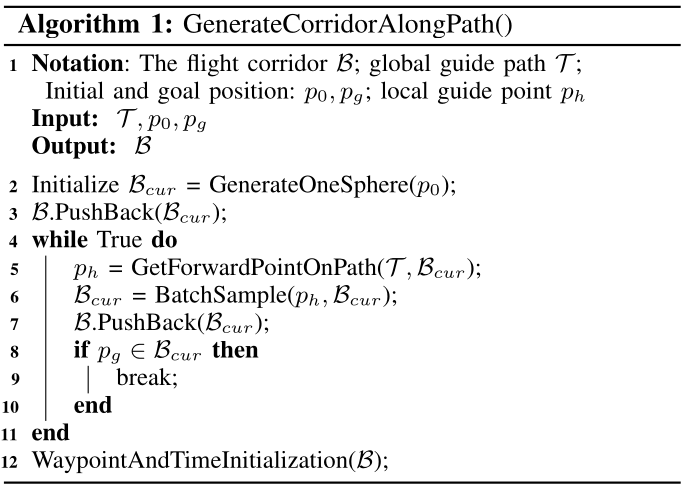
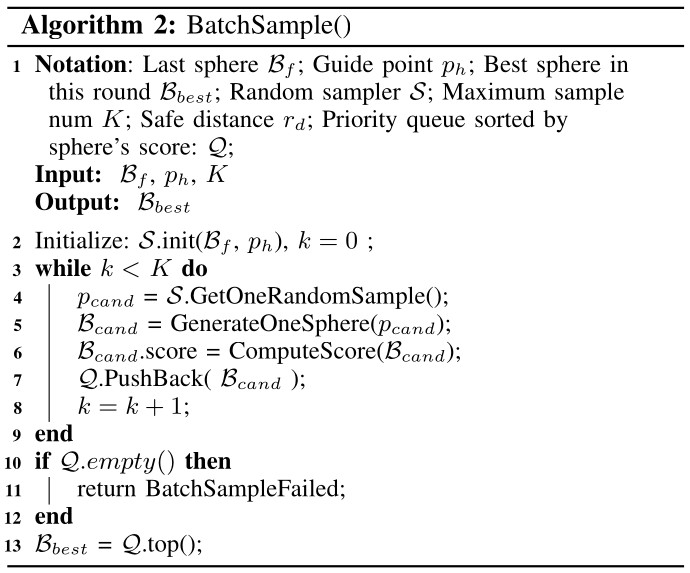

# Bubble PLanner

[toc]

### Abstract

Quadrotors are agile platforms. With human experts, they can perform extremely high-speed flights in cluttered environments. However, fully autonomous flight at high speed remains a significant challenge. In this work, we propose a motion planning algorithm based on the corridor-constrained minimum control effort trajectory optimization (MINCO) framework. Specifically, we use a series of overlapping spheres to represent the free space of the environment and propose two novel designs that enable the algorithm to plan high-speed quadrotor trajectories in real-time.

One is a sampling-based corridor generation method that generates spheres with large overlapped areas (hence overall corridor size) between two neighboring spheres. The second is a Receding Horizon Corridors (RHC) strategy, where part of the previously generated corridor is reused in each replan. Together, these two designs enlarge the corridor spaces in accordance with the quadrotor’s current state and hence allow the quadrotor to maneuver at high speeds.

We benchmark our algorithm against other state-of-the-art planning methods to show its superiority in simulation. Comprehensive ablation studies are also conducted to show the necessity of the two designs. The proposed method is finally evaluated on an autonomous LiDAR-navigated quadrotor UAV in woods environments, achieving flight speeds over 13.7m/s without any prior map of the environment or external localization facility.

### Preliminaries

The quadrotor is modeled as a non-linear dynamic system and is differential flat with flat output

$$
\boldsymbol{\sigma}
=
[x,y,z,\psi]^T
$$

where

$$
\boldsymbol{p}
=
[x,y,z]^T
$$

is the quadrotor position in the world frame, and $\psi$ is the yaw angle. The planner only plans the position trajectory $\boldsymbol{p}(t)$, and specifies the yaw angle trajectory $\Phi(t)$ as the tangent direction of $\boldsymbol{p}(t)$.

Given a flight corridor $\boldsymbol{B}$ consisting of overlapping spheres $B_i$, the goal is to find a smooth trajectory

$$
\boldsymbol{p}(t):[0,t_M]\mapsto \mathbb{R}^3
$$

which connects the initial position $\boldsymbol{q}_0$ to the terminal position $\boldsymbol{q}_M$ and is completely contained in the sphere-shaped corridor $\boldsymbol{B}$.

The trajectory is decomposed into $M$ pieces. Each piece $\boldsymbol{p}_i(t)$ is contained in sphere $B_i$ during the time period $t\in[t_{i-1},t_i]$

$$
\boldsymbol{p}(t)
=
\boldsymbol{p}_i(t-t_{i-1})
\in
B_i,
\quad
t\in[t_{i-1},t_i]
$$

Adjacent pieces meet at the same intermediate waypoint $\boldsymbol{q}_i$ at time $t_i$. The trajectory starts at the given initial state $\boldsymbol{d}_0$ and terminates at the given goal state $\boldsymbol{d}_g$, both up to the $(s-1)$-th order derivative.

The trajectory optimization is formulated as

$$
\min_{\boldsymbol{p}(t)}
\int_0^{t_M}
\left\|
\boldsymbol{p}^{(s)}(t)
\right\|_2^2
dt
+
\rho_T t_M
$$

subject to
$$
\boldsymbol{p}^{(0:s-1)}(0)
=
\left[
\boldsymbol{p}(0),
\dot{\boldsymbol{p}}(0),
\ddot{\boldsymbol{p}}(0),
\cdots,
\boldsymbol{p}^{(s-1)}(0)
\right]

=
\boldsymbol{d}_0,
\quad
$$

$$
\boldsymbol{p}^{(0:s-1)}(t_M)
=
\left[
\boldsymbol{p}(t_M),
\dot{\boldsymbol{p}}(t_M),
\ddot{\boldsymbol{p}}(t_M),
\cdots,
\boldsymbol{p}^{(s-1)}(t_M)
\right]
= \boldsymbol{d}_g
$$

$$
\boldsymbol{p}(t_i)
=
\boldsymbol{q}_i,
\quad
1\le i<M
$$

$$
t_{i-1}<t_i,
\quad
1\le i\le M
$$

$$
\left\|
\boldsymbol{p}^{(1)}(t)
\right\|_2^2
\le
v_{\max}^2,
\quad
\left\|
\boldsymbol{p}^{(2)}(t)
\right\|_2^2
\le
a_{\max}^2
$$

$$
\boldsymbol{p}(t)
=
\boldsymbol{p}_i(t-t_{i-1})
\in
B_i,
\quad
1\le i\le M,
\quad
t\in[t_{i-1},t_i]
$$

The weight $\rho_T$ penalizes the total trajectory time $t_M$, so that the maximal allowed speed $v_{\max}$ can be attained.

With fixed intermediate waypoint vector

$$
\boldsymbol{q}
=
(\boldsymbol{q}_1,\ldots,\boldsymbol{q}_{M-1})
$$

and time allocation vector

$$
\boldsymbol{T}
=
(T_1,\ldots,T_M),
\quad
T_i=t_i-t_{i-1}>0
$$

the smoothness-only optimization gives an optimal solution where each piece is a $(2s-1)$-th order polynomial

$$
\boldsymbol{p}_i(t)
=
\boldsymbol{c}_i(\boldsymbol{q},\boldsymbol{T})^T
\boldsymbol{\beta}(t),
\quad
t\in[0,T_i]
$$

where

$$
\boldsymbol{\beta}(t)
=
[1,t,\ldots,t^{2s-1}]^T
$$

For fixed intermediate waypoints $\boldsymbol{q}$ and fixed time allocation $\boldsymbol{T}$, the smoothness cost

$$
\min_{\boldsymbol{p}(t)}
\sum_{i=1}^{M}
\int_{0}^{T_i}
\left\|
\boldsymbol{p}_i^{(s)}(t)
\right\|_2^2
dt
$$

subject to the boundary and waypoint constraints

$$
\boldsymbol{p}^{(0:s-1)}(0)
=
\boldsymbol{d}_0,
\qquad
\boldsymbol{p}^{(0:s-1)}(t_M)
=
\boldsymbol{d}_g
$$

$$
\boldsymbol{p}_i(T_i)
=
\boldsymbol{p}_{i+1}(0)
=
\boldsymbol{q}_i,
\qquad
1\le i<M
$$

For one scalar component $x_i(t)$ of $\boldsymbol{p}_i(t)$, the smoothness cost is

$$
J_i
=
\int_{0}^{T_i}
\left(
x_i^{(s)}(t)
\right)^2
dt
$$

For a functional depending on higher-order derivatives

$$
J[x]
=
\int_{t_0}^{t_1}
L
\left(
x,
\dot{x},
\ddot{x},
\ldots,
x^{(s)}
\right)
dt
$$

the corresponding higher-order Euler-Lagrange equation is

$$
\frac{\partial L}{\partial x}
-
\frac{d}{dt}
\left(
\frac{\partial L}{\partial \dot{x}}
\right)
+
\frac{d^2}{dt^2}
\left(
\frac{\partial L}{\partial \ddot{x}}
\right)
-
\cdots
+
(-1)^s
\frac{d^s}{dt^s}
\left(
\frac{\partial L}{\partial x^{(s)}}
\right)
=
0
$$

The Euler-Lagrange equation for a functional only depending on the $s$-th derivative gives
$$
\frac{d^s}{dt^s}
\left(
\frac{\partial}{\partial x_i^{(s)}}
\left(x_i^{(s)}\right)^2
\right)
=
\frac{d^s}{dt^s}
\left(
2x_i^{(s)}
\right)
=
0
$$

$$
x_i^{(2s)}(t)
=
0
$$

Thus $x_i(t)$ must be a polynomial whose degree is no higher than $2s-1$

$$
x_i(t)
=
c_{i,0}
+
c_{i,1}t
+
\cdots
+
c_{i,2s-1}t^{2s-1}
$$

For the vector trajectory piece $\boldsymbol{p}_i(t)\in\mathbb{R}^3$, the same conclusion holds for each coordinate component

$$
\boldsymbol{p}_i(t)
=
\boldsymbol{c}_{i,0}
+
\boldsymbol{c}_{i,1}t
+
\cdots
+
\boldsymbol{c}_{i,2s-1}t^{2s-1}
$$

Because $\boldsymbol{q}$ and $\boldsymbol{T}$ are fixed, the boundary constraints, waypoint constraints and continuity conditions become linear equations of the polynomial coefficients. Therefore the coefficients are uniquely determined by $\boldsymbol{q}$ and $\boldsymbol{T}$

$$
\boldsymbol{p}_i(t)
=
\boldsymbol{c}_i(\boldsymbol{q},\boldsymbol{T})^T
\boldsymbol{\beta}(t),
\qquad
t\in[0,T_i]
$$

The complete optimization is then performed over the trajectory class parameterized by $\boldsymbol{q}$ and $\boldsymbol{T}$.

The time constraint $T_i>0$ is parameterized as

$$
T_i=e^{\tau_i},
\quad
\tau_i\in\mathbb{R}
$$

The feasibility constraints are softly penalized by a $C^2$-continuous barrier function

$$
L_{\mu}(x)
=
\begin{cases}
0,
&
x\le 0
\\
(\mu-x/2)(x/\mu)^3,
&
0<x<\mu
\\
x-\mu/2,
&
x\ge\mu
\end{cases}
$$

The constrained optimization is transformed into the unconstrained form

$$
\begin{aligned}
\min_{\boldsymbol{\tau},\boldsymbol{q}}
J
=
&
\sum_{i=1}^{M}
\left(
\int_{0}^{T_i}
\left\|
\boldsymbol{p}_i^{(s)}(t)
\right\|_2^2
dt
+
\rho_T e^{\tau_i}
\right)
\\
&
+
\rho_{\mathrm{vel}}
\sum_{i=1}^{M}
\int_{0}^{T_i}
L_{\mu}
\left(
\left\|
\boldsymbol{p}_i^{(1)}(t)
\right\|_2^2
-
v_{\max}^2
\right)
dt
\\
&
+
\rho_{\mathrm{acc}}
\sum_{i=1}^{M}
\int_{0}^{T_i}
L_{\mu}
\left(
\left\|
\boldsymbol{p}_i^{(2)}(t)
\right\|_2^2
-
a_{\max}^2
\right)
dt
\\
&
+
\rho_c
\sum_{i=1}^{M}
\int_{0}^{T_i}
L_{\mu}
\left(
\left\|
\boldsymbol{p}_i(t)-\boldsymbol{o}_i
\right\|_2^2
-
r_i^2
\right)
dt
\end{aligned}
$$

where $\rho_{\mathrm{vel}}$, $\rho_{\mathrm{acc}}$, and $\rho_c$ are the weights of maximum speed, maximum acceleration, and collision-free penalty. The center and radius of the $i$-th sphere are $\boldsymbol{o}_i$ and $r_i$.

All gradients of the objective with respect to waypoints $\boldsymbol{q}$ and time allocation $\boldsymbol{\tau}$ can be computed analytically, so a Quasi-Newton method, L-BFGS, is used to solve the optimization problem effectively.

### Planner

This section presents the frontend design that enables high-speed trajectory optimization.

##### Sphere-Shaped Corridor

A sphere is defined by its center $\boldsymbol{o}\in\mathbb{R}^3$, the nearest obstacle point $\boldsymbol{n}\in\mathbb{R}^3$, and the radius

$$
r
=
\left\|
\boldsymbol{o}
-
\boldsymbol{n}
\right\|_2
-
r_d
$$

where $r_d$ is the radius of the drone.

During trajectory optimization, each piece of trajectory is constrained in the corresponding sphere to satisfy safety constraints.

To generate a new sphere, the planner first builds a KD-Tree with the obstacle point cloud. For a given sphere center $\boldsymbol{o}$, NN-Search is performed to find the nearest obstacle point $\boldsymbol{n}$, which determines the radius. This process is called

$$
\operatorname{GenerateOneSphere}(\boldsymbol{o})
$$

##### Flight Corridor Generation

A complete flight corridor $\boldsymbol{B}$ is generated from the initial position $\boldsymbol{p}_0$, goal position $\boldsymbol{p}_g$, and a global guide path $\boldsymbol{\mathcal{T}}$ generated by A*.

The algorithm initializes with the largest possible sphere around $\boldsymbol{p}_0$. Then a local guide point $\boldsymbol{p}_h$ is selected from the guide path $\boldsymbol{\mathcal{T}}$, which is the nearest point out of the current sphere. A new sphere is generated by

$$
\operatorname{BatchSample}(\boldsymbol{p}_h,B_{\mathrm{cur}})
$$

and added to $\boldsymbol{B}$. This process repeats until $\boldsymbol{p}_g$ is included in the newly generated sphere.

With the found flight corridor $\boldsymbol{B}$, the initial waypoint position $\boldsymbol{q}$ and time allocation $\boldsymbol{T}$ are initialized by

$$
\operatorname{WaypointAndTimeInitialization}(\boldsymbol{B})
$$

and then optimized in the MINCO backend.

**Batch sample**

Trajectory optimization under flight corridor constraints is highly non-convex. Overly conservative constraints may lead to local minimum or infeasible solution when the quadrotor initial speed is high.

Existing methods only consider the connectivity between two adjacent spheres. To preserve larger space for maneuvering and improve the feasibility of the trajectory optimization at high speeds, the batch sample method considers

+ the volume of each sphere

+ the volume of the overlapped spaces between adjacent spheres

A larger sphere better approximates the real free space with fewer spheres. A larger intersecting space gives more freedom to the optimization process because all waypoints are constrained in the intersecting space.

The sampler generates a random candidate point under a 3D Gaussian distribution

$$
\boldsymbol{p}_{\mathrm{cand}}
\sim
\mathcal{N}(\boldsymbol{\mu},\boldsymbol{\Sigma})
$$

where

$$
\boldsymbol{\mu}
=
\boldsymbol{p}_h
$$

and

$$
\boldsymbol{\Sigma}
=
\operatorname{diag}(\sigma_x,\sigma_y,\sigma_z)
$$

with

$$
\sigma_x
=
\frac{1}{3}
\left\|
\boldsymbol{o}_f
-
\boldsymbol{p}_h
\right\|_2,
\quad
\sigma_z
=
\sigma_y
=
2\sigma_x
$$

where $\boldsymbol{o}_f$ is the center of the last sphere. The $\sigma_x$ direction is aligned with the direction of $\boldsymbol{o}_f-\boldsymbol{p}_h$.

For each sampled point, a candidate sphere is generated by

$$
B_{\mathrm{cand}}
=
\operatorname{GenerateOneSphere}(\boldsymbol{p}_{\mathrm{cand}})
$$

The score of each candidate sphere is computed by the function
$$
\operatorname{ComputeScore}(B_{\mathrm{cand}})
$$
defined below
$$
\operatorname{Score}
=
\rho_r V_{\mathrm{cand}}
+
\rho_v V_{\mathrm{inter}}
$$

where $\rho_r,\rho_v\in\mathbb{R}^{+}$ are positive weights, $V_{\mathrm{cand}}$ is the volume of the candidate sphere, and $V_{\mathrm{inter}}$ is the overlapped volume between $B_{\mathrm{cand}}$ and $B_f$.

The best sphere with the highest score is selected.

The process follows a coarse-to-fine manner. A* first finds the shortest path, and batch samples are taken only around this path. The sample space and computation time are reduced.

**Waypiont and Time Initialization** 

For a given flight corridor $\boldsymbol{B}$, the default initialization strategy initializes the waypoints as the center of the overlap space between two adjacent spheres.

The time allocation is initialized as

$$
T_i
=
\frac{
\left\|
\boldsymbol{q}_i
-
\boldsymbol{q}_{i-1}
\right\|_2
}{
v_{\max}
}
$$

##### Receding Horizon Corridors in Replan

During high-speed flight in an unknown environment, the quadrotor replans frequently to avoid newly sensed obstacles.

A distance-triggering replanning strategy is used. The trajectory is planned in a fixed distance $D$, called the planning horizon, depending on the sensing range.

Let the position of the last replan be $\boldsymbol{p}_{\mathrm{last}}$, and the current quadrotor position be $\boldsymbol{p}_{\mathrm{curr}}$. Replan is triggered if

$$
\left\|
\boldsymbol{p}_{\mathrm{last}}
-
\boldsymbol{p}_{\mathrm{curr}}
\right\|_2
>
\gamma D,
\quad
\gamma\in[0,1]
$$

A replan is also triggered when the current trajectory under execution is found to collide with obstacles.

The key of Receding Horizon Corridors is to reuse a few spheres from the previous planning cycle in the current replan.

When a new replan is triggered, the nearest future waypoint $\boldsymbol{d}_{rp}$ in $\boldsymbol{q}$ is selected as the initial state. A few spheres after $\boldsymbol{d}_{rp}$ are reused to form the first part of the new corridor, followed by newly generated spheres reaching the current planning horizon $D$.

This receding scheme ensures that the corridor in each replan contains sufficient space for the quadrotor to maneuver from its current state, because the current quadrotor state is on the previous trajectory and the previous trajectory is contained in the previous corridor.

The waypoints $\boldsymbol{q}$ and time allocation $\boldsymbol{T}$ contained in the reused corridor were optimized in the previous planning cycle, and are used to initialize the current trajectory optimization. This is called Hot Initialization.

The waypoints and time allocation in newly generated spheres are still initialized by the default scheme.

### Conclusion and future work

The paper proposes a motion planning algorithm that generates smooth, collision-free, and high-speed trajectories in real time.

The whole planning system works with fully onboard sensing and computation at a replan frequency over $50\,\mathrm{Hz}$.

The two main designs are

+ a sampling-based sphere-shaped corridor generation method that generates high-quality corridors with larger size and bigger overlaps in a relatively short time

+ a Receding Horizon Corridors strategy that reuses previously generated corridors and the optimized trajectory

These designs significantly increase the replan success rate in high-speed cases.

One limitation is that reused corridors from the last planning cycle are not guaranteed to be obstacle-free due to newly sensed obstacles that may have been occluded in previous LiDAR measurements. This can cause the reused corridor to be discarded and occasionally lower the success rate in extremely cluttered environments.

The paper suggests placing the first few corridors of a replan in known free spaces, enabling safe reuse and backup trajectory planning.
