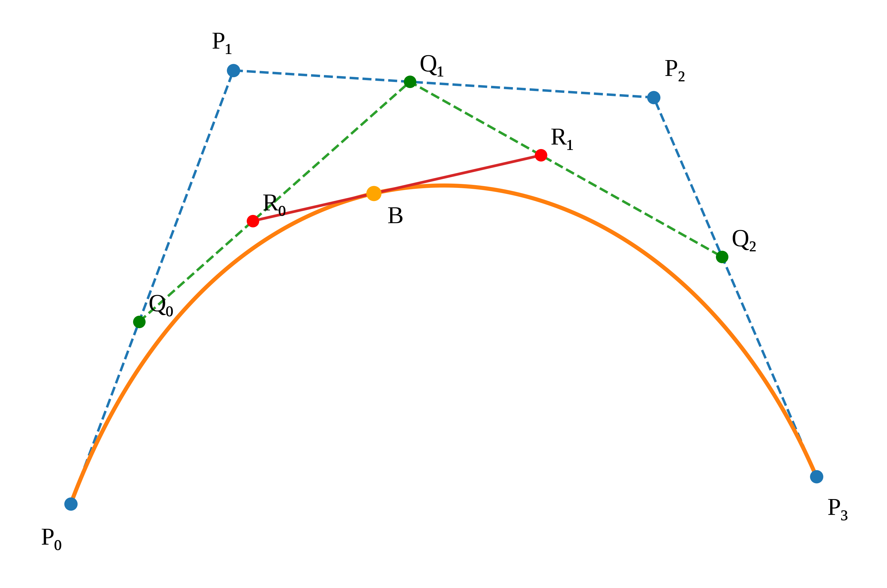

# Bézier Curve

[toc]

A Bézier curve starts at the first control point and ends at the last control point, but generally does not pass through the intermediate control points. 

An $n$th-degree Bézier curve is defined by $n+1$ control points $P_0,P_1,...,P_n$.

##### Bernstein Form

The Bernstein basis functions of degree $n$ are

$$
B_{i,n}(t)=\binom{n}{i}t^i(1-t)^{n-i},
\qquad i=0,1,\ldots,n
$$

where

$$
\binom{n}{i}={C_n^i}=\frac{n!}{i!(n-i)!}
$$

The Bézier curve is

$$
B(t)=\sum_{i=0}^{n}B_{i,n}(t)P_i,
\qquad t\in[0,1]
$$

The $t$ is a continuous parameter representing the **positional progress** along the curve.

By sampling a series of specific $t$ values, the corresponding path point coordinates are calculated, resulting in a discrete trajectory executable by the robot. Sampling 11 points corresponds to $t=0,0.1,0.2,...,1$.

##### Geometric Interpretation

A Bézier curve can be geometrically constructed by repeatedly performing linear interpolation between adjacent control points. This procedure is called the **de Casteljau algorithm**.

Let the original control points be

$$
P_i^{(0)}(t)=P_i
$$

At the $r$th interpolation level, the new points are computed as

$$
P_i^{(r)}(t)
=
(1-t)P_i^{(r-1)}(t)
+
tP_{i+1}^{(r-1)}(t)
$$

where

$$
r=1,2,\ldots,n,
\qquad
i=0,1,\ldots,n-r
$$

After $n$ interpolation levels, only one point remains

$$
B(t)=P_0^{(n)}(t)
$$

This point is the point on the Bézier curve corresponding to the parameter $t$. As $t$ varies continuously from $0$ to $1$, the point $B(t)$ traces the complete Bézier curve.

**eg.** For a **cubic Bézier curve** defined by four control points $P_0,P_1,P_2,P_3$, the first interpolation level is
$$
\begin{aligned}
Q_0(t) &= (1-t)P_0+tP_1 \\
Q_1(t) &= (1-t)P_1+tP_2 \\
Q_2(t) &= (1-t)P_2+tP_3
\end{aligned}
$$

The second interpolation level is

$$
\begin{aligned}
R_0(t) &= (1-t)Q_0(t)+tQ_1(t) \\
R_1(t) &= (1-t)Q_1(t)+tQ_2(t)
\end{aligned}
$$

Finally,

$$
B(t)=(1-t)R_0(t)+tR_1(t)
$$

$$
B(t)=(1-t)^3P_0
+
3t(1-t)^2P_1
+
3t^2(1-t)P_2
+
t^3P_3
\qquad
t\in[0,1]
$$

Therefore, a cubic Bézier curve point is obtained through three successive levels of linear interpolation.

##### Polynomial Coefficients Form

Using the power basis,

$$
B(t)=\sum_{k=0}^{n}A_k t^k
$$

with

$$
A_k
=
\binom{n}{k}
\sum_{i=0}^{k}
(-1)^{k-i}\binom{k}{i}P_i
$$

For a cubic Bézier curve,

$$
B(t)=A_0+A_1t+A_2t^2+A_3t^3
$$

$$
\begin{aligned}
A_0 &= P_0 \\
A_1 &= 3(P_1-P_0) \\
A_2 &= 3(P_0-2P_1+P_2) \\
A_3 &= -P_0+3P_1-3P_2+P_3
\end{aligned}
$$

##### Matrix Form

For a cubic Bézier curve,

$$
B(t)
=
\begin{bmatrix}
1 & t & t^2 & t^3
\end{bmatrix}
\begin{bmatrix}
1 & 0 & 0 & 0 \\
-3 & 3 & 0 & 0 \\
3 & -6 & 3 & 0 \\
-1 & 3 & -3 & 1
\end{bmatrix}
\begin{bmatrix}
P_0 \\
P_1 \\
P_2 \\
P_3
\end{bmatrix}
$$

##### Important Properties

- Endpoint interpolation

  $$
  B(0)=P_0,
  \qquad
  B(1)=P_n
  $$

- Endpoint tangent directions

  $$
  B'(0)=n(P_1-P_0)
  $$

  $$
  B'(1)=n(P_n-P_{n-1})
  $$

- **Convex-hull property**

  Since the Bernstein basis functions are non-negative and satisfy

  $$
  \sum_{i=0}^{n} B_{i,n}(t)=1
  $$

  each curve point is a weighted average of the control points. Therefore, the Bézier curve lies inside the convex hull of its control points.

- **Global control**

  Moving an intermediate control point generally changes the entire curve, because its Bernstein basis function contributes over almost the whole parameter interval $t\in(0,1)$.