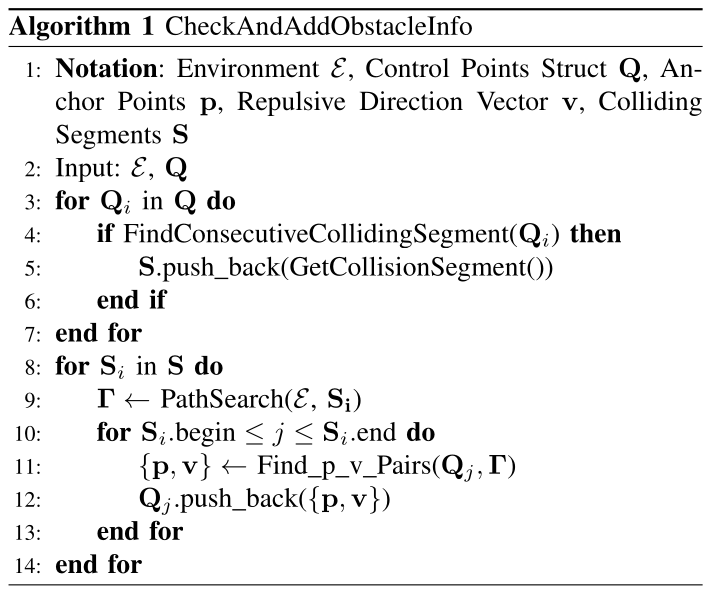
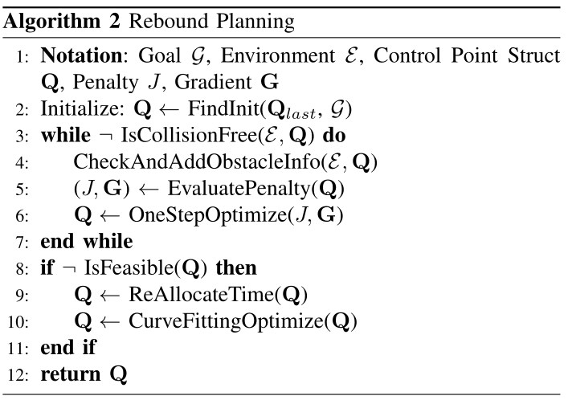

# EGO-Planner

[toc]

### Abstract

Gradient-based planners are widely used for quadrotor local planning, in which a Euclidean Signed Distance Field (ESDF) is crucial for evaluating gradient magnitude and direction. Nevertheless, computing such a field has much redundancy since the trajectory optimization procedure only covers a very limited subspace of the ESDF updating range. In this paper, an ESDF-free gradient-based planning framework is proposed, which significantly reduces computation time.

The main improvement is that the collision term in penalty function is formulated by comparing the colliding trajectory with a collision-free guiding path. The resulting obstacle information will be stored only if the trajectory hits new obstacles, making the planner only extract necessary obstacle information.

Then, we lengthen the time allocation if dynamical feasibility is violated. An anisotropic curve fitting algorithm is introduced to adjust higher order derivatives of the trajectory while maintaining the original shape. Benchmark comparisons and real-world experiments verify its robustness and high-performance. The source code is released as ros packages.

### Collision Avoidance Force Estimation

In this paper, the decision variables are control points $\boldsymbol{Q}$ of a B-spline curve $\boldsymbol{\Phi}$. Each control point possesses its own environment information independently.

Initially, a naive B-spline curve $\boldsymbol{\Phi}$ satisfying terminal constraints is given, regardless of collision. For each colliding segment detected in an iteration, a collision-free path $\boldsymbol{\Gamma}$ is generated. Each control point $\boldsymbol{Q}_i$ of the colliding segment is assigned an anchor point $\boldsymbol{p}_{ij}$ at the obstacle surface with a corresponding repulsive direction vector $\boldsymbol{v}_{ij}$.

The obstacle distance from $\boldsymbol{Q}_i$ to the $j$-th obstacle is defined as

$$
d_{ij}
=
(\boldsymbol{Q}_i-\boldsymbol{p}_{ij})^T\boldsymbol{v}_{ij}
$$

##### Check And Add Obstacle Info

The procedure detects consecutive colliding segments, searches a collision-free path $\boldsymbol{\Gamma}$, and assigns $\{\boldsymbol{p},\boldsymbol{v}\}$ pairs to the control points of the colliding segment.

To avoid duplicative $\{\boldsymbol{p},\boldsymbol{v}\}$ pair generation before the trajectory escapes from the current obstacle, an obstacle is regarded as newly discovered only if the current $\boldsymbol{Q}_i$ satisfies

$$
d_{ij}>0
$$

for all valid $j$.

This criterion allows only necessary obstacles that contribute to the final trajectory to be taken into optimization. The planner does not require a collision-free initialization. Compared with ESDF-based methods, the explicitly designed repulsive force provides vital information for collision avoidance without maintaining the whole distance field.

### Gradient-based Trajectory Optimization

##### Problem Formulation

The trajectory is parameterized by a uniform B-spline curve $\boldsymbol{\Phi}$, which is determined by its degree $p_b$, control points $\{\boldsymbol{Q}_1,\boldsymbol{Q}_2,\cdots,\boldsymbol{Q}_{N_c}\}$, and a knot vector $\{t_1,t_2,\cdots,t_M\}$. For a uniform B-spline, each knot is separated by the same time interval

$$
\Delta t=t_{m+1}-t_m
$$

B-spline enjoys the convex hull property. A single span of a B-spline curve is controlled by $p_b+1$ successive control points and lies within the convex hull of these points.

The $k$-th derivative of a B-spline is still a B-spline. Since $\Delta t$ is identical along $\boldsymbol{\Phi}$, the control points of the velocity, acceleration, and jerk curves are obtained by

$$
\boldsymbol{V}_i
=
\frac{\boldsymbol{Q}_{i+1}-\boldsymbol{Q}_i}{\Delta t}
$$

$$
\boldsymbol{A}_i
=
\frac{\boldsymbol{V}_{i+1}-\boldsymbol{V}_i}{\Delta t}
$$

$$
\boldsymbol{J}_i
=
\frac{\boldsymbol{A}_{i+1}-\boldsymbol{A}_i}{\Delta t}
$$

The optimization problem is formulated as

$$
\min_{\boldsymbol{Q}}
J
=
\lambda_sJ_s+
\lambda_cJ_c+
\lambda_dJ_d
$$

where $J_s$ is the smoothness penalty, $J_c$ is the collision penalty, and $J_d$ is the feasibility penalty.

**Smoothness penalty**

The smoothness penalty penalizes squared acceleration and jerk without time integration. Benefiting from the convex hull property, minimizing the control points of second and third order derivatives is sufficient to reduce these derivatives along the whole curve.

$$
J_s
=
\sum_{i=1}^{N_c-1}
\left\|\boldsymbol{A}_i\right\|_2^2
+
\sum_{i=1}^{N_c-2}
\left\|\boldsymbol{J}_i\right\|_2^2
$$

**Collision penalty**

Collision penalty pushes control points away from obstacles. This is achieved by adopting a safety clearance $s_f$ and punishing control points with $d_{ij}<s_f$.

$$
c_{ij}=s_f-d_{ij}
$$

The twice continuously differentiable penalty function is

$$
j_c(i,j)
=
\begin{cases}
0 & c_{ij}\le 0\\
c_{ij}^3 & 0<c_{ij}\le s_f\\
3s_fc_{ij}^2-3s_f^2c_{ij}+s_f^3 & c_{ij}>s_f
\end{cases}
$$

The cost on each $\boldsymbol{Q}_i$ is evaluated independently and accumulated from all corresponding $\{\boldsymbol{p},\boldsymbol{v}\}_j$ pairs.

$$
j_c(\boldsymbol{Q}_i)
=
\sum_{j=1}^{N_p}j_c(i,j)
$$

$$
J_c
=
\sum_{i=1}^{N_c}j_c(\boldsymbol{Q}_i)
$$

Unlike traditional ESDF-based methods, which compute gradient by trilinear interpolation on the field, the gradient is obtained by directly computing the derivative of $J_c$ with respect to $\boldsymbol{Q}_i$.

$$
\frac{\partial J_c}{\partial \boldsymbol{Q}_i}
=
\sum_{j=1}^{N_p}
\boldsymbol{v}_{ij}
\begin{cases}
0 & c_{ij}\le 0\\
-3c_{ij}^2 & 0<c_{ij}\le s_f\\
-6s_fc_{ij}+3s_f^2 & c_{ij}>s_f
\end{cases}
$$

**Feasibility penalty**

Feasibility is ensured by restricting the higher order derivatives of the trajectory on every single dimension.

$$
\left|\boldsymbol{\Phi}^{(k)}_r(t)\right|
<
\boldsymbol{\Phi}^{(k)}_{r,\max}
$$

where $r\in\{x,y,z\}$ indicates each dimension.

Thanks to the convex hull property, constraining derivatives of the control points is sufficient for constraining the whole B-spline.

$$
J_d
=
\sum_{i=1}^{N_c}w_vF(\boldsymbol{V}_i)
+
\sum_{i=1}^{N_c-1}w_aF(\boldsymbol{A}_i)
+
\sum_{i=1}^{N_c-2}w_jF(\boldsymbol{J}_i)
$$

$$
F(\boldsymbol{C})
=
\sum_{r=x,y,z}f(c_r)
$$

$$
f(c_r)
=
\begin{cases}
a_1c_r^2+b_1c_r+c_1 & c_r\le -c_j\\
(-\lambda c_m-c_r)^3 & -c_j<c_r<-\lambda c_m\\
0 & -\lambda c_m\le c_r\le \lambda c_m\\
(c_r-\lambda c_m)^3 & \lambda c_m<c_r<c_j\\
a_2c_r^2+b_2c_r+c_2 & c_r\ge c_j
\end{cases}
$$

where $\boldsymbol{C}\in\{\boldsymbol{V}_i,\boldsymbol{A}_i,\boldsymbol{J}_i\}$, $c_m$ is the derivative limit, $c_j$ is the splitting point of the quadratic interval and the cubic interval, and $\lambda<1-\epsilon$ is an elastic coefficient.

##### Numerical Optimization

The formulated problem has two features. The objective function $J$ alters adaptively according to newly found obstacles, so the solver should restart fast. Quadratic terms dominate the objective function, making $J$ approximate quadratic.

Quasi-Newton methods are adopted to approximate the inverse Hessian from gradient information. The paper compares Barzilai-Borwein, truncated Newton, and L-BFGS. L-BFGS outperforms the other two algorithms with appropriately selected memory size.

For an unconstrained optimization problem, the update follows the approximated Newton step

$$
\boldsymbol{x}_{k+1}
=
\boldsymbol{x}_k
-
\alpha_k\boldsymbol{H}_k\nabla f_k
$$

The inverse Hessian approximation is updated by

$$
\boldsymbol{H}_{k+1}
=
\boldsymbol{V}_k^T\boldsymbol{H}_k\boldsymbol{V}_k
+
\rho_k\boldsymbol{s}_k\boldsymbol{s}_k^T
$$

$$
\rho_k
=
\left(\boldsymbol{y}_k^T\boldsymbol{s}_k\right)^{-1}
$$

$$
\boldsymbol{V}_k
=
\boldsymbol{I}-\rho_k\boldsymbol{y}_k\boldsymbol{s}_k^T
$$

$$
\boldsymbol{s}_k
=
\boldsymbol{x}_{k+1}-\boldsymbol{x}_k
$$

$$
\boldsymbol{y}_k
=
\nabla f_{k+1}-\nabla f_k
$$

$\boldsymbol{H}_k$ is not calculated explicitly. The efficient two-loop recursion gives linear time and space complexity. A monotone line search under strong Wolfe condition is used to enforce convergence.

### Time Re-allocation and Trajectory Refinement

Allocating an accurate time profile before optimization is unreasonable, since the planner knows no information about the final trajectory then. Therefore, an additional time re-allocation procedure is vital to ensure dynamical feasibility.

Previous works parameterize the trajectory as a non-uniform B-spline and iteratively lengthen a subset of knot spans. However, one knot span influences multiple control points and vice versa, which can lead to high-order discontinuity near the start state.

In this section, a uniform B-spline trajectory $\boldsymbol{\Phi}_f$ is re-generated with reasonable time re-allocation according to the safe trajectory $\boldsymbol{\Phi}_s$. An anisotropic curve fitting method makes $\boldsymbol{\Phi}_f$ freely optimize its control points to meet higher order derivative constraints while maintaining a nearly identical shape to $\boldsymbol{\Phi}_s$.

The limits exceeding ratio is computed as

$$
r_e
=
\max
\left\{
\left|\frac{V_{i,r}}{v_m}\right|,
\sqrt{\left|\frac{A_{j,r}}{a_m}\right|},
\sqrt[3]{\left|\frac{J_{k,r}}{j_m}\right|},
1
\right\}
$$

where the subscript $m$ represents the limitation of a derivative. $r_e$ indicates how much the time allocation should be lengthened for $\boldsymbol{\Phi}_f$ relative to $\boldsymbol{\Phi}_s$.

$$
\Delta t'
=
r_e\Delta t
$$

$\boldsymbol{\Phi}_f$ is initially generated under boundary constraints while maintaining the identical shape and control point number to $\boldsymbol{\Phi}_s$. The smoothness and feasibility are then refined by optimization.

$$
\min_{\boldsymbol{Q}}
J'
=
\lambda_sJ_s+
\lambda_dJ_d+
\lambda_fJ_f
$$

The fitting penalty function $J_f$ is formulated as the integral of anisotropic displacements from points $\boldsymbol{\Phi}_f(\alpha T')$ to the corresponding $\boldsymbol{\Phi}_s(\alpha T)$.

Since the fitted curve $\boldsymbol{\Phi}_s$ is already collision-free, the axial displacement is assigned with low penalty weight to relax smoothness adjustment restriction, and the radial displacement is assigned with high penalty weight to avoid collision.

$$
d_a
=
(\boldsymbol{\Phi}_f-\boldsymbol{\Phi}_s)^T
\frac{\dot{\boldsymbol{\Phi}}_s}{\left\|\dot{\boldsymbol{\Phi}}_s\right\|}
$$

$$
d_r
=
\left\|
(\boldsymbol{\Phi}_f-\boldsymbol{\Phi}_s)
\times
\frac{\dot{\boldsymbol{\Phi}}_s}{\left\|\dot{\boldsymbol{\Phi}}_s\right\|}
\right\|
$$

$$
J_f
=
\int_0^1
\left[
\frac{d_a(\alpha T')^2}{a^2}
+
\frac{d_r(\alpha T')^2}{b^2}
\right]
d\alpha
$$

where $a$ and $b$ are the semi-major and semi-minor axes of the ellipse.

### Experiment Results

##### Implementation Details

The planning framework is summarized as Rebound Planning.

The B-spline order is set as $p_b=3$. The number of control points $N_c$ is around $25$, determined by the planning horizon and the initial distance interval of adjacent points.

The time complexity is $O(N_c)$, since one control point only affects nearby segments according to the local support property of B-spline. The complexity of L-BFGS is also linear on the same relative tolerance.

For collision-free path searching, A* is adopted. Since the path $\boldsymbol{\Gamma}$ tends to be close to the obstacle surface naturally, $\boldsymbol{p}$ can be directly selected at $\boldsymbol{\Gamma}$ without obstacle surface searching.

For the vector $\boldsymbol{R}_i$ defined in the $\{\boldsymbol{p},\boldsymbol{v}\}$ generation, the property of uniform B-spline parameterization gives

$$
\boldsymbol{R}_i
=
\frac{\boldsymbol{Q}_{i+1}-\boldsymbol{Q}_{i-1}}{2\Delta t}
$$

The fitness integral is discretized to a finite number of points. To further enforce safety, a collision check of a circular pipe with a fixed radius around the final trajectory is performed to provide enough obstacle clearance.

##### Optimization Algorithms Comparison

Three optimization algorithms are compared: Barzilai-Borwein, L-BFGS, and truncated Newton. The data include success rate, computation time, and numbers of objective function evaluations.

L-BFGS significantly outperforms the other two algorithms. It is suitable for optimizing the objective function because the formulation is dominated by quadratic terms. Truncated Newton approximates the second order optimization direction but requires too many objective function evaluations. Barzilai-Borwein estimates the Hessian as a scalar times identity, and the insufficient estimation leads to a low convergence rate.

##### Trajectory Generation With and Without ESDF

The proposed EGO algorithm achieves a comparable success rate to ESDF-based methods with collision-free initialization. The trajectory energy is slightly higher because control points containing more than one $\{\boldsymbol{p},\boldsymbol{v}\}$ pair produce stronger trajectory deformation force.

On the other hand, stronger force accelerates convergence and results in shorter optimization time. Even when the ESDF updating size is reduced, ESDF updating still takes up a majority of the computation time.

##### Multiple Planners Comparison

The proposed planner is compared with Fast-Planner and EWOK. EGO-Planner achieves shorter flight time and trajectory length, while saving computation time by removing ESDF updating.

Compared with Fast-Planner, EGO-Planner has higher energy cost, mainly because Fast-Planner uses front-end kinodynamic path searching. EWOK suffers twisty trajectories in dense environments because its objective function contains exponential terms, which leads to unstable convergence in optimization.

##### Real-world Experiments

Experiments are conducted in cluttered unknown environments with limited camera field of view. Indoor experiments include waypoint flight through a narrow passage and goal chasing with arbitrary and abrupt goals during flight.

The outdoor experiment flies through a forest of massive trees and low bushes. Although wild airflow causes branches and leaves to swing and makes the map less reliable, the drone still reaches a speed above $3\,\mathrm{m/s}$.

### Conclusion and Future Work

This paper investigates the necessity of ESDF for gradient-based trajectory planning and proposes an ESDF-free local planner. It achieves comparable performance to state-of-the-art ESDF-based planners and reduces computation time for over an order of magnitude.

The proposed method still has flaws: local minimum introduced by A* search and conservative trajectories introduced by unified time re-allocation. Future work includes topological planning to escape local minima, re-formulating the problem to generate near-optimal trajectories, and dynamic environment navigation by moving object detection and topological planning.
