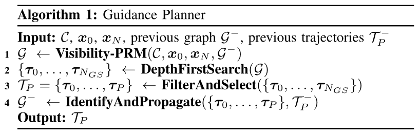

# Topology-driven MCP

[toc]

### Abstract

Ground robots navigating in complex, dynamic environments must compute collision-free trajectories to avoid obstacles safely and efficiently. Nonconvex optimization is a popular method to compute a trajectory in real-time. However, these methods often converge to locally optimal solutions and frequently switch between different local minima, leading to inefficient and unsafe robot motion.

In this work, we propose a novel topology-driven trajectory optimization strategy for dynamic environments that plans multiple distinct evasive trajectories to enhance the robot’s behavior and efficiency. A global planner iteratively generates trajectories in distinct homotopy classes. These trajectories are then optimized by local planners working in parallel. While each planner shares the same navigation objectives, they are locally constrained to a specific homotopy class, meaning each local planner attempts a different evasive maneuver.

The robot then executes the feasible trajectory with the lowest cost in a receding horizon manner. We demonstrate, on a mobile robot navigating among pedestrians, that our approach leads to faster trajectories than existing planners.

### Problem Formulation

The robot follows discrete-time nonlinear dynamics

$$
\boldsymbol{x}_{k+1}
=
f(\boldsymbol{x}_k,\boldsymbol{u}_k)
$$

where $\boldsymbol{x}_k\in\mathbb{R}^{n_x}$ and $\boldsymbol{u}_k\in\mathbb{R}^{n_u}$. The state contains the planar position

$$
\boldsymbol{p}_k=(x_k,y_k)\in\mathbb{R}^2
$$

For each moving obstacle $j$, predictions over the next $N$ time steps are provided

$$
\boldsymbol{o}_0^j,\boldsymbol{o}_1^j,\ldots,\boldsymbol{o}_N^j
$$

For high-level planning, time is included in the state space

$$
\mathcal{X}
:=
\mathbb{R}^2\times[0,T]
\qquad
\mathcal{O}
:=
\bigcup_{t\in[0,T]}(\mathcal{O}_t,t)
\qquad
\mathcal{C}
:=
\mathcal{X}\setminus\mathcal{O}
$$

The predicted motion of a dynamic obstacle therefore forms a space-time obstacle in $(x,y,t)$. A guidance trajectory is a continuous path through the dynamic collision-free space $\mathcal{C}$.

##### Optimization Problem

The original local planning problem over a horizon of $N$ steps is

$$
\begin{aligned}
\min_{\boldsymbol{u}\in\mathcal{U},\,\boldsymbol{x}\in\mathcal{X}}
&\quad
\sum_{k=0}^{N}J(\boldsymbol{x}_k,\boldsymbol{u}_k)
\\
\text{s.t.}
&\quad
\boldsymbol{x}_{k+1}
=
f(\boldsymbol{x}_k,\boldsymbol{u}_k)
&&
\forall k
\\
&\quad
\boldsymbol{x}_0
=
\boldsymbol{x}_{\mathrm{init}}
\\
&\quad
g(\boldsymbol{x}_k,\boldsymbol{o}_k^j)
\le
0
&&
\forall k,j
\end{aligned}
$$

The cost expresses navigation objectives such as progress, path following, and smoothness. The constraints impose robot dynamics, the initial condition, and collision avoidance.

Dynamic obstacles puncture holes in the free space, making the problem nonconvex. A nonlinear optimizer returns only one of several possible local optima, and the result strongly depends on the initial guess. T-MPC uses this dependence to explore several locally optimal trajectories that evade obstacles in distinct ways.

##### Homotopic Trajectories

Two paths connecting the same start and end points are homotopic if they can be continuously deformed into each other without intersecting an obstacle.

The homotopy comparison function is

$$
\mathcal{H}(\tau_i,\tau_j,\mathcal{O})
=
\begin{cases}
1 & \tau_i,\tau_j\text{ are in the same homotopy class}\\
0 & \text{otherwise}
\end{cases}
$$

Exact verification is generally expensive. T-MPC supports the H-signature, winding numbers, and Universal Visibility Deformation to approximately perform this comparison in real time.

### Topology-Driven Model Predictive Control

T-MPC explicitly separates high-level passing decisions from low-level trajectory refinement.

$$
\mathcal{G}(\boldsymbol{x}_0,\mathcal{P}_g,\mathcal{C})
=
\{\tau_1,\ldots,\tau_P\}
=:
\mathcal{T}_P
$$

The guidance planner $\mathcal{G}$ generates $P$ homotopy-distinct trajectories from the current state $\boldsymbol{x}_0$ toward a set of goal positions $\mathcal{P}_g$.

Each local planner defines the mapping

$$
L:\mathcal{X}^N\rightarrow\mathcal{X}^N
\qquad
L(\tau_i)=\tau_i^*
$$

and the parallel planners produce

$$
\mathcal{T}_P^*
=
\{\tau_1^*,\ldots,\tau_P^*\}
$$

The complete planning logic is

> obstacle predictions $\rightarrow$ dynamic free space in $(x,y,t)$ $\rightarrow$ homotopy-distinct guidance trajectories $\rightarrow$ spline smoothing $\rightarrow$ parallel local optimization with homotopy constraints $\rightarrow$ cost-based decision $\rightarrow$ execute and replan

##### Guidance Planner

The goal of the guidance planner is to quickly compute several homotopy-distinct trajectories through the free space. It applies a modified Visibility-PRM and preserves useful graph and trajectory information over successive planning iterations.

+ **Visibility-PRM** randomly samples states and constructs a sparse graph using **Guard**, **Connector**, and **Goal** nodes.

+ **DepthFirstSearch** searches the graph for paths from the robot state to the goals.

+ **FilterAndSelect** removes homotopy-equivalent paths and selects the $P$ lowest-cost distinct trajectories.

+ **IdentifyAndPropagate** reidentifies trajectories from the previous iteration and shifts graph nodes forward with the receding horizon.

A **Guard** is added when no existing Guard is visible. A **Connector** is added when exactly two Guards are visible and both connections satisfy feasibility checks such as velocity and acceleration limits.

When several Connectors join the same Guards, a homotopy-distinct connection is retained. A homotopy-equivalent connection replaces the existing one only when it is more efficient.

The paper extends Visibility-PRM with multiple **Goal** nodes. A grid of goals is placed around the reference path at $t=T$. If a Connector reaches several goals, the planner selects the goal closest to the point expected along the reference path at the reference velocity. Multiple goals prevent the search from failing when one nominal goal is blocked.

The filtered trajectory set satisfies

$$
\mathcal{H}(\tau_i,\tau_j,\mathcal{O})
=
0
\qquad
\forall i\ne j
\qquad
\tau_i,\tau_j\in\mathcal{T}_F
$$

The $P$ lowest-cost trajectories in $\mathcal{T}_F$ form $\mathcal{T}_P$.

To maintain consistency between planning iterations, a previous trajectory $\tau_i^-$ and a current trajectory $\tau_j$ are linked when

$$
\exists\tau_j\in\mathcal{T}_P
\qquad
\mathcal{H}(\tau_i^-,\tau_j,\mathcal{O})
=
1
$$

The current trajectory inherits the identifier associated with that homotopy class. This allows the planner to recognize the same passing behavior over time.

The selected graph paths are piecewise linear. They are smoothened and fitted with cubic splines to make them differentiable, while keeping the displacement small enough to maintain their homotopy classes.

##### Local Planner

Each guidance trajectory initializes one optimization-based local planner. Initialization accelerates convergence, but initialization alone does not guarantee that the optimized trajectory remains in the same homotopy class.

T-MPC therefore uses two mechanisms together

+ the guidance trajectory provides the initial guess

+ topology constraints keep the optimized trajectory on the same side of each obstacle

For guidance trajectory $\tau_i$ and obstacle prediction $\boldsymbol{o}^j$, a linear half-space is constructed at each time step

$$
(\boldsymbol{A}_k^j)^{\mathsf{T}}\boldsymbol{p}_k
\le
b_k^j
$$

where

$$
\boldsymbol{A}_k^j
=
\frac{
\boldsymbol{o}_k^j-\boldsymbol{\tau}_{i,k}
}{
\|\boldsymbol{o}_k^j-\boldsymbol{\tau}_{i,k}\|
}
$$

$$
b_k^j
=
(\boldsymbol{A}_k^j)^{\mathsf{T}}
\left(
\boldsymbol{o}_k^j
-
\boldsymbol{A}_k^j\beta(r+r^j)
\right)
$$

Here, $\boldsymbol{A}_k^j$ is the unit vector pointing from the guidance point $\boldsymbol{\tau}_{i,k}$ toward the predicted obstacle position $\boldsymbol{o}_k^j$. It is the normal vector of the separating line. The scalar $b_k^j$ determines the position of this line, which passes through

$$
\boldsymbol{o}_k^j
-
\boldsymbol{A}_k^j\beta(r+r^j)
$$

on the side of the obstacle containing the guidance point.

The relaxation factor satisfies
$$
0\le\beta\le1
$$

The inequality $(\boldsymbol{A}_k^j)^{\mathsf T}\boldsymbol{p}_k
\le
b_k^j$ selects the half-space containing $\boldsymbol{\tau}_{i,k}$. The feasible half-space contains the guidance point and prevents the optimized position from crossing to the opposite side of the obstacle. 

Because the original collision-avoidance constraints remain active, $\beta\approx0$ can make the topology constraint inactive near the obstacle boundary while preserving the passing side.

The homotopy-preserving local optimization is

$$
\begin{aligned}
J_i^*
=
\min_{\boldsymbol{u}\in\mathcal{U},\,\boldsymbol{x}\in\mathcal{X}}
&\quad
\sum_{k=0}^{N}J(\boldsymbol{x}_k,\boldsymbol{u}_k)
\\
\text{s.t.}
&\quad
\boldsymbol{x}_{k+1}
=
f(\boldsymbol{x}_k,\boldsymbol{u}_k)
&&
\forall k
\\
&\quad
\boldsymbol{x}_0
=
\boldsymbol{x}_{\mathrm{init}}
\\
&\quad
g(\boldsymbol{x}_k,\boldsymbol{o}_k^j)
\le
0
&&
\forall k,j
\\
&\quad
g_H(\boldsymbol{x}_k,\boldsymbol{o}_k^j,\tau_{i,k})
\le
0
&&
\forall k,j
\end{aligned}
$$

All local planners retain the original objective function. Only the initialization and additional topology constraints differ between homotopy classes.

##### Enforcing Consistency over Time

Distinct initialization is necessary but not sufficient. If the guidance trajectories are not filtered, duplicate guidance paths can initialize identical solutions. If the topology constraints are removed, distinct initializations can still converge to the same passing side under a strongly weighted objective.

T-MPC therefore combines homotopy comparison with homotopy-preserving constraints

> homotopy comparison makes the guidance trajectories distinct  
> topology constraints keep the optimized trajectories distinct

IdentifyAndPropagate further preserves trajectory identifiers across replanning cycles, allowing the decision layer to recognize and prefer the previously selected passing behavior.

##### Decision Making

Since every local planner minimizes the same cost function, the optimized trajectories can be compared directly through their optimal costs.

The minimal-cost decision is

$$
\tau_i^*
\qquad
i
=
\arg\min_i J_i^*
$$

An infeasible optimization is assigned $J_i^*=\infty$. Because guidance trajectories may terminate at different goals, the objective includes a terminal cost that accounts for deviation of the end point from the reference path.

Frequently switching between homotopy classes can produce indecisive motion. T-MPC can therefore give precedence to the previously selected trajectory

$$
\tau_i^*
\qquad
i
=
\arg\min_i w_iJ_i^*
$$

with

$$
w_i
=
\begin{cases}
c_i & \text{if the trajectory was previously selected}\\
1 & \text{otherwise}
\end{cases}
\qquad
0\le c_i\le1
$$

$c_i=1$ recovers the minimal-cost decision. A smaller $c_i$ makes the planner more consistent by favoring the previous homotopy class, while still allowing a switch when another trajectory becomes sufficiently better or the previous class becomes infeasible.

##### Theoretical Analysis

Constraining the optimization to one homotopy class does not remove nonconvexity caused by the objective function or nonlinear robot dynamics. T-MPC therefore does not generally guarantee the globally optimal solution of the original problem.

The paper introduces the weaker notion of a **Homotopy Globally Optimal** solution. If $\tau_i^-$ denotes the highest-cost local optimum in feasible homotopy class $i$, then $\tau$ is HGO when

$$
J(\tau)
\le
J(\tau_i^-)
\qquad
\forall i
$$

The property requires that the topology constraints are inactive at the final solutions, the guidance planner finds a trajectory in every feasible homotopy class, and the executed trajectory is selected by the minimal-cost decision.

These conditions are not guaranteed in crowded environments. In practice, T-MPC searches only the $P$ most promising distinct classes to retain real-time performance.

##### Non-Guided Local Planner in Parallel

Once the robot is already in a suitable homotopy class, the additional topology constraints may unnecessarily restrict the solution. T-MPC++ therefore adds the regular non-guided local planner to the parallel set.

The non-guided planner is less restricted and does not depend on the guidance graph. Under minimal-cost selection

$$
J(\tau^*)
\le
J(\bar{\tau}^*)
$$

where $\bar{\tau}^*$ is the non-guided solution.

If every guided solution has higher cost, the architecture reduces to the original local planner. If a guided solution has lower cost, the guidance planner improves the executed trajectory.

### Homotopy Comparison

##### H-signature

The H-signature approximates homotopy classes by homology classes. In the $(x,y,t)$ state space, each obstacle and its predicted motion are virtually represented as a closed current-carrying wire.

The virtual magnetic field induced by obstacle $j$ is integrated along trajectory $\tau$ to obtain $h_j(\tau)$. Two trajectories are treated as equivalent when

$$
h_j(\tau_1)
=
h_j(\tau_2)
\qquad
\forall j
$$

If the loop formed by the two trajectories encloses an obstacle prediction, their signatures differ and the trajectories represent different passing behaviors.

##### Winding Number

For obstacle $j$, define the relative displacement and angle

$$
\boldsymbol{d}_k^j
=
\boldsymbol{p}_k-\boldsymbol{o}_k^j
\qquad
\theta_k^j
=
\angle\boldsymbol{d}_k^j
$$

The winding number accumulates the relative-angle change

$$
\lambda(\tau,\boldsymbol{o}^j)
=
\frac{1}{2\pi}
\sum_{k=1}^{N}\Delta\theta_k^j
$$

Its sign represents the passing direction and its magnitude represents passing progress. Two trajectories are distinct when at least one obstacle is passed differently.

##### Universal Visibility Deformation

Two trajectories $\tau_1(s)$ and $\tau_2(s)$ are in the same UVD class if corresponding points can be connected without collision

$$
\overline{\tau_1(s)\tau_2(s)}
\subset
\mathcal{C}
\qquad
\forall s\in[0,1]
$$

In implementation, the visibility condition is checked at discrete trajectory samples.

##### Comparison

The experiments use the H-signature. Winding numbers are efficient but require a passing-angle threshold. UVD is based on visibility between corresponding samples and may produce duplicate classes in dynamic environments.

The H-signature is suitable for T-MPC because it represents predicted obstacle motion directly in space-time and can distinguish whether trajectories pass the same moving obstacle in different ways.
